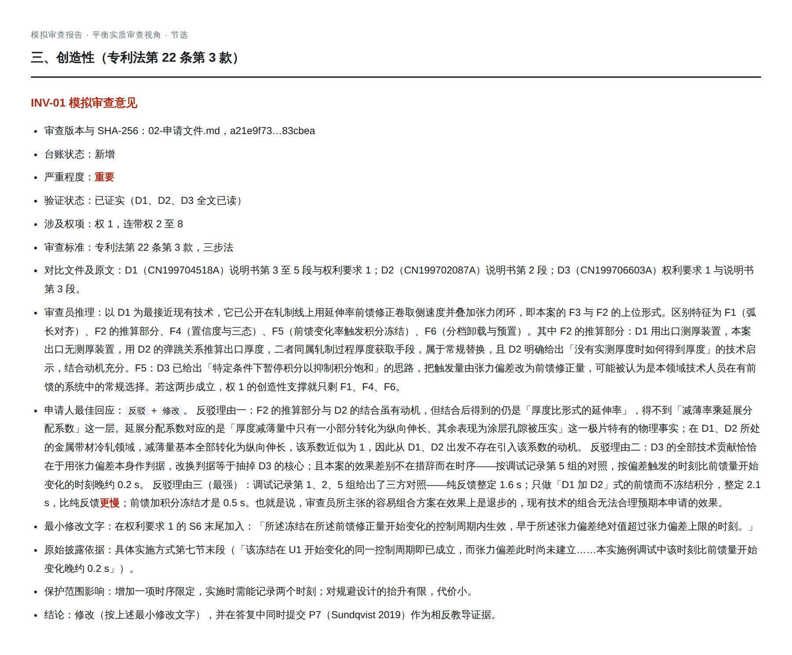
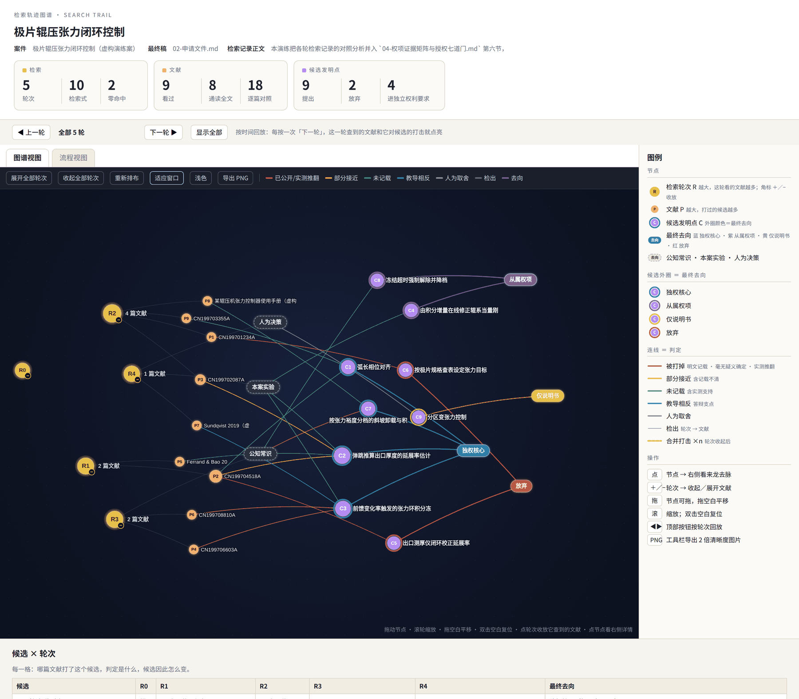
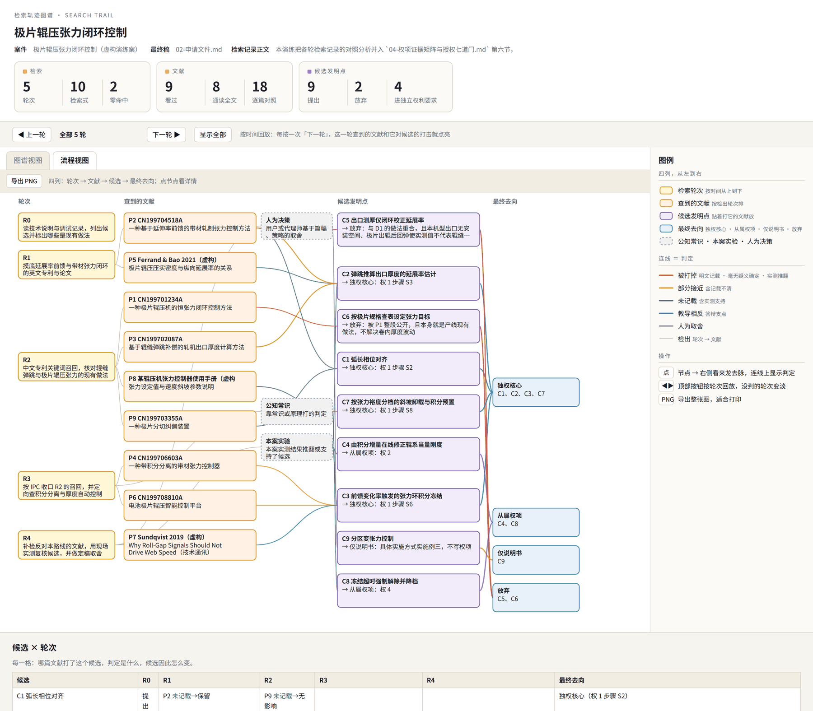

<div align="center">

# cn-patent-skill

> Not just explaining the invention — turning it into an application that **survives examination**.

[](LICENSE)
[](#install)
[](#tests)
[](#install)

<br>

The disclosure is written — but **which limitations belong in claim 1**?<br>
The draft is filed — and you have **no idea whether it will be rejected**?<br>
Dozens of documents read, several candidates killed — and **none of it is visible** in what you hand over?

[Five minutes](#try-it-in-five-minutes) · [What it looks like](#what-it-looks-like) · [Four worked cases](#four-worked-cases-four-industries) · [What you say](#what-you-say-to-the-agent) · [Install](#install) · [vs. the other skill](#how-this-differs-from-the-other-open-source-skill) · [中文](README.md)

</div>

---

> **Scope: Chinese invention patents only** (CNIPA, 发明专利). Not utility models, not
> designs, not US/EP practice. The rules and the agent's output are in Chinese —
> that is the language the application is filed in. This page is the English guide
> to what the repository contains.

## What it is for

Producing *a document* is no longer hard — any model will write you a disclosure.
The hard part comes after: **how the solution collapses into a set of claims that
hold up, what evidence lets each limitation in, and how you attack your own draft
before an examiner does.**

That is what this skill package covers. Not a prompt collection, not a template —
a set of **rules an agent executes**, plus the deterministic scripts around them.

## Try it in five minutes

After [installing](#install), say one sentence to your agent:

```
专利审查：examples/demo-case/bad-draft.md
```

`demo-case` is a **fictional** practice case shipped with the repo: a draft with
12 deliberate defects, plus fictional source code and tests. You get back an issue
ledger — location, problem, minimal fix — for each one.

No model at all? The deterministic form check runs offline in seconds:

```bash
python3 scripts/check_patent_package.py examples/demo-case/bad-draft.md
# expect 3 ERROR, 7 WARN
```

## What it looks like

### Simulated substantive examination



Every opinion carries the same eight fields: **legal standard, cited passage,
examiner's reasoning, applicant's best response, minimal amendment text, original
disclosure basis, effect on scope, conclusion.** The one above lands on this: the
combination the examiner calls obvious is, on the applicant's own bench data,
*slower* than the prior art it started from.

### Search-trail graph

<table width="100%">
<tr>
<th width="50%" align="center">Graph view<br><sub>rounds · documents · candidates · fate</sub></th>
<th width="50%" align="center">Flow view<br><sub>four columns, left to right</sub></th>
</tr>
<tr>
<td width="50%" valign="top"></td>
<td width="50%" valign="top"></td>
</tr>
</table>

By the end of a case you have read dozens of documents, killed several candidates
and promoted a dependent feature to the core — and **none of it appears in the filed
application**. One fixed-format ledger per round plus one command gives you the graph
above: **a single self-contained HTML file, double-click to open**, no network, no
install, PNG export for your report.

```bash
python3 obsidian/build_search_trail.py examples/02-机械-极片辊压张力控制
```

## Four worked cases, four industries

**This is the part worth looking at.** Most `examples/` folders hold *input material*.
These hold **finished output** — readable on GitHub with nothing installed.

| Case | Industry | The point of it | Claims |
|---|---|---|---|
| [demo-case](examples/demo-case/) | Software / SRE | A **deliberately bad** draft with 12 planted defects, for practising review | — |
| [Electrode roll-press tension control](examples/02-机械-极片辊压张力控制/) | Machinery / process control | The applicant's own data shows the "obvious combination" performs **worse** | 8 |
| [Dialysis-circuit bubble detection](examples/03-医疗器械-透析管路气泡检测/) | Medical device / signal processing | **Working around Article 25** (methods of diagnosis and treatment are unpatentable in China) | 9 |
| [Selective Li recovery from LFP](examples/04-化工材料-磷酸铁锂选择性提锂/) | Chemistry / hydrometallurgy | How a **numerical range earns support** from the description (Art. 26.3 / 26.4) | 9 |

Each of the last three ships the whole chain: **raw input material** (rough and
colloquial, on purpose) → **invention disclosure** (7 sections + evidence-status
appendix) → **application** (claims + description + abstract, figures rendered by
GitHub) → **Word final** (open it and hand it to your attorney) → **search-trail
ledger + graph** → **claim–evidence matrix + seven grantability gates** →
**simulated examination report**.

Index and per-file notes: [`examples/README.md`](examples/README.md).

> All four cases are fictional — solutions, data, document numbers and dates are
> invented, purely to demonstrate the shape of the output.

## What you say to the agent

No skill name to memorise. Any ordinary sentence containing "专利" routes it:

| You type | What it does | Touches your files? |
|---|---|---|
| `专利审查：<file>` | Balanced simulated substantive examination | No — report only |
| `专利驳回：<file>` | Adversarial rejection stress test | No — report only |
| `专利审查和专利驳回：<file>` | Both passes in order, then a regression check | No — report only |
| `专利撰写：<path>` | Full new application, from the tech through search and verification | Creates files |
| `专利交底书：<path>` | Invention disclosure for your attorney | Creates files |
| `专利修改：<file>` | Locks the master, saves a new version | Master untouched |
| `专利审查意见答复：<notice>` | Analyses a real office action, prepares a response (does not file) | Creates a draft |
| `专利检索：<topic>` | Prior-art search and material filing | Creates a search record |
| `专利检索图谱：<case dir>` | Draws what was searched, compared and why this route won | Only under `图谱/检索轨迹/` |

**Unless the word 修改 ("revise") appears, review tasks only report — they never edit.**

## What's inside

| Part | What it does |
|---|---|
| `SKILL.md` + 12 rule files | New-case workflow, drafting & review, disclosure template, seven grantability gates, claim–evidence matrix, AI/software subject matter, office-action response, pre-filing risk, filing formalities, search discipline, search-trail ledger |
| `references/prompts/` | Balanced examination + adversarial rejection stress test. **Two independent passes, run separately — not a model arguing with itself** |
| `references/official/` | Verbatim excerpts of the Patent Law, Implementing Regulations and CNIPA Order No. 84, so article numbers can be checked offline |
| `scripts/check_patent_package.py` | Model-free form check: sections, word limits, claim numbering and dependency, antecedent basis, placeholders, overclaiming, leaked code symbols |
| `scripts/prior_art_search.py` + `cnipa_search.py` | **Key-free** search: CNIPA official gazette (two-round IPC narrowing), Google Patents search + full text, OpenAlex / arXiv, GitHub, plus a reachability probe |
| `scripts/mermaid_render.py` | `mermaid` fences → PNG using your local Chrome/Edge. **No network, no Node.js** |
| `scripts/md_to_docx.py` + `math_to_omml.py` | Markdown → filing-formatted Word, LaTeX → **native editable Word equations** |
| `scripts/pptx_to_md.py` / `docx_to_md.py` / `pdf_to_text.py` | Inventor-supplied PPT / Word / PDF → Markdown |
| `obsidian/build_case_graph.py` | Case graph: claims, distinguishing features, references, evidence, issues as one Obsidian backlink graph |
| `obsidian/build_search_trail.py` | The search-trail graph shown above |
| `mcp/` | Optional: register the scripts as MCP tools for hosts without a terminal |

### Four ideas worth stating plainly

**Evidence matrix.** Every substantive limitation must trace to source code, a test,
a document, or an explicitly flagged proposed design. No evidence, no claim.

**Seven grantability gates.** Each marked only `PASS` / `RISK` / `BLOCKED` / `N/A`.
An unresolved `BLOCKED` blocks the filing draft. **No grant-probability percentage
is ever produced** — a percentage detached from a real search scope is fiction.

**Two examiner passes.** Balanced first, over all six statutory grounds. Then an
adversarial pass that must write your strongest rebuttal *before* deciding whether
the attack survives. Separate runs, never merged.

**Unreachable is not "nothing found".** A source that cannot be opened is recorded as
"entry point unavailable", **never** as "no prior art found". If nothing is reachable,
the draft still gets finished with novelty and inventive step left as open items.

## Install

```bash
git clone https://github.com/echososo/cn-patent-skill.git
cd cn-patent-skill
bash install/install.sh        # macOS / Linux / WSL / Git Bash
```

```powershell
powershell -ExecutionPolicy Bypass -File install\install.ps1   # Windows
```

The installer detects which agents you have (Claude Code, Codex CLI, Cursor,
WorkBuddy, nanobot), installs into each, strips the UTF-8 BOM that makes Codex
reject a `SKILL.md`, and prints a line you can paste to verify. It does not touch
the network, install dependencies, or modify anything else. Then `bash install/verify.sh`.

**The rules are plain Markdown and need no dependencies.** Two optional installs:

```bash
pip3 install -r requirements-min.txt   # Word conversion + editable equations
pip3 install playwright                # figures and CNIPA search; uses your existing Chrome/Edge
```

**No Node.js required** — mermaid renders in the browser you already have, and the
mermaid js ships with the repo.

Manual installation, per-host paths and troubleshooting: [INSTALL.md](INSTALL.md) (Chinese).

## Prior-art search needs no configuration

No key, no account, no service. The agent probes what this machine can reach, then
uses whatever is available:

```bash
python3 scripts/prior_art_search.py probe
python3 scripts/prior_art_search.py cnipa 批任务调度 资源画像 异构算力
python3 scripts/prior_art_search.py patents "alert suppression sliding window" --country CN
python3 scripts/prior_art_search.py get CN107196804B --out D1.md
python3 scripts/prior_art_search.py papers "alert suppression sliding window"
```

**Completeness is not promised.** Every search record states which entry points were
used, which were unreachable, what was queried and what was not covered.

Your draft, code and figures never leave your machine. Only query terms do.

## How this differs from the other open-source skill

There is a solid sibling project: [handsomestWei/patent-disclosure-skill](https://github.com/handsomestWei/patent-disclosure-skill) (MIT).
It has two things this repo does **not**: a **plain-language reading mode** for
published patents, and an Obsidian patent-intelligence vault around it. For reading
patents, go use it — that is its home turf.

| | This repo | patent-disclosure-skill |
|---|---|---|
| Invention disclosure | ✅ 7 sections + evidence-status appendix | ✅ its strength |
| **Claims + description + abstract** | ✅ **all the way to a filable application** | ➖ stops at the disclosure |
| **Simulated substantive examination** | ✅ two independent passes, per-issue minimal fix | ➖ self-check only |
| **Grantability judgement** | ✅ seven gates + claim–evidence matrix + fallback ladder | ➖ |
| **Office-action response** | ✅ incl. Article 33 added-matter verification | ➖ |
| **Search-trail graph** | ✅ rounds → documents → candidates → fate | ➖ (its graph is for *reading* patents) |
| Plain-language patent reading | ➖ **not covered** | ✅ its home turf |
| Prior-art search | ✅ CNIPA + Google Patents + OpenAlex/arXiv + GitHub + probe | ✅ CNIPA first, WebSearch fallback |
| Figures → PNG → Word | ✅ **no Node.js** | ✅ needs Node / mmdc |
| **Examples** | ✅ **four industries, finished output** | ➖ mostly input material |
| **Tests** | ✅ 291, fully offline | ➖ |
| Offline statutes | ✅ Patent Law + Regulations + Order No. 84 | ➖ |
| License | CC BY-NC-SA 4.0 (non-commercial) | MIT |

In one line: **it helps you explain the technology; this repo helps you turn that
into something grantable.**

The figure, equation and PPT-conversion toolchains here are **adapted from it under
MIT**, with attribution and a per-file list of changes in
[THIRD_PARTY_NOTICES.md](THIRD_PARTY_NOTICES.md).

## Tests

```bash
python3 -m unittest discover -s scripts   -p 'test_*.py'
python3 -m unittest discover -s obsidian  -p 'test_*.py'
python3 -m unittest discover -s mcp       -p 'test_*.py'
```

291 cases, **fully offline** — browsers and network are faked, no keys needed.

## What it will not do

- Chinese invention patents only. No utility models, no designs, no US/EP practice.
- No plain-language reading of published patents — use the project above.
- **It does not file anything, does not promise a grant, and is not legal advice.**
- **It does not invent experimental data.**

## Contributing

Rule-text bugs are the most valuable issues — see [CONTRIBUTING.md](CONTRIBUTING.md).
**Never paste a real application into an issue**: an unfiled technical solution posted
publicly is a public disclosure. Reproduce with `demo-case`.

## License

**CC BY-NC-SA 4.0**, rules and code alike. Free for personal and in-house use;
attribution and ShareAlike apply; **bundling it into a paid product or fee-charging
service needs a separate license** — open an issue. **Whatever you produce with it is
yours**, commercial use included. Exceptions: `references/official/` is statutory text
outside copyright, and the third-party files in `THIRD_PARTY_NOTICES.md` keep their MIT
licenses. See [LICENSE](LICENSE).

---

<div align="center">

Drafting assistance only. Not legal advice, no guarantee of grant, does not file on your behalf.

</div>
