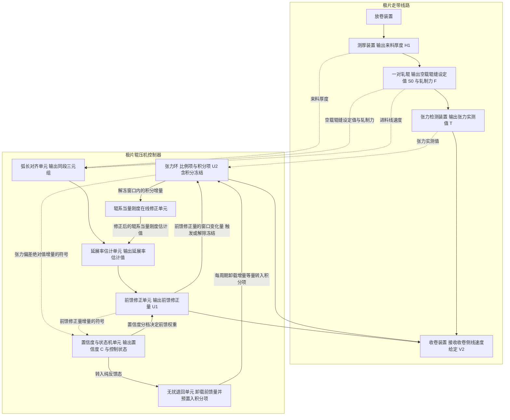
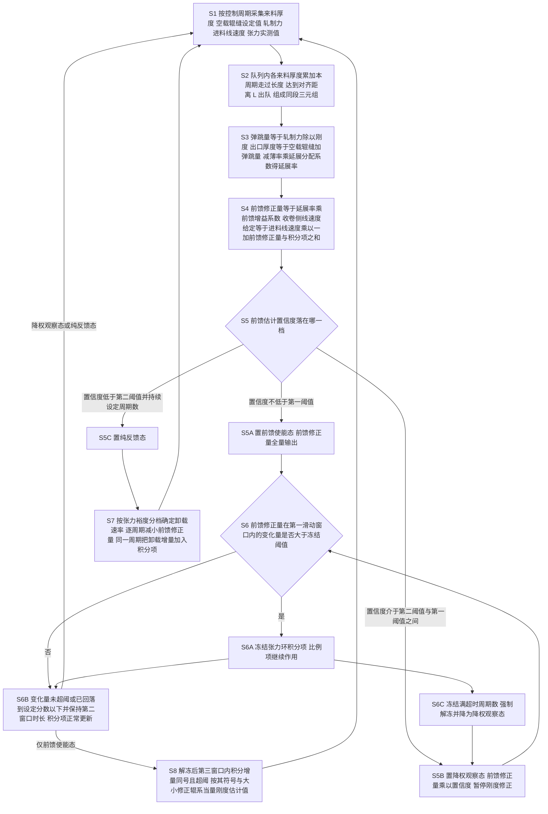

> 虚构演练案例。技术方案、调试数据、文献号、日期全部是编的，只用于演示本技能包的产物形态，不构成任何真实技术或法律主张。

# 技术交底书

- 案件名称：一种极片辊压机的张力前馈反馈协同控制方法
- 技术联系人：（姓名待填）　电话：（待填）　邮箱：（待填）
- 专利类型：发明

## 注意事项

一、本交底书是写给代理人看的。代理人不了解本产线，请把背景技术和技术方案写全、写清楚，尤其是各步骤之间的因果关系和触发条件。

二、公开程度以本领域普通技术人员不付出创造性劳动就能实施为准。参数、阈值、窗口长度、异常分支都要写出来，不能只写"根据实际情况确定"。

三、代理人来问时请认真回答、及时补材料。凡本文标为"拟议待验证"的机制，代理人在写入权利要求前会回头确认，请如实答复是否已经实现或已经决定实施。

---

## 一、背景与现有技术

**检索说明**：本案在 2026-06-18 至 2026-07-03 期间做了四轮检索（另有一轮为材料分析），入口为 Google Patents、Google Scholar 和国家知识产权局公布公告查询，其中国知局分关键词轮与分类号收口轮各一轮，分类号限定为 B21B37、B30B3、H01M4。共登记 9 篇文献，其中 8 篇读到全文，1 篇（CN199708810A）全文下载页返回验证码，只读到摘要。未覆盖范围：CNKI、万方、Espacenet 全文，以及 ScienceDirect 的付费正文。检索过程按《检索轨迹台账》单独记录，本节只放结论。

### 1.1 现有技术

按技术方向分为三类。

**（一）按规格查表的恒张力闭环**

- 文献号：CN199701234A
- 申请人：某电池装备公司（虚构）
- 技术方案：张力设定值按极片牌号与幅宽查表得到；收卷侧线速度给定等于轧辊线速度乘以一个固定的超前比例，再叠加张力偏差经比例积分运算得到的修正量。超前比例按牌号在参数表里配置。
- 应用场景：锂电池极片辊压工序的张力控制。
- 局限性（**读过全文**）：超前比例是配置值，只对应某一种来料厚度；同一卷极片内部的厚度波动无法由它跟随。说明书全文未涉及任何在线估计延展率的手段。
- 可打开的公开源 URL：（虚构演练案例，此处为空；真实案件必须填写撰写时实际打开并与文献号核对过的 URL，打不开就删掉这一条）

**（二）用进出口厚度比作延伸率前馈的带材轧制张力控制**

- 文献号：CN199704518A
- 申请人：某冶金自动化研究院（虚构）
- 技术方案：在轧机进出口两侧各设一台测厚装置，以出口厚度与入口厚度之比得到延伸率，据此前馈修正卷取机速度给定，并叠加张力闭环的反馈修正量；说明书第 5 段还给出用出口厚度实测值闭环校正延伸率估计的做法。
- 应用场景：金属带材冷轧的卷取张力控制。
- 局限性（**读过全文**）：整套方案依赖出口侧测厚装置。极片辊压机出口空间被出料导辊组占据，通常装不下；并且极片离开辊缝后涂层会回弹，出口测得的厚度不代表辊缝内的厚度。该文献的进出口两个厚度读数分列辊缝两侧、天然成对，因此文中不存在"上游单点测厚如何与辊缝时刻对齐"这一问题，也未给出任何对齐手段。
- 可打开的公开源 URL：（虚构演练案例，此处为空）

**（三）辊缝弹跳补偿与积分分离**

- 文献号：CN199702087A
- 申请人：某冶金自动化研究院（虚构）
- 技术方案：公开出口厚度等于空载辊缝设定值加上轧制力除以机架刚度这一弹跳关系，用于厚度自动控制中由辊缝和轧制力推算实际厚度。
- 应用场景：冷轧机厚度自动控制。
- 局限性（**读过全文**）：弹跳关系只被用在厚度环里，推算出的厚度用于修正压下位置，全文未把它接到速度环或张力环上，也没有出现延展率这一概念。
- 可打开的公开源 URL：（虚构演练案例，此处为空）

- 文献号：CN199706603A
- 申请人：某控制设备公司（虚构）
- 技术方案：带材张力控制器，当张力偏差绝对值超过设定阈值时暂停积分运算，待偏差回到阈值以内恢复积分，用以抑制积分饱和。
- 应用场景：带材放卷收卷张力控制。
- 局限性（**读过全文**）：触发依据是张力偏差本身，属于反馈通道的量。扰动发生后张力偏差要经过检测滤波和机械响应才建立起来，触发时刻必然晚于扰动时刻；该文献没有前馈通道，也就不存在"用前馈通道的中间量去决定反馈通道行不行动"这件事。
- 可打开的公开源 URL：（虚构演练案例，此处为空）

**（四）背景性文献与反对意见**

- 文献：Ferrand & Bao 2021（虚构论文）《极片辊压压实密度与纵向延展率的关系》
- 技术方案：离线试验，给出多种负极配方下纵向延展率随厚度减薄率变化的曲线，指出减薄量中只有很小一部分转化为纵向伸长。
- 局限性（**读过全文**）：纯离线表征，未涉及在线估计，也未与任何速度给定相连。
- 可打开的公开源 URL：（虚构演练案例，此处为空）

- 文献：Sundqvist 2019（虚构技术通讯）《Why Roll-Gap Signals Should Not Drive Web Speed》
- 技术方案：论述辊缝位移信号受液压压下抖动和辊面偏心影响，噪声大，主张卷绕线的速度前馈应以出口测厚仪闭环为准，不应由辊缝信号驱动。
- 局限性（**读过全文**）：这是一篇明确反对本案路线的材料。它成立的前提是出口装得下测厚仪；对本案这类出口无测厚仪的机型没有给出替代方案。答复审查意见时这篇是有利材料，说明本领域当时的主流认识与本案方向相反。
- 可打开的公开源 URL：（虚构演练案例，此处为空）

- 文献：某辊压机张力控制器使用手册（虚构 V3.2）
- 技术方案：产品资料。张力设定值、超前比例、速度斜坡时间均列为固定配置项。
- 局限性（**只读摘要相关章节，未通读全册**）：所读章节未见随来料厚度变化的自适应机制，也未见按张力裕度决定的卸载速率。只能写"所读章节未见"，不能写"该产品不具备"。
- 可打开的公开源 URL：（虚构演练案例，此处为空）

- 文献号：CN199708810A（《电池极片辊压智能控制平台》）
- 全文状态：**未取得全文**，下载页返回验证码，只读到摘要。摘要提到"多源信号融合的张力优化"。
- 局限性：摘要未见对积分器的任何干预。不能据此断定它没做，这一条列出来是提示代理人：这是本案检索里唯一没读到全文的近似文献，答复审查意见时如果被引用，需要先取得全文再判断。
- 可打开的公开源 URL：（虚构演练案例，此处为空）

### 1.2 现有技术的缺点

1. 固定超前比例无法跟随卷内来料厚度变化，来料变厚时张力下降、变薄时张力升高。对应（一）。
2. 用进出口厚度比作延伸率前馈，必须在辊压出口装测厚装置；出口装不下，且出辊后涂层回弹使出口实测厚度不代表辊缝内厚度。对应（二）。
3. 只有上游一台测厚装置时，测量点与辊缝之间相隔一段行程，读到即用会提前动作反而制造扰动；按固定时间延时则在升速降速阶段错位。现有技术因为是进出口成对测厚，没有提出这个问题，也没有给出对齐手段。对应（二）。
4. 弹跳关系只被用于厚度环，没有被接到速度环上，因此现有技术里没有"出口无测厚装置时如何得到出口厚度以估计延展率"的做法。对应（三）。
5. 积分分离由张力偏差触发，必然晚于扰动发生；在有前馈的系统中，这段偏差本来就是前馈过渡过程引起的，积分再作用一次属于重复作用，过渡结束后表现为反方向偏差和更长的整定时间。对应（三）。
6. 现有技术未涉及前馈估计不可信时如何退出。前馈量一次性置零本身就是一次控制量阶跃，会再造成一次张力扰动。对应（一）（二）（三）均未涉及。

**申请人现状（不属于现有技术的缺点，另起一段说明）**：本产线 3 号辊压机目前跑的是（一）类做法，超前比例负极填 1.0%、正极填 0.6%。曾试过按上游测厚读数直接改超前比例，因为测厚装置故障导致过一次断带，此后前馈通路被工艺锁定，现仍为纯反馈运行。

## 二、要解决的技术问题

对着 1.2 逐条：

1. 针对缺点 1：使收卷侧线速度给定实时跟随来料厚度变化引起的延展率变化，而不是按牌号取固定值。
2. 针对缺点 2 和缺点 4：在辊压出口不设测厚装置的条件下得到反映辊缝内实际状态的出口厚度，进而得到在线的延展率估计值。
3. 针对缺点 3：使上游测厚读数在它对应的那一段极片真正进入辊缝的时刻才被用于前馈，且在升速降速阶段同样成立。
4. 针对缺点 5：使张力环积分在前馈过渡过程中不与前馈重复作用，且干预时刻不晚于前馈量开始变化的时刻。
5. 针对缺点 6：使前馈估计不可信时的退出过程本身不产生控制量阶跃。

## 三、技术方案详述

### 3.1 背景

**场景与参与者。** 干活的主体是极片辊压机及其控制器。极片是涂布并干燥后的金属箔带材，由放卷装置放出，经过装在轧辊上游的测厚装置，进入一对相向转动的轧辊被压实，再经过装有张力检测装置的出料导辊，最后由收卷装置收成卷。控制器按固定的控制周期运行，同时管着两件事：一是根据来料情况提前算出收卷侧应该比进料快多少（前馈通道），二是根据张力检测装置的读数把张力拉回设定值（反馈通道）。本方案的全部内容都发生在这两条通道之间。

**标题里那个对象怎么进入系统。** 极片辊压机在开机时由工艺配方选定极片牌号、幅宽、张力设定值 T0、张力偏差上限 TL、空载辊缝设定值 S0 的目标值和延展分配系数 λ；辊系当量刚度估计值 K 由停机标定得到并写入控制器；对齐距离 L 由测厚装置的安装位置量得，写入控制器后不随生产变化。起车时控制器先进入纯反馈态，待前馈估计置信度连续达标后才切入前馈使能态，这一点见 3.4 的 S5。**材料未涉及**换卷、接头检测和牌号在线切换时控制器的具体处置流程，本文不作推测。

**高频术语的场景定义。**

- **来料厚度 H1**：测厚装置输出的极片总厚度，含集流体和两面涂层。由射线式测厚仪按控制周期给出，读数带一个采集周期序号，用于判断数据新鲜与否。
- **空载辊缝设定值 S0**：轧辊在没有轧制力时两辊工作面之间的间距设定值。液压压下采用预压方式时 S0 为负值。
- **轧制力 F**：两侧压力传感器读数的平均值。
- **辊系弹跳量 D**：轧制力使整个辊系发生弹性变形、两辊被顶开的量。
- **辊系当量刚度估计值 K**：轧制力与其引起的辊系弹性张开量之比的估计值，由停机分档加载标定，本机标定值 4.0 kN/μm。
- **出口厚度 H2**：极片位于辊缝中时的厚度。本方案不实测它，由 S0 与 D 相加推算。
- **减薄率 R**：H1 与 H2 之差占 H1 的比例。
- **延展分配系数 λ**：厚度减薄量中转化为纵向伸长的比例，其余部分表现为涂层孔隙被压实。按配方离线标定，本机负极 A 配方取 0.05。
- **延展率估计值 ε**：出料线速度相对进料线速度的超出比例的估计值，ε 等于 λ 乘 R。
- **前馈修正量 U1**：由 ε 换算得到的收卷侧速度超前量，以进料线速度的比例表示。
- **张力环积分项 U2**：张力偏差经积分运算得到的收卷侧速度修正量，同样以进料线速度的比例表示。反馈通道的比例项另算，不计入 U2。
- **前馈估计置信度 C**：0 到 1 之间的实数，表示当前时刻还能不能信任前馈通道。
- **张力裕度 M**：当前张力偏差离工艺允许上限还有多远，M 等于 TL 与张力偏差绝对值之差再除以 TL。
- **同段三元组**：同一段极片的来料厚度、以及这段极片进入辊缝那一刻的空载辊缝设定值和轧制力，三者配成一组。

### 3.2 系统框图

### 3.3 模块功能

- **测厚装置**：按控制周期输出来料厚度 H1，并给出读数的采集周期序号。它装在辊缝上游，输出的是"此刻位于测量点那一段极片"的厚度，不是此刻进辊缝那一段的厚度。它把 H1 交给弧长对齐单元，不直接进入估计单元。
- **一对轧辊**：执行辊压，同时对外提供空载辊缝设定值 S0、轧制力 F 和轧辊线速度（作为进料线速度 V1）。它同时是被测对象和信号源，向弧长对齐单元供 S0 与 F。
- **张力检测装置**：输出张力实测值 T，交给张力环。它是反馈通道唯一的测量入口。
- **收卷装置**：接收收卷侧线速度给定 V2 并执行。V2 由前馈修正单元和张力环共同决定，两者的贡献在数值上相加。
- **弧长对齐单元**：收测厚装置的 H1 和轧辊侧的 S0、F、V1，把 H1 按它对应的那段极片实际走过的长度延后，直到这段极片进入辊缝，才与当时的 S0、F 配成同段三元组交给延展率估计单元。它是前馈通道的入口，上游是测厚装置和轧辊，下游只有延展率估计单元。
- **延展率估计单元**：收同段三元组和辊系当量刚度在线修正单元给来的 K，算出延展率估计值交给前馈修正单元。它有一条回路：K 不是常数，而是由张力环的行为经辊系当量刚度在线修正单元反过来送回来的。
- **前馈修正单元**：把延展率估计值乘前馈增益系数得到 U1，一路输出到收卷装置参与速度给定，一路把 U1 的窗口变化量送给张力环作为冻结判据，一路把 U1 的逐周期增量符号送给置信度与状态机单元。它是本方案里出度最高的模块。
- **张力环**：由比例项和积分项构成，积分项输出 U2。它向收卷装置输出速度修正量，向置信度与状态机单元提供张力偏差绝对值的增量符号，向辊系当量刚度在线修正单元提供解冻窗口内的积分增量，并接受前馈修正单元的冻结指令和无扰退回单元转入的卸载增量。
- **置信度与状态机单元**：收前馈修正单元和张力环的两路符号，加上三项输入有效性检查，算出 C 并决定控制状态；向前馈修正单元下发前馈权重，向无扰退回单元下发转入纯反馈态的指令。
- **无扰退回单元**：只在转入纯反馈态时工作。按张力裕度分档确定卸载速率，逐周期把 U1 减一点、同时把减掉的量加到 U2 上，让两者之和不变。
- **辊系当量刚度在线修正单元**：只在解冻之后的窗口内工作。看张力环积分项在这个窗口里往哪个方向走、走了多少，据此改 K，再把 K 送回延展率估计单元。它是反馈通道回到前馈通道的唯一路径。

### 3.4 系统流程

**S1 采集。** 每个控制周期采一次来料厚度 H1、空载辊缝设定值 S0、轧制力 F、进料线速度 V1 和张力实测值 T。V1 由轧辊编码器折算。每个采集值连同它的采集周期序号一起保存，S5 的数据年龄检查要用。控制周期 Ts 本机取 2 ms。

**S2 按累计走过长度对齐。** 设一个先进先出队列。每个控制周期把新采到的 H1 压入队尾，条目附一个累计走过长度字段，初值为零。同一周期内，对队列中已有的每个条目，把本周期极片走过的长度即 V1 与 Ts 之积累加上去。然后看队首：累计走过长度达到对齐距离 L 就出队，与本周期采到的 S0、F 组成同段三元组送 S3。本机 L 为 0.85 m；V1 等于 60 m/min 即 1.0 m/s 时，一段极片走完 0.85 m 需要 425 个控制周期，队列深度就是 425。起车爬升段 V1 从 0 涨到 60 m/min，同一段极片走完 0.85 m 所需的周期数远大于 425，队列会自然等到累计长度达标才放行，因此对齐关系不随速度变化而失效。队列容量按最低线速度对应的最大周期数留余量，本机取 4000。

**S3 延展率估计。** 对同段三元组依次算：辊系弹跳量 D 等于 F 除以 K；出口厚度 H2 等于 S0 与 D 之和；减薄率 R 等于 H1 与 H2 之差除以 H1；延展率估计值 ε 等于 λ 乘 R。这一步的关键在于 H2 不是实测值，而是由辊缝和轧制力推算出来的辊缝内厚度，因此不受极片出辊后涂层回弹的影响，也不需要在出口装测厚装置。

**S4 前馈修正与速度给定。** 前馈修正量 U1 等于前馈增益系数 η 乘 ε。收卷侧线速度给定 V2 等于 V1 乘以（1 加 U1 加 U2）。η 取小于 1 的值，因为 ε 本身带误差，前馈只承担其中大部分，剩下的留给张力环；η 太大时估计误差会被直接放大成速度给定误差。本机 η 取 0.8，可用范围 0.6 到 0.9。

**S5 置信度与控制状态。** 置信度 C 等于有效性因子与符号一致性因子之积。有效性因子取 1 或 0：来料厚度的数据年龄不超过 3 个控制周期、相邻周期 S0 的变化量绝对值不超过 2 μm、F 落在标称值的 0.5 到 1.5 倍之间，三项全过取 1，任一项不过取 0。符号一致性因子来自前馈与反馈的配合方向：逐周期算 U1 的增量符号与张力偏差绝对值增量的符号之积，在最近 N 个周期内取均值 m，本机 N 取 100 即 200 ms。前馈方向对的时候，U1 增大会让张力偏差绝对值减小，符号之积为负，所以 m 越接近 −1 越可信；m 不大于 −0.2 时符号一致性因子取 1，不小于 0.2 时取 0，中间按线性内插。控制状态按 C 分三档：C 不小于 0.7 为前馈使能态；C 落在 0.3 与 0.7 之间为降权观察态，此时 U1 再乘以 C 输出，并暂停 S8；C 小于 0.3 且持续 50 个周期即 100 ms 转入纯反馈态。从纯反馈态回到前馈使能态要求 C 不小于 0.7 并持续 500 个周期即 1 s，且 U1 按加载斜坡自零增大到计算值。两个方向的保持周期数不同，是为了形成滞回、避免在阈值附近来回切换。

三项有效性检查只能挡明显的坏数据。本机曾发生测厚装置测量窗口积粉，读数由 181 μm 跳到 412 μm 并持续 6 s，期间辊缝信号和轧制力都正常，后两项检查根本不触发。这类故障要靠符号一致性统计识别：读数跳高把 U1 顶高，张力随之升高、偏差绝对值增大，符号之积转正，m 在 200 ms 内越过 0.2，C 掉到 0，随即转入纯反馈态。

**S6 前馈变化率触发的积分冻结。** 只作用于积分项。取第一滑动窗口 100 个周期即 200 ms，算 U1 在该窗口内的变化量绝对值，大于冻结阈值 θ 时冻结积分项；本机 θ 取 0.010 个百分点，在 V1 等于 60 m/min 时折合 0.006 m/min。变化量绝对值回落到 θ 的一半即 0.005 个百分点以下、并保持第二窗口时长 20 个周期即 40 ms 后解冻。冻结期间积分项保持不变，比例项照常作用，所以突发扰动仍然压得住，只是不再被积分累积。另设超时保护：冻结持续 300 个周期即 600 ms 时强制解冻，并把控制状态置为降权观察态；不设这一条的话，前馈信号长期抖动会让冻结判据长期成立，积分项被锁死，稳定段静差消不掉。

这一步和现有的积分分离在触发依据上不同：现有做法看张力偏差，本方案看前馈修正量的变化率。在来料厚度台阶这种工况下，两者的动作时刻差着一段。本机调试中，按张力偏差触发的时刻比 U1 开始变化的时刻晚约 0.2 s，这 0.2 s 里积分项已经沿一个方向累了一段。

**S7 不可信时的无扰退回。** 转入纯反馈态时不把 U1 置零。先算张力裕度 M 等于 TL 与张力偏差绝对值之差除以 TL，再按 M 分三档取卸载速率：M 不小于 0.6 取 0.60 个百分点每秒，M 在 0.3 到 0.6 之间取 0.25 个百分点每秒，M 小于 0.3 取 0.10 个百分点每秒。裕度大说明张力离允许上限还远，可以卸得快；裕度小说明已经贴近上限，卸慢一点，免得卸载本身又打一次张力。每个周期的卸载增量等于卸载速率乘 Ts；同一个周期把这个增量加到 U2 上。因为 V2 只看 U1 与 U2 之和，U1 减多少 U2 就加多少，切换过程中 V2 连续，没有阶跃。

**S8 辊系当量刚度在线修正。** 解冻之后取第三窗口 250 个周期即 500 ms，记这段窗口内 U2 的增量为 ΔU2。若 ΔU2 在窗口内始终同号且绝对值大于修正阈值 0.05 个百分点，就按它的符号和幅度改 K：新的 K 等于原 K 乘以（1 加 μ 乘符号乘归一化幅度），μ 本机取 0.02，归一化幅度取 ΔU2 绝对值除以参考值 0.20 个百分点后对 1 限幅，也就是单次修正不超过 2%；改完把 K 限制在标定值 4.0 kN/μm 的 ±15% 之内，即 3.4 到 4.6 kN/μm。方向是这样定的：U2 朝增大收卷侧线速度给定的方向累积，说明前馈给出的 ε 偏小，也就是 H2 估计偏大，也就是 D 估计偏大，也就是 K 偏小，应当增大 K；反之减小。降权观察态和纯反馈态下不执行这一步，免得用不可信的前馈量去污染模型参数。

**两处协同关系（这是本方案的要点，请代理人特别注意）。** 第一处在 S4 到 S6：前馈通道算出来的中间量 U1 的变化率，决定了反馈通道的积分器动不动。前一机制的中间结果改变了后一机制的执行结果，而不是两条通道各算各的再把输出相加。第二处在 S6 到 S8 再到 S3：反馈通道的中间量 U2 在解冻窗口内的走向，改变了前馈通道的模型参数 K，K 又回到 S3 参与下一周期的估计。这两处合起来构成一个双向回路。

### 3.4.1 符号与公式

| 符号 | 含义 | 下标或说明 | 量纲或取值范围 |
|---|---|---|---|
| H1 | 来料厚度 | 含集流体与两面涂层 | μm，本机 180 附近 |
| H2 | 出口厚度 | 极片位于辊缝中时的厚度，推算值 | μm |
| S0 | 空载辊缝设定值 | 预压时为负 | μm，本机 −20 |
| F | 轧制力 | 两侧压力传感器平均值 | kN，本机 620 附近 |
| K | 辊系当量刚度估计值 | 停机标定后可由 S8 在线修正 | kN/μm，本机 3.4 至 4.6 |
| D | 辊系弹跳量 | 轧制力引起的辊系弹性张开量 | μm |
| R | 减薄率 | 无量纲 | 0 至 1 |
| λ | 延展分配系数 | 按配方标定 | 无量纲，负极 A 取 0.05 |
| ε | 延展率估计值 | 无量纲 | 本机 0.010 至 0.016 |
| η | 前馈增益系数 | 无量纲 | 0.6 至 0.9，本机 0.8 |
| U1 | 前馈修正量 | 以进料线速度的比例表示 | 无量纲 |
| U2 | 张力环积分项 | 以进料线速度的比例表示 | 无量纲 |
| V1 | 进料线速度 | 取轧辊线速度 | m/min，本机 20 至 80 |
| V2 | 收卷侧线速度给定 | — | m/min |
| T0 | 张力设定值 | — | N，本机 120 |
| T | 张力实测值 | — | N |
| TL | 张力偏差上限 | 工艺给定 | N，本机 10 |
| M | 张力裕度 | 无量纲 | 0 至 1 |
| C | 前馈估计置信度 | 无量纲 | 0 至 1 |
| m | 符号一致性统计值 | 最近 N 个周期内符号之积的均值 | −1 至 1 |
| L | 对齐距离 | 测厚测量点至辊缝的极片行程长度 | m，本机 0.85 |
| Ts | 控制周期 | — | ms，本机 2 |
| θ | 冻结阈值 | U1 在第一滑动窗口内的变化量阈值 | 个百分点，本机 0.010 |

公式如下。

式 (1) 辊系弹跳量：\( D = F / K \)

式 (2) 出口厚度：\( H_2 = S_0 + D \)

式 (3) 减薄率：\( R = (H_1 - H_2) / H_1 \)

式 (4) 延展率估计值：\( \varepsilon = \lambda R \)

式 (5) 前馈修正量：\( U_1 = \eta \varepsilon \)

式 (6) 收卷侧线速度给定：\( V_2 = V_1 (1 + U_1 + U_2) \)

式 (7) 张力裕度：\( M = (T_L - |T_0 - T|) / T_L \)

式 (8) 辊系当量刚度在线修正：\( K \leftarrow K \left[ 1 + \mu \cdot \mathrm{sgn}(\Delta U_2) \cdot \min(|\Delta U_2| / \Delta U_{ref}, 1) \right] \)

式 (1)、(2) 是轧制领域的弹跳关系，材料里由现场人员提到"轧钢那边有公式，是轧制力除以机架刚度"，本文按标准形式转录。式 (3) 是定义式。式 (4) 是本技能按材料第四节第 2 点的描述形式化而来：材料写的是"厚度压掉 25%，长度只多了 1% 出头"，据此取 λ 等于 0.05。式 (5)、(6) 是本技能补写的前馈叠加形式。式 (7) 是本技能补写的裕度定义。式 (8) 是本技能补写的在线修正律。

数值例（可代入复核）：S0 等于 −20 μm，F 等于 620 kN，K 等于 4.0 kN/μm，则式 (1) 得 D 等于 155 μm；式 (2) 得 H2 等于 135 μm；H1 等于 180 μm，式 (3) 得 R 等于 0.250；λ 等于 0.05，式 (4) 得 ε 等于 0.0125；η 等于 0.8，式 (5) 得 U1 等于 0.0100；V1 等于 60 m/min、U2 约等于 0，式 (6) 得 V2 等于 60.60 m/min。式 (7)：TL 等于 10 N，张力偏差绝对值等于 5.5 N，得 M 等于 0.45。式 (8)：ΔU2 等于 +0.10 个百分点，参考值 0.20 个百分点，μ 等于 0.02，则归一化幅度等于 0.5，新的 K 等于 4.0 乘 1.01 等于 4.04 kN/μm。

### 3.5 关键技术参数

| 符号 | 含义 | 取值或本例取值 | 来源 |
|---|---|---|---|
| L | 对齐距离 | 0.85 m | 材料：技术说明第一节，安装图量得 |
| Ts | 控制周期 | 2 ms | 材料：调试记录抬头 |
| K | 辊系当量刚度标定值 | 4.0 kN/μm | 材料：调试记录第 3 组，三档加载标定 |
| λ | 延展分配系数（负极 A） | 0.05 | 材料：技术说明第四节第 2 点粗算 |
| λ | 延展分配系数（正极 B） | 0.03 | 示例值 |
| η | 前馈增益系数 | 0.8（可用 0.6 至 0.9） | 示例值 |
| θ | 冻结阈值 | 0.010 个百分点 | 材料：调试记录第 5 组现场试出 |
| — | 解冻回落分数 | θ 的 0.5 倍 | 材料：调试记录第 5 组 |
| — | 第一滑动窗口 | 100 个周期（200 ms） | 材料：调试记录第 5 组 |
| — | 第二窗口时长 | 20 个周期（40 ms） | 材料：调试记录第 5 组 |
| — | 冻结超时周期数 | 300 个周期（600 ms） | 示例值 |
| N | 符号一致性统计窗口 | 100 个周期（200 ms） | 示例值 |
| — | 置信度第一阈值 | 0.7 | 示例值 |
| — | 置信度第二阈值 | 0.3 | 示例值 |
| — | 第一保持周期数 | 50 个周期（100 ms） | 示例值 |
| — | 第二保持周期数 | 500 个周期（1 s） | 示例值 |
| — | 数据年龄上限 | 3 个控制周期 | 示例值 |
| — | 相邻周期辊缝变化量上限 | 2 μm | 示例值 |
| — | 轧制力标定区间 | 标称值的 0.5 至 1.5 倍 | 示例值 |
| — | 卸载速率三档 | 0.60 / 0.25 / 0.10 个百分点每秒 | 示例值 |
| — | 裕度分档阈值 | 0.6 与 0.3 | 示例值 |
| 第三窗口 | 刚度修正观察窗口 | 250 个周期（500 ms） | 示例值 |
| — | 刚度修正阈值 | ΔU2 绝对值 0.05 个百分点 | 示例值 |
| μ | 刚度修正系数 | 0.02 | 示例值 |
| — | 刚度限幅范围 | 标定值的 ±15% | 示例值 |

标"示例值"的参数是本技能给出的可实施取值，不是实测经验值，代理人不要把它们当作已验证的优选范围写入从属权利要求；需要写入时请先与发明人确认。

## 四、与现有技术相比的优点

总的来说，本方案让收卷侧速度给定在出口无测厚装置的条件下跟上了卷内来料厚度的变化，同时让前馈通道和反馈通道不再互相打架，并且在前馈不可信时能安全退出。

1. **出口无测厚装置也能在线估计延展率。** 由区别特征"以空载辊缝设定值与轧制力弹跳量之和作为出口厚度"产生。推导链：辊缝内厚度由辊缝几何和辊系弹性变形共同决定，与出辊后的涂层回弹无关；因此推算值比出口实测值更接近真正决定出料速度的那一段变形状态。**机制推导，无实测对比数据。**
2. **升速降速阶段前馈不错位。** 由区别特征"按累计走过长度出队"产生。推导链：对齐条件写成"这段极片走了 L 那么长"而不是"过了多少时间"，与速度无关。现场第 6 组观察到按固定 0.85 s 延时在爬升段中段早了约 0.6 s，改按弧长后该误差在原理上消失。**现场观察支持问题存在，改法本身未实测。**
3. **消除了前馈过渡过程与积分的重复作用。** 由区别特征"由前馈修正量窗口变化量触发积分冻结"产生。现场第 1、2、5 组数据：纯反馈峰值偏差 22 N、整定 1.6 s；只加前馈不冻结积分峰值偏差 9 N 但台阶后出现 14 N 反向偏差、整定 2.1 s；前馈加冻结峰值偏差 6 N、未观察到反向偏差、整定 0.5 s。**条件：幅宽 600 mm 负极 A 配方、线速度 60 m/min、张力设定 120 N、来料厚度由 180 μm 台阶式升到 196 μm；第 5 组只做了 2 次，参数未扫描。**
4. **退出前馈时不再产生控制量阶跃。** 由区别特征"按张力裕度分档斜坡卸载并把卸载增量同步预置入积分项"产生。推导链：V2 只取决于 U1 与 U2 之和，等量转移使该和不变。作为对照，现场第 7 组把前馈量一次性置零，张力在 0.3 s 内下降 26 N、需要 1.9 s 拉回。**对照数据只做了一次；斜坡卸载本身未实测。**
5. **辊系刚度漂移时前馈模型仍能保持精度。** 由区别特征"由解冻窗口内积分增量修正辊系当量刚度估计值"产生。推导链见 3.4 的 S8。**机制推导，现场第 3 组只支持"刚度是可标定量且标定值可能偏"，不支持在线修正的收敛性。**

## 五、技术关键点和欲保护点

1. **按累计走过长度把上游来料厚度与辊缝、轧制力对齐成同段三元组。** 输入是逐周期的来料厚度、进料线速度、空载辊缝设定值和轧制力；判定是队首条目的累计走过长度是否达到对齐距离；输出是同段三元组。详见 3.4 的 S2。证据状态：直接证据（问题存在）＋拟议待验证（按弧长对齐的实现）。**拟作核心保护点。**
2. **由空载辊缝设定值与轧制力弹跳量推算出口厚度，再经减薄率和延展分配系数得到延展率估计值。** 输入是同段三元组与辊系当量刚度估计值；处理是式 (1) 至 (4)；输出是延展率估计值。详见 3.4 的 S3。证据状态：必然可推出（弹跳关系）＋直接证据（λ 的量级）。**拟作核心保护点。**
3. **以前馈修正量在滑动窗口内的变化量为判据冻结与解除张力环积分项。** 输入是前馈修正量序列；判定是窗口变化量绝对值与冻结阈值、回落分数、保持时长的比较；输出是积分项冻结与否。详见 3.4 的 S6。证据状态：直接证据（第 5 组录波）。**拟作核心保护点，也是本案最强的区别特征。**
4. **由输入有效性检查与前馈反馈符号一致性统计共同确定前馈估计置信度，并据此在三个控制状态之间迁移。** 输入是三项有效性检查结果和逐周期两路增量符号；处理是取积、取均值、限幅线性映射、分档与滞回；输出是置信度与控制状态。详见 3.4 的 S5。证据状态：直接证据（第 4 组证明只查有效性挡不住）＋拟议待验证（符号一致性统计未上过设备）。**拟作核心保护点。**
5. **转入纯反馈态时按张力裕度分档确定卸载速率，逐周期减小前馈修正量并把卸载增量同步加入张力环积分项。** 输入是当前前馈修正量与张力偏差；判定是裕度所处分档；输出是逐周期的前馈量与积分项的等量转移。详见 3.4 的 S7。证据状态：直接证据（第 7 组证明一次性置零有害）＋拟议待验证（分档卸载速率与预置实现）。**拟作核心保护点。**
6. **由解冻窗口内张力环积分项的同号增量修正辊系当量刚度估计值，并限幅。** 输入是解冻后第三窗口内的积分增量；判定是同号且超过修正阈值；输出是修正后的辊系当量刚度估计值，回送估计单元。详见 3.4 的 S8。证据状态：拟议待验证。**拟作从属特征，不进独立权利要求。**
7. **冻结超时强制解除并降为降权观察态。** 输入是冻结持续周期数；判定是是否达到超时周期数；输出是强制解冻并改控制状态。详见 3.4 的 S6。证据状态：拟议待验证。**拟作从属特征。**

第 1 至 5 条拟组成独立权利要求的核心闭环，第 6、7 条及各参数分档拟作从属特征。

## 六、其它

### 实施例一：稳定段（"稳定段实例"）

来料厚度稳定在 180 μm 附近、波动不超过 ±2 μm。弧长对齐单元每周期出队一个来料厚度并与当周期的辊缝、轧制力配对；延展率估计单元给出 ε 约 1.25%；前馈修正单元给出 U1 约 1.00%，收卷侧线速度给定约 60.60 m/min。置信度与状态机单元的三项有效性检查全过，符号一致性统计值 m 在 −0.4 附近，C 等于 1，控制状态为前馈使能态。张力环这边，U1 在 200 ms 窗口内的变化量约 0.002 个百分点，小于 θ，积分项不冻结，U2 承担剩余静差，稳定段张力偏差在 ±1 N 以内。辊系当量刚度在线修正单元因为没有解冻事件而不动作。这一例说明：稳定段各模块的依赖关系是"对齐→估计→前馈→速度给定"一条直线，两处协同回路都不激活。

### 实施例二：来料厚度台阶（"台阶实例"）

来料厚度由 180 μm 台阶式升到 196 μm，台阶过渡长度约 0.3 m，在 60 m/min 下约 0.3 s。这段极片进辊缝时，恒辊缝控制下轧制力由 620 kN 升到 660 kN。弹跳量由 155 μm 变为 165 μm，出口厚度由 135 μm 变为 145 μm，减薄率由 0.250 变为 0.2602，ε 由 1.25% 变为 1.301%，U1 由 1.000% 变为 1.041%，变化 0.041 个百分点。取 200 ms 窗口，窗口内变化量约为 0.041 乘 0.2 除以 0.3 等于 0.027 个百分点，大于 θ 等于 0.010，冻结成立，且成立于 U1 开始变化的同一周期。冻结期间比例项继续作用，张力峰值偏差 6 N，没有超出 ±10 N。台阶过去后窗口变化量回落到 0.005 个百分点以下并保持 40 ms，解冻。解冻后 500 ms 窗口内若 ΔU2 同号且超过 0.05 个百分点，辊系当量刚度在线修正单元动作，把 K 从 4.0 改到 4.04 kN/μm，回送估计单元；下一周期起 ε 由 1.25% 变为 1.292%，U1 由 1.000% 变为 1.033%。这一例说明两处协同回路都被激活，且前后依赖顺序是"前馈变化→冻结积分→解冻→看积分走向→改刚度→回到前馈估计"。

### 实施例三：测厚装置故障与退回（"故障退回实例"）

测厚装置读数由 181 μm 跳到 412 μm 并持续 6 s，辊缝与轧制力信号正常。三项有效性检查全过，因此有效性因子仍为 1；但 U1 被顶高、张力随之升高，U1 增量与张力偏差绝对值增量的符号之积转正，m 在约 200 ms 内越过 0.2，符号一致性因子降到 0，C 等于 0。持续 50 个周期后转入纯反馈态，无扰退回单元接管：此时张力偏差绝对值约 5.5 N，TL 等于 10 N，M 等于 0.45，落第二档，卸载速率 0.25 个百分点每秒，卸载耗时 4.0 s；每周期卸 0.0005 个百分点，同周期把这 0.0005 个百分点加到 U2 上，V2 无阶跃。这段时间辊系当量刚度在线修正单元不动作。故障排除后 C 回到 1 并保持 500 个周期，返回前馈使能态，U1 按加载斜坡自零增大。这一例说明置信度与状态机单元、无扰退回单元、张力环三者的依赖关系，也说明为什么有效性检查和符号一致性统计缺一不可。

### 技术效果

见第四章。有实测数据的是第 3 条（第 1、2、5 组录波，条件已在该条注明）；第 1、2、4、5 条为机制推导或只有对照数据，不作实测主张。

### 参数设置示例（不作为权利要求限制）

Ts 等于 2 ms，L 等于 0.85 m，K 标定值 4.0 kN/μm，λ 等于 0.05，η 等于 0.8，θ 等于 0.010 个百分点，第一滑动窗口 100 个周期，第二窗口时长 20 个周期，冻结超时 300 个周期，N 等于 100，置信度阈值 0.7 与 0.3，保持周期数 50 与 500，第三窗口 250 个周期，刚度修正阈值 0.05 个百分点，μ 等于 0.02，刚度限幅 ±15%，卸载速率 0.60 / 0.25 / 0.10 个百分点每秒，裕度分档 0.6 与 0.3。数值与 3.5 一致。

## 附：证据状态

| 内容 | 位置 | 证据状态 | 出处或说明 |
|---|---|---|---|
| 设备构成：出口侧无测厚装置 | 3.1、3.3 | 直接证据 | 技术说明第一节 |
| 对齐距离 L 等于 0.85 m | 3.4 S2、3.5 | 直接证据 | 技术说明第一节（安装图量得，注明可能有厘米级误差） |
| 控制周期 Ts 等于 2 ms | 3.4 S1、3.5 | 直接证据 | 调试记录抬头 |
| 现有控制逻辑：固定超前比例加张力 PI | 一、1.2 申请人现状 | 直接证据 | 技术说明第二节 |
| 厚度台阶引起张力尖峰与松弛 | 二、四 | 直接证据 | 调试记录第 1 组（3 次重复） |
| 固定延时在升降速时错位 | 一、1.2 第 3 条 | 直接证据 | 调试记录第 6 组（3 次起车，定性观察，无定量曲线） |
| 按累计走过长度对齐（S2 的实现） | 3.4 S2 | 拟议待验证 | 调试记录第 6 组明写"这个改法没写过代码" |
| 弹跳关系 D 等于 F 除以 K（式 1、2） | 3.4 S3、3.4.1 | 必然可推出 | 轧制领域标准关系；材料第四节第 1 点提到并给出量级 |
| K 标定值 4.0 kN/μm | 3.4 S3、3.5 | 直接证据 | 调试记录第 3 组三档加载；**未含辊面压扁，只标过一台设备** |
| 延展分配系数 λ 等于 0.05 | 3.4 S3、3.5 | 发明人确认 | 技术说明第四节第 2 点粗算，只在负极 A 配方上做过一次 |
| λ 等于 0.03（正极 B） | 3.5、六 | 拟议待验证 | 材料未涉及，本技能给出的示例值 |
| 前馈增益系数 η 与其 0.6 至 0.9 范围 | 3.4 S4、3.5 | 拟议待验证 | 本技能补写；材料只有"固定超前比例 1.0%" |
| 三项输入有效性检查 | 3.4 S5 | 发明人确认 | 技术说明第四节第 3 点提出这三条 |
| 三项检查挡不住测厚仪读数漂移 | 3.4 S5、六实施例三 | 直接证据 | 调试记录第 4 组事故录波回溯 |
| 符号一致性统计（m 与映射） | 3.4 S5 | 拟议待验证 | 调试记录第 4 组明写"只在纸上推过，没上过设备" |
| 置信度三档与滞回保持周期数 | 3.4 S5、3.5 | 拟议待验证 | 本技能补写 |
| 前馈变化率触发积分冻结与解冻 | 3.4 S6 | 直接证据 | 调试记录第 5 组（2 次，PLC 临时逻辑，含对照数据） |
| θ 等于 0.010 个百分点、回落 0.5 倍、保持 40 ms | 3.4 S6、3.5 | 直接证据 | 调试记录第 5 组现场试出；**未做参数扫描** |
| 冻结超时强制解除并降档 | 3.4 S6、五第 7 条 | 拟议待验证 | 本技能补写 |
| 一次性撤前馈会造成张力扰动 | 四第 4 条、六实施例三 | 直接证据 | 调试记录第 7 组（**只做过一次**） |
| 按张力裕度分档的卸载速率 | 3.4 S7、3.5 | 拟议待验证 | 调试记录第 7 组明写"完全没试过" |
| 卸载增量同步预置入积分项 | 3.4 S7 | 拟议待验证 | 材料只提到"想到的做法"，未实现 |
| 由积分增量在线修正 K（式 8） | 3.4 S8、五第 6 条 | 拟议待验证 | 本技能补写；第 3 组只支持"K 可标定且标定值可能偏" |
| μ 等于 0.02、参考值 0.20 个百分点、±15% 限幅 | 3.4 S8、3.5 | 拟议待验证 | 本技能补写 |
| 效果：峰值 22 / 9 / 6 N，整定 1.6 / 2.1 / 0.5 s | 四第 3 条、六实施例二 | 直接证据 | 调试记录第 1、2、5 组；条件已注明 |
| 效果：出口推算厚度优于出口实测厚度 | 四第 1 条 | 必然可推出 | 由回弹发生在辊缝之后这一事实推出；无对比实测 |
| 效果：在线修正 K 可抵消刚度漂移 | 四第 5 条 | 拟议待验证 | 机制推导，收敛性未验证 |

---

本输出为撰写辅助，不构成法律意见，不保证授权，不代为提交。
