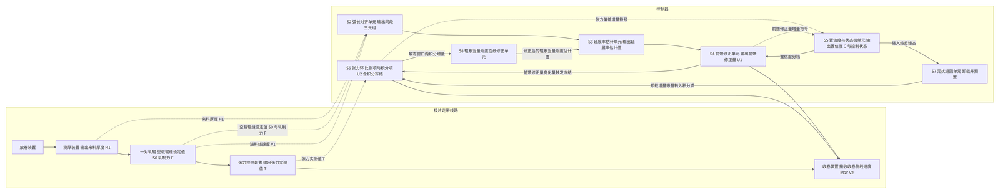
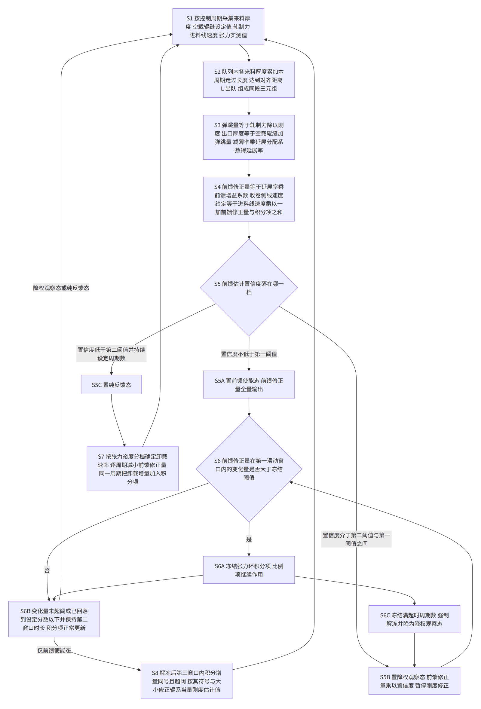
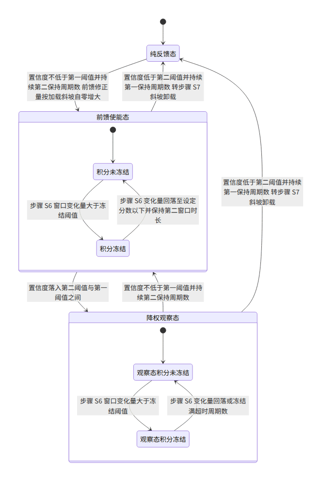

> 虚构演练案例。技术方案、调试数据、文献号、日期全部是编的，只用于演示本技能包的产物形态，不构成任何真实技术或法律主张。

发明名称：一种极片辊压机的张力前馈反馈协同控制方法

## 技术领域

本发明涉及锂离子电池极片制造装备的控制技术领域，具体涉及一种极片辊压机的张力前馈反馈协同控制方法。

## 背景技术

锂离子电池的极片由集流体金属箔和涂覆于其上的活性物质涂层构成。涂布干燥后的极片需要经过辊压工序，由一对相向转动的轧辊施加压力，把涂层中的孔隙压实，以提高压实密度。极片在辊压过程中厚度减薄，其中一小部分减薄量以纵向伸长的形式表现出来，因此辊压出口侧的极片线速度略高于进料侧的极片线速度，二者之比减一称为延展率。为了不让多出来的极片在辊压出口至收卷装置之间堆积或者被拉紧，收卷侧的线速度给定必须比进料线速度高出相应的比例。

现有的极片辊压张力控制通常采用两种做法。第一种是按极片牌号与幅宽查表得到张力设定值，收卷侧线速度给定取进料线速度乘以一个固定的超前比例，再叠加张力偏差经比例积分运算得到的修正量，形成张力闭环。第二种是在辊压机进出口两侧各装一台测厚装置，用进出口厚度实测值之比得到延伸率，据此前馈修正卷取侧速度给定，再叠加张力闭环的反馈修正量。

第一种做法的固定超前比例只能对应某一种来料厚度。实际生产中同一卷极片内部的来料厚度并不恒定：涂布起停位置、极片接头附近以及涂布本身的纵向波动都会使来料厚度在很短的极片长度内发生台阶式变化。来料变厚时被压掉的厚度更多，延展率随之增大，出料变快；固定的超前比例跟不上这一变化，多出来的极片长度只能靠张力段吸收，表现为张力下降；来料变薄时则表现为张力升高。由于张力检测信号需要滤波、收卷装置转动惯量大，张力闭环从偏差出现到把偏差拉回允许带内需要较长时间，在此期间极片已经走过相当长度，容易出现极片跑偏起皱，或者把涂层拉出暗裂乃至断带。

第二种做法把延展率变成在线量，方向是对的，但它要求辊压出口侧装有测厚装置。极片辊压机的出口空间通常被出料导辊组占据，难以安装；即使装上，极片离开辊缝后涂层会发生回弹，出口测得的厚度并不等于辊缝内的厚度，用它算出的延伸率与真正决定出料速度的那一段变形对不上。此外，进出口两台测厚装置分列辊缝两侧，同一段极片的两个厚度读数天然是成对的，一旦只有上游一台测厚装置，就出现了新的问题：上游测厚装置的测量点与辊缝之间相隔一段距离，它此刻读到的那一段极片要经过一段时间才会进入辊缝，如果读到即用，前馈会提前动作，反而制造出一次额外扰动；如果按固定时间延时，则在升速降速阶段延时与实际行程不再对应，仍然错位。

现有技术中另有一类做法，是在张力偏差绝对值超过设定阈值时暂停积分运算，待偏差回到阈值以内再恢复积分，用以抑制积分饱和。这类做法的触发依据是张力偏差本身，也就是反馈通道的量。在来料厚度台阶这种工况下，张力偏差是在扰动发生之后经过检测滤波和机械响应才建立起来的，等到偏差超过阈值时，积分项已经沿一个方向累积了一段时间；而在采用前馈的系统中，这段偏差恰恰是前馈正在处理的过渡过程所引起的，积分项对它再作用一次属于重复作用，过渡过程结束、前馈量回落之后，这部分多累积的积分量没有及时释放，就表现为反方向的张力偏差和更长的整定时间。

综上，现有技术在只有上游测厚装置的极片辊压机上，缺少一种既能实时估计延展率并据此前馈修正收卷侧线速度给定、又能在估计不可信时安全退回纯反馈、还能避免前馈过渡过程与张力环积分相互干扰的控制方法。

## 发明内容

本发明要解决的技术问题是：在辊压出口侧不设测厚装置的极片辊压机上，如何使收卷侧线速度给定实时跟随来料厚度变化引起的延展率变化，同时避免前馈过渡过程与张力环积分的重复作用，并在前馈估计不可信时不引入新的张力扰动。

为解决上述技术问题，本发明提供一种极片辊压机的张力前馈反馈协同控制方法。所述极片辊压机包括放卷装置、位于轧辊上游的测厚装置、一对轧辊、张力检测装置和收卷装置。所述方法按控制周期执行，包括步骤 S1 至 S7，并可选地包括步骤 S8。

本发明中使用的符号含义如下。来料厚度 H1 指测厚装置输出的极片总厚度，含集流体与两面涂层。空载辊缝设定值 S0 指轧辊在无轧制力时两辊工作面之间的间距设定值，采用预压方式时取负值。轧制力 F 指两侧压力传感器读数的平均值。辊系当量刚度估计值 K 指轧制力与其引起的辊系弹性张开量之比的估计值。辊系弹跳量 D 指轧制力引起的辊系弹性张开量，D 等于 F 除以 K。出口厚度 H2 指极片位于辊缝中时的厚度，H2 等于 S0 与 D 之和。减薄率 R 等于 H1 与 H2 之差除以 H1。延展分配系数 λ 指厚度减薄量中转化为纵向伸长的比例，其余部分表现为涂层致密化。延展率估计值 ε 等于 λ 与 R 之积。前馈增益系数 η 为不大于 1 的正数。前馈修正量 U1 等于 η 与 ε 之积，以进料线速度的比例表示。张力环积分项 U2 同样以进料线速度的比例表示。进料线速度 V1 取轧辊线速度。收卷侧线速度给定 V2 等于 V1 乘以 1 与 U1、U2 之和。张力设定值记为 T0，张力实测值记为 T，张力偏差 E 等于 T0 与 T 之差。张力上限 TL 为工艺允许的张力偏差上限。张力裕度 M 等于 TL 与 E 的绝对值之差再除以 TL。前馈估计置信度记为 C。对齐距离 L 指测厚装置测量点至辊缝之间的极片行程长度。控制周期记为 Ts。

步骤 S1，按控制周期采集来料厚度、空载辊缝设定值、轧制力、进料线速度和张力实测值。

步骤 S2，把每个控制周期采集到的来料厚度按顺序存入队列，并对队列中已有的每个来料厚度累加本控制周期内极片走过的长度，即进料线速度与控制周期之积。当队首来料厚度的累计走过长度达到对齐距离 L 时，将其出队，与本控制周期采集到的空载辊缝设定值和轧制力组成同段三元组。由于累加的是实际走过的长度而不是时间，升速降速阶段的对齐仍然成立。

步骤 S3，对同段三元组，先由轧制力除以辊系当量刚度估计值得到辊系弹跳量，再由空载辊缝设定值与辊系弹跳量之和得到出口厚度，再由来料厚度与出口厚度之差除以来料厚度得到减薄率，最后由减薄率乘以延展分配系数得到延展率估计值。

步骤 S4，由延展率估计值乘以前馈增益系数得到前馈修正量，把前馈修正量与张力环积分项之和叠加到进料线速度上，得到收卷侧线速度给定并输出至收卷装置。

步骤 S5，由两组依据确定前馈估计置信度。第一组是输入有效性检查，包括来料厚度数据的年龄、相邻控制周期空载辊缝设定值的变化量、轧制力是否落在标定区间之内。第二组是前馈与反馈的符号一致性统计：在最近若干控制周期内，逐周期计算前馈修正量增量的符号与张力偏差绝对值增量的符号之积，取其均值。前馈方向正确时，前馈修正量增大应当使张力偏差绝对值减小，符号之积为负；若该均值持续为正，说明前馈估计的方向是错的，即使各项输入检查都通过也不应继续信任前馈。按置信度所处的档位，把控制状态置为前馈使能态、降权观察态或纯反馈态。

步骤 S6，在前馈使能态与降权观察态下，当前馈修正量在第一滑动窗口内的变化量绝对值大于冻结阈值时，冻结张力环积分项，使其在冻结期间保持不变，而张力环比例项继续作用；当该变化量绝对值回落到冻结阈值的设定分数以下并保持第二窗口时长后解除冻结。这一步是本发明的第一个协同点：冻结与否不由张力偏差决定，而由前馈通道的中间量决定，因此冻结在前馈量开始变化的同一控制周期就已生效，早于张力偏差建立起来的时刻。

步骤 S7，当控制状态转入纯反馈态时，不把前馈修正量置零，而是按张力裕度所在的分档确定卸载速率，每个控制周期把前馈修正量减小一个卸载增量直至为零，同时在同一控制周期把该卸载增量加到张力环积分项上。由于收卷侧线速度给定取决于前馈修正量与张力环积分项之和，卸载增量在两者之间等量转移，控制器总输出在切换过程中保持连续。

步骤 S8 为可选步骤：在解除冻结后的第三窗口内，若张力环积分项的增量为同号且其绝对值大于修正阈值，则按该增量的符号与大小修正辊系当量刚度估计值，并把修正后的估计值限制在标定值的设定范围之内。其机理是：前馈量正确时，解冻窗口内积分项只需要在零附近小幅波动；若积分项持续朝增大收卷侧线速度给定的方向累积，说明前馈给出的延展率偏小，也就是出口厚度估计偏大，也就是辊系弹跳量估计偏大，也就是辊系当量刚度估计值偏小，应当增大它。这一步是本发明的第二个协同点：反馈通道的中间量反过来修正了前馈通道的模型参数。

与现有技术相比，本发明的有益效果如下。

第一，在辊压出口侧不设测厚装置的条件下得到了在线的延展率估计值。出口厚度由空载辊缝设定值与辊系弹跳量推算，反映的是极片在辊缝内被压到的厚度，不受出辊后涂层回弹的影响。

第二，来料厚度与辊缝、轧制力按累计走过长度对齐，前馈动作发生在这段极片实际进入辊缝的时刻，升速降速阶段同样成立，避免了读到即用造成的提前扰动和固定延时造成的错位。

第三，积分冻结由前馈修正量的变化率触发，比由张力偏差触发提前动作，避免了前馈过渡过程与张力环积分的重复作用。在本申请实施例的调试条件下，来料厚度由 180 μm 台阶式升到 196 μm 时，纯反馈的张力峰值偏差为 22 N、回到 ±10 N 带内需要 1.6 s；只加前馈不冻结积分时峰值偏差降到 9 N，但台阶过去后出现 14 N 的反方向偏差、总整定时间反而增至 2.1 s；前馈与积分冻结同时作用时峰值偏差为 6 N、未观察到反方向偏差、整定时间为 0.5 s。上述数据在幅宽 600 mm 的负极极片、线速度 60 m/min、张力设定值 120 N 的条件下取得，其他配方与工况下的具体数值会有差别。

第四，前馈估计不可信时按张力裕度分档斜坡卸载并把卸载量同步预置入积分项，切换过程中控制器总输出连续，不会因为撤除前馈本身再造成一次张力扰动。

第五，解冻窗口内积分项的走向被用来在线修正辊系当量刚度估计值，使前馈模型在辊面磨损、温度变化引起刚度漂移时仍能保持精度，而不需要停机重新标定。

## 附图说明

图 1 是本发明实施例的极片辊压机张力控制系统框图；

图 2 是本发明实施例的控制流程图；

图 3 是本发明实施例的控制状态迁移图。

## 具体实施方式

下面结合附图对本发明的实施方式进行说明。以下实施例中的具体数值为示例值，不作为对权利要求保护范围的限制。

### 一、系统构成

如图 1 所示，本实施例的极片辊压机沿极片走带方向依次设有放卷装置、测厚装置、一对轧辊、张力检测装置和收卷装置。测厚装置为射线式测厚仪，其测量点至辊缝之间的极片行程长度即对齐距离 L 为 0.85 m。轧辊采用液压压下，空载辊缝设定值 S0 可设为负值以实现预压。两侧压力传感器输出取平均得到轧制力 F。张力检测装置为装在辊压出口至收卷装置之间导辊轴承座上的测力传感器，输出张力实测值 T。辊压出口侧不设测厚装置。

控制器按控制周期 Ts 等于 2 ms 运行，内部划分为弧长对齐单元、延展率估计单元、前馈修正单元、置信度与状态机单元、张力环、无扰退回单元和辊系当量刚度在线修正单元，分别执行步骤 S2 至 S8。

本实施例的工况参数为：极片幅宽 600 mm，负极极片，名义来料厚度 H1 等于 180 μm，进料线速度 V1 等于 60 m/min，张力设定值 T0 等于 120 N，工艺允许的张力偏差上限 TL 等于 10 N。

### 二、步骤 S1，采集

每个控制周期采集一次来料厚度 H1、空载辊缝设定值 S0、轧制力 F、进料线速度 V1 和张力实测值 T。V1 由轧辊编码器折算得到。采集值连同其采集周期序号一并保存，供步骤 S5 的数据年龄检查使用。

### 三、步骤 S2，按累计走过长度对齐

测厚装置装在辊缝上游，它在某一控制周期读到的来料厚度，对应的是当时正位于测量点的那一段极片；这一段极片要再走过对齐距离 L 才进入辊缝。因此不能读到即用，也不宜按固定时间延时。

本实施例的做法是：设一个先进先出队列，每个控制周期把新采到的来料厚度作为一个条目压入队尾，条目附带一个累计走过长度字段，初值为零。同一控制周期内，对队列中已有的每个条目，把本周期极片走过的长度，即 V1 与 Ts 之积，累加到它的累计走过长度字段上。然后检查队首条目：若其累计走过长度已经达到 L，则将其出队，与本控制周期采集到的 S0 和 F 组成同段三元组，送入步骤 S3。

在 V1 等于 60 m/min 即 1.0 m/s 时，一段极片走完 0.85 m 需要 0.85 s，折合 425 个控制周期，队列深度为 425。在起车爬升段，V1 由 0 增至 60 m/min，同一段极片走完 0.85 m 所需的周期数远大于 425，队列会自动等到累计长度达标才出队，因此对齐关系仍然成立。队列容量按最低线速度对应的最大周期数留出余量，本实施例取 4000。

### 四、步骤 S3，延展率估计

对同段三元组按下列各式计算。

辊系弹跳量：D 等于 F 除以 K。

出口厚度：H2 等于 S0 与 D 之和。

减薄率：R 等于 H1 与 H2 之差除以 H1。

延展率估计值：ε 等于 λ 与 R 之积。

其中辊系当量刚度估计值 K 的标定值由停机标定得到：空载时把辊缝设到两辊刚接触处并记位移零点，然后分档加载并读辊缝位移，本实施例在 300 kN、620 kN、900 kN 三档下分别读到 76 μm、154 μm、227 μm，三点线性度良好，标定值取 4.0 kN/μm。延展分配系数 λ 由同配方极片的离线试验得到，本实施例负极 A 配方取 0.05，其物理含义是厚度减薄量中约二十分之一转化为纵向伸长，其余部分表现为涂层孔隙被压实。

稳定段算例：S0 等于 −20 μm，F 等于 620 kN，则 D 等于 620 除以 4.0 等于 155 μm，H2 等于 −20 加 155 等于 135 μm；H1 等于 180 μm，则 R 等于 180 减 135 再除以 180，等于 0.250；ε 等于 0.05 乘 0.250，等于 0.0125，即 1.25%。

### 五、步骤 S4，前馈修正与速度给定

前馈修正量 U1 等于 η 与 ε 之积。本实施例 η 取 0.8，则 U1 等于 0.8 乘 0.0125，等于 0.0100，即 1.00%。

收卷侧线速度给定 V2 等于 V1 乘以 1 与 U1、U2 之和。稳定段 U2 在零附近小幅波动，此时 V2 约等于 60 乘 1.0100，等于 60.60 m/min。

η 取小于 1 的值，是因为延展率估计值本身带有误差，前馈只承担其中大部分，余下部分留给张力环处理；η 取值过大时估计误差会被直接放大成速度给定误差。本实施例 η 的可用范围为 0.6 至 0.9。

### 六、步骤 S5，置信度与控制状态

置信度 C 等于有效性因子与符号一致性因子之积。

有效性因子取 1 或 0。下列三项检查全部通过时取 1，任一项不通过时取 0：来料厚度数据的年龄不超过 3 个控制周期；相邻控制周期空载辊缝设定值的变化量绝对值不超过 2 μm；轧制力落在标定区间内，本实施例为标称值的 0.5 倍至 1.5 倍，即 310 kN 至 930 kN。

符号一致性因子由前馈与反馈的配合方向决定。逐控制周期计算前馈修正量的增量与张力偏差绝对值的增量，取二者符号之积，在最近 N 个控制周期内求均值，记为 m。本实施例 N 取 100，即 200 ms。前馈方向正确时，前馈修正量增大会使张力偏差绝对值减小，符号之积为负；因此 m 越接近 −1 越可信。符号一致性因子取 m 的限幅线性映射：m 不大于 −0.2 时取 1；m 不小于 0.2 时取 0；介于两者之间时按 0.2 减 m 再除以 0.4 计算。

控制状态按 C 的档位确定：C 不小于第一阈值 0.7 时为前馈使能态；C 落在第二阈值 0.3 与第一阈值之间时为降权观察态；C 小于 0.3 并持续第一保持周期数 50 个周期即 100 ms 时转入纯反馈态。由纯反馈态返回前馈使能态需要 C 不小于 0.7 并持续第二保持周期数 500 个周期即 1 s，且前馈修正量按加载斜坡自零增大至计算值。两个方向的保持周期数不同，形成滞回，避免在阈值附近反复切换。

降权观察态下，步骤 S4 输出的前馈修正量再乘以 C，并暂停步骤 S8 的辊系当量刚度修正。

有效性检查只能挡住明显的坏数据。以本实施例调试期间记录到的一次测厚装置故障为例：测量窗口积粉后读数由 181 μm 跳到 412 μm 并持续 6 s，期间辊缝信号与轧制力都正常，仅靠上述三项检查中的后两项无法识别。符号一致性统计能够识别这一类故障：读数跳高使前馈修正量被顶高，张力随之升高、偏差绝对值增大，符号之积转为正，m 在 200 ms 内越过 0.2，C 降到 0，随即转入纯反馈态。

### 七、步骤 S6，前馈变化率触发的积分冻结

张力环由比例项和积分项构成，其输出即 U2。步骤 S6 只作用于积分项。

冻结判据：取第一滑动窗口为 100 个控制周期即 200 ms，计算 U1 在该窗口内的变化量绝对值；大于冻结阈值 θ 时冻结积分项。本实施例 θ 取 0.010 个百分点，在 V1 等于 60 m/min 时折合 0.006 m/min。

解冻判据：该变化量绝对值回落到 θ 的一半即 0.005 个百分点以下，并保持第二窗口时长 20 个控制周期即 40 ms 后解除冻结。

冻结期间积分项保持不变，比例项照常作用，因此突发扰动仍然能被张力环快速抑制，只是不再被积分累积。

超时保护：冻结持续时长达到超时周期数 300 个周期即 600 ms 时强制解除冻结，并把控制状态置为降权观察态。设置该保护是因为前馈信号若长期抖动，冻结判据可能长期成立，积分项被长期锁死会使稳定段静差无法消除。

来料厚度台阶算例：来料厚度由 180 μm 台阶式升到 196 μm，台阶过渡长度约 0.3 m，在 60 m/min 下约 0.3 s。台阶进入辊缝后，恒辊缝控制下轧制力由 620 kN 升到 660 kN，则 D 等于 660 除以 4.0 等于 165 μm，H2 等于 −20 加 165 等于 145 μm，R 等于 196 减 145 再除以 196，等于 0.2602，ε 等于 0.05 乘 0.2602，等于 0.01301，U1 等于 0.8 乘 0.01301，等于 0.01041，即 1.041%。U1 由 1.000% 变为 1.041%，变化 0.041 个百分点，发生在 0.3 s 内。取 200 ms 窗口，窗口内变化量约为 0.041 乘以 0.2 除以 0.3，等于 0.027 个百分点，大于 θ 等于 0.010 个百分点，冻结成立。

该冻结在 U1 开始变化的同一控制周期即已成立，而张力偏差此时尚未建立。作为对比，按张力偏差触发的做法要等偏差绝对值超过阈值才动作，本实施例调试中该时刻比前馈量开始变化晚约 0.2 s，此时积分项已经沿一个方向累积了一段。

### 八、步骤 S7，不可信时的无扰退回

转入纯反馈态时，前馈修正量不置零，按下式逐周期卸载。

张力裕度 M 等于 TL 与 E 的绝对值之差再除以 TL。

卸载速率按 M 分为三档：M 不小于第一裕度阈值 0.6 时取第一卸载速率 0.60 个百分点每秒；M 落在第二裕度阈值 0.3 与 0.6 之间时取第二卸载速率 0.25 个百分点每秒；M 小于 0.3 时取第三卸载速率 0.10 个百分点每秒。裕度大说明当前张力离允许上限还远，可以卸得快；裕度小说明张力已经接近上限，卸得慢一些，避免卸载本身再制造一次冲击。

每个控制周期的卸载增量等于卸载速率与 Ts 之积。同一控制周期把该卸载增量加到 U2 上。由于 V2 取决于 U1 与 U2 之和，U1 减少多少、U2 就增加多少，V2 在切换过程中保持连续。

算例：切换时 U1 等于 1.00 个百分点，E 的绝对值等于 5.5 N，TL 等于 10 N，则 M 等于 10 减 5.5 再除以 10，等于 0.45，落在第二档，卸载速率取 0.25 个百分点每秒，卸载耗时 1.00 除以 0.25 等于 4.0 s。每个控制周期卸载 0.25 乘以 0.002 等于 0.0005 个百分点，同一周期 U2 增加 0.0005 个百分点，在 V1 等于 60 m/min 时折合 0.0003 m/min，V2 无阶跃。

### 九、步骤 S8，辊系当量刚度在线修正

解除冻结后取第三窗口 250 个控制周期即 500 ms，记该窗口内 U2 的增量为 ΔU2。若 ΔU2 在窗口内始终同号，且其绝对值大于修正阈值 0.05 个百分点，则按下式修正辊系当量刚度估计值：新的 K 等于原 K 乘以 1 加上修正系数 μ 与 ΔU2 符号及归一化幅度之积。本实施例 μ 取 0.02，归一化幅度取 ΔU2 的绝对值除以参考值 0.20 个百分点后对 1 限幅，即单次修正幅度不超过 2%。修正后的 K 限制在标定值 4.0 kN/μm 的 ±15% 之内，即 3.4 至 4.6 kN/μm。

方向约定：ΔU2 朝增大收卷侧线速度给定的方向累积时，说明前馈给出的延展率偏小，即出口厚度估计偏大，即辊系弹跳量估计偏大，即 K 偏小，应当增大 K；反之减小 K。

算例：某解冻窗口内 ΔU2 等于 +0.10 个百分点且始终同号，大于修正阈值 0.05；归一化幅度等于 0.10 除以 0.20 等于 0.5；则新的 K 等于 4.0 乘以 1 加 0.02 乘 0.5，等于 4.0 乘 1.01，等于 4.04 kN/μm。以修正后的 K 重算稳定段：D 等于 620 除以 4.04 等于 153.5 μm，H2 等于 133.5 μm，R 等于 180 减 133.5 再除以 180 等于 0.2583，ε 等于 0.01292，U1 等于 0.01033，即 1.033%，比修正前的 1.000% 略有增大，方向与积分项的走向一致。

降权观察态与纯反馈态下不执行本步骤，避免用不可信的前馈量去污染模型参数。

### 十、实施例一：稳定段

来料厚度稳定在 180 μm 附近，波动不超过 ±2 μm。S2 每周期出队一个来料厚度并与当周期的 S0、F 配对；S3 给出 ε 约 1.25%；S4 给出 U1 约 1.00%；S5 中三项有效性检查通过，符号一致性统计的均值 m 在 −0.4 附近，C 等于 1，控制状态为前馈使能态；S6 中 U1 在 200 ms 窗口内的变化量约 0.002 个百分点，小于 θ，积分项不冻结，U2 承担剩余静差，稳定段张力偏差在 ±1 N 以内；S8 因为解冻事件未发生而不触发。

### 十一、实施例二：来料厚度台阶

这是本发明的主路径。按第七节的算例，台阶段 U1 由 1.000% 升至 1.041%，S6 在 U1 开始变化的当周期冻结积分项。冻结期间比例项继续作用，张力峰值偏差为 6 N，未超出 ±10 N 带。台阶过去后 U1 的窗口变化量回落到 0.005 个百分点以下并保持 40 ms，冻结解除。解冻后 500 ms 窗口内 ΔU2 若同号且超阈，则触发 S8 修正 K。

与两种对照做法相比：纯反馈时峰值偏差 22 N、整定 1.6 s；前馈而不冻结积分时峰值偏差 9 N，但台阶后出现 14 N 反方向偏差、整定 2.1 s；本实施例峰值偏差 6 N、未观察到反方向偏差、整定 0.5 s。前馈而不冻结积分之所以整定更慢，是因为台阶期间的张力偏差本来就是前馈过渡过程引起的，积分项对它再作用一次属于重复作用，多累积的量在台阶结束后才释放出来。

### 十二、实施例三：测厚装置故障与退回

测厚装置读数由 181 μm 跳到 412 μm 并持续 6 s，辊缝与轧制力信号正常。前馈修正量被顶高，张力随之升高，前馈修正量增量与张力偏差绝对值增量的符号之积转为正，m 在约 200 ms 内越过 0.2，符号一致性因子降到 0，C 等于 0，持续 50 个周期后转入纯反馈态。此时 E 的绝对值约 5.5 N，M 等于 0.45，按第二档卸载速率 0.25 个百分点每秒卸载，4.0 s 卸完，卸载增量逐周期转入 U2，V2 无阶跃。作为对比，若把前馈修正量一次性置零，本实施例调试中记录到张力在 0.3 s 内下降 26 N、需要 1.9 s 才拉回带内。

故障排除后，测厚读数恢复正常，符号一致性因子回升，C 回到 1 并保持 500 个周期后返回前馈使能态，前馈修正量按加载斜坡自零增大至计算值。

### 十三、其他实施方式

上述实施例中的张力设定值取单一值。作为另一种实施方式，也可以沿极片长度分区设定不同的张力目标值，例如极片接头段采用低于稳定段的张力目标值。该分区方式与本发明的前馈反馈协同机制彼此独立，可以叠加使用，本文不作展开。

本发明的方法同样适用于正极极片辊压，此时延展分配系数 λ 需按正极配方另行标定，本实施例正极 B 配方的离线试验值为 0.03。

以上所述仅为本发明的较佳实施例，凡在本发明精神和原则之内所作的任何修改、等同替换和改进，均应包含在本发明的保护范围之内。

## 权利要求书

1. 一种极片辊压机的张力前馈反馈协同控制方法，所述极片辊压机沿极片走带方向依次设有放卷装置、位于轧辊上游的测厚装置、一对轧辊、张力检测装置和收卷装置，所述辊压机的辊压出口侧不设测厚装置，其特征在于，所述方法按控制周期执行，包括：S1，采集所述测厚装置输出的来料厚度、所述轧辊的空载辊缝设定值与轧制力、进料线速度以及所述张力检测装置输出的张力实测值；S2，将各控制周期采集到的来料厚度按顺序存入先进先出队列，并在每个控制周期对队列中已有的各来料厚度累加本控制周期内极片走过的长度，当队首来料厚度的累计走过长度达到所述测厚装置的测量点至辊缝之间的对齐距离时，将该来料厚度出队并与本控制周期采集到的空载辊缝设定值和轧制力组成同段三元组；S3，对所述同段三元组，以所述轧制力除以辊系当量刚度估计值得到辊系弹跳量，以所述空载辊缝设定值与所述辊系弹跳量之和作为出口厚度，以所述来料厚度与所述出口厚度之差除以所述来料厚度得到减薄率，以所述减薄率乘以延展分配系数得到延展率估计值；S4，以所述延展率估计值乘以前馈增益系数得到前馈修正量，将所述前馈修正量与张力环积分项之和叠加于所述进料线速度得到收卷侧线速度给定，并输出至所述收卷装置；S5，由输入有效性检查结果和符号一致性统计值确定前馈估计置信度，所述符号一致性统计值为最近设定个数的控制周期内前馈修正量增量的符号与张力偏差绝对值增量的符号之积的均值，并按所述前馈估计置信度所处档位将控制状态置为前馈使能态、降权观察态或纯反馈态；S6，在所述前馈使能态和所述降权观察态下，当所述前馈修正量在第一滑动窗口内的变化量绝对值大于冻结阈值时，冻结所述张力环积分项使其在冻结期间保持不变且张力环比例项继续作用，当所述变化量绝对值回落至所述冻结阈值的设定分数以下并保持第二窗口时长后解除冻结；S7，当所述控制状态转入所述纯反馈态时，按张力裕度所处的分档确定卸载速率，在每一控制周期将所述前馈修正量减小一个由所述卸载速率与所述控制周期之积确定的卸载增量直至所述前馈修正量为零，并在同一控制周期将所述卸载增量加入所述张力环积分项，所述张力裕度为张力偏差上限与张力偏差绝对值之差除以所述张力偏差上限。

2. 根据权利要求 1 所述的方法，其特征在于，还包括：S8，在解除冻结后的第三窗口内，当所述张力环积分项的增量在该窗口内始终同号且其绝对值大于修正阈值时，按所述增量的符号与幅度修正所述辊系当量刚度估计值，并将修正后的辊系当量刚度估计值限制在标定值的设定范围之内；其中所述张力环积分项朝增大所述收卷侧线速度给定的方向累积时增大所述辊系当量刚度估计值，反之减小所述辊系当量刚度估计值。

3. 根据权利要求 1 所述的方法，其特征在于，所述前馈估计置信度为有效性因子与符号一致性因子之积；所述有效性因子在来料厚度的数据年龄不超过设定周期数、相邻控制周期的空载辊缝设定值变化量绝对值不超过设定值、以及所述轧制力落在标定区间内三项检查均通过时取 1，任一项不通过时取 0；所述符号一致性因子由所述符号一致性统计值经限幅线性映射得到，所述符号一致性统计值不大于第一映射端点时所述符号一致性因子取 1，不小于第二映射端点时取 0，介于两者之间时按线性内插取值。

4. 根据权利要求 1 所述的方法，其特征在于，所述冻结的持续时长达到冻结超时周期数时强制解除冻结，并将所述控制状态置为所述降权观察态。

5. 根据权利要求 2 所述的方法，其特征在于，所述降权观察态下将 S4 得到的前馈修正量再乘以所述前馈估计置信度后输出，且在所述降权观察态和所述纯反馈态下不执行 S8 的辊系当量刚度估计值修正。

6. 根据权利要求 1 所述的方法，其特征在于，由所述前馈使能态或所述降权观察态转入所述纯反馈态的条件为所述前馈估计置信度小于第二阈值并持续第一保持周期数；由所述纯反馈态返回所述前馈使能态的条件为所述前馈估计置信度不小于第一阈值并持续第二保持周期数，且所述前馈修正量按加载斜坡自零增大至由 S4 得到的值，所述第二保持周期数大于所述第一保持周期数。

7. 根据权利要求 1 所述的方法，其特征在于，所述卸载速率分为三档：所述张力裕度不小于第一裕度阈值时取第一卸载速率，所述张力裕度落在第二裕度阈值与所述第一裕度阈值之间时取第二卸载速率，所述张力裕度小于所述第二裕度阈值时取第三卸载速率；所述第一卸载速率大于所述第二卸载速率，所述第二卸载速率大于所述第三卸载速率。

8. 根据权利要求 1 所述的方法，其特征在于，所述前馈增益系数取 0.6 至 0.9 之间的值。

## 说明书摘要

本发明公开一种极片辊压机的张力前馈反馈协同控制方法，用于辊压出口侧不设测厚装置的极片辊压机。该方法按累计走过长度将上游来料厚度与辊缝、轧制力对齐成同段三元组，由轧制力与辊系当量刚度得到弹跳量并推算出口厚度，再由减薄率与延展分配系数估计延展率，据此前馈修正收卷侧线速度给定；当前馈修正量在滑动窗口内的变化量超过冻结阈值时冻结张力环积分项，避免前馈过渡过程与积分作用重复；由输入有效性与前馈反馈符号一致性确定置信度，置信度过低时按张力裕度分档斜坡卸载前馈量并把卸载量同步预置入积分项，实现无扰退回。

---

本输出为撰写辅助，不构成法律意见，不保证授权，不代为提交。
