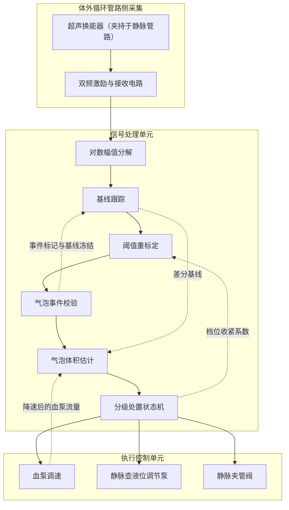
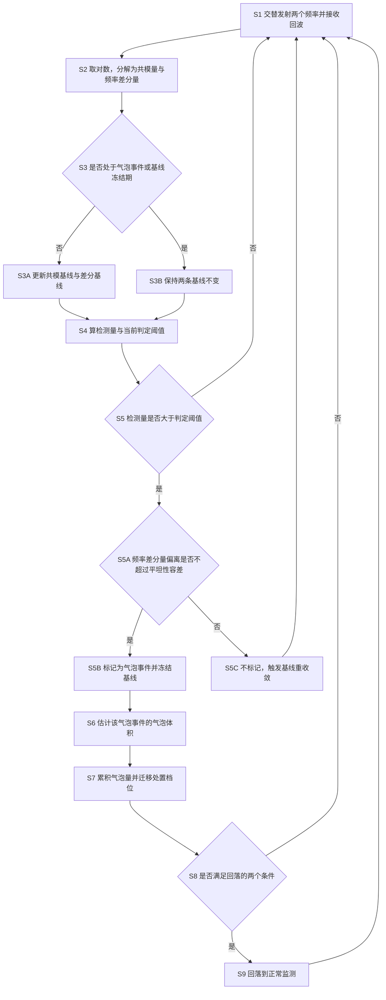

> 虚构演练案例。技术方案、试验数据、文献号、日期全部是编的，只用于演示本技能包的产物形态，不构成任何真实技术、医疗或法律主张。

# 技术交底书

- 案件名称：一种血液透析体外循环管路气泡检测与分级处置方法
- 技术联系人：姓名（待填）／电话（待填）／邮箱（待填）
- 专利类型：发明

## 注意事项

一、这份交底书是写给代理人看的，他不认识这个项目。背景技术和技术方案都要写全、写清楚，让他读完能自己排出权利要求。

二、公开程度以本领域普通技术人员不用创造性劳动就能实施为准。参数取值、判据、分支和异常处理都要写出来，不能只写"按经验设定"。

三、代理人来问的时候请认真回答、及时补材料。特别是标为"拟议待验证"的几条，代理人要据此判断能不能写进独立权利要求。

---

## 一、背景与现有技术

**检索说明。** 本案共做了五轮，第一轮在 Google Patents 与 IEEE Xplore 用英文检索双频超声气泡检测；第二轮在国知局公布公告用中文关键词检索报警阈值设定与分级处置；第三轮在国知局公布公告按分类号 A61M1 与 G01N29 收口，并在 CNKI 补检中文论文；另有一轮材料分析和一轮台架实测取舍。未覆盖的范围是：Espacenet 全文、日文专利、CNKI 之外的中文期刊库。下述五条中，四条读过全文，一条只读到摘要。过程按检索轨迹台账单独记录，本节只放结论。

**关于公开源 URL。** 本案是虚构演练案例，下列文献号与论文均为编造，没有可打开的公开源。真实案件中本栏必须填写撰写时实际打开并确认与文献号对应的 URL，打不开的条目不写进本节。

### 1.1 现有技术

按技术方向分成三类。

**方向一：单频固定阈值检测。**

（1）某透析机气泡检测模块技术说明书（虚构版本 2.1，2023-05，某设备厂商）。技术方案：单片超声换能器夹持在静脉管路上，单一频率发射，取回波幅值；幅值低于阈值且连续若干个采样均低于阈值时判为气泡，输出停泵与夹管信号。阈值为出厂固定值，上机前对空管做一次自校准，取空管幅值的固定百分比。应用场景：血液透析机静脉管路空气监测。局限性（读过全文）：阈值在整个治疗过程中不变，无法跟随管腔内液体声学性质和换能器贴合状态的缓慢变化；其门限折算成截面遮挡比例约为 0.45，单个体积很小的气泡逐个判断时检不出。公开源 URL：无（虚构案例）。

（2）CN199801733A，一种血液透析气泡报警阈值设定方法（虚构申请人）。技术方案：治疗开始前读取外部输入的化验值，按查表方式一次性设定报警阈值；检测仍为单频幅值过阈。应用场景：血液透析气泡报警。局限性（读过全文）：阈值取值确实与血液状态有关，但取值来自外部输入的化验值而非检测通道本身，且治疗开始后不再更新；而基线漂移恰恰集中在治疗后半程，因此对本案要解决的误触发问题作用有限。公开源 URL：无（虚构案例）。

**方向二：双频或多频超声用于目标鉴别。**

（3）CN199800456A，一种体外循环管路气泡超声检测装置及方法（虚构申请人）。技术方案：同一超声换能器交替发射两个频率的超声脉冲，比较两路回波幅值，据此区分管腔内气泡与管壁附着物；判定为气泡后直接输出停泵信号。应用场景：体外循环管路空气监测。局限性（读过全文）：两个频率的比较结果只用作一次性的二分判断，既不用于修正判定阈值，也不在判为非气泡时对基线作任何处理；处置只有"停泵"一档，没有按量分级。公开源 URL：无（虚构案例）。

（4）CN199801177A，双频超声微粒计数方法及装置（虚构申请人）。技术方案：双频发射，对两路回波幅值取对数后作和差分解，用于液体中固体微粒的计数与粒径估计。应用场景：工业流体在线颗粒监测。局限性（读过全文）：对象是固体微粒不是气泡，不涉及管路安全控制，也不涉及泵阀执行部件；该文献说明"双频对数幅值的和差分解"这一数学处理本身在相邻领域并不新鲜，本案的区别不能落在这一步上。公开源 URL：无（虚构案例）。

（5）何澜、吴敬远 2021（虚构论文），全血 MHz 段超声衰减的频率依赖性及其对气泡检测阈值的影响。技术方案：测量全血在 MHz 段的衰减频率依赖性，并讨论其对气泡检测阈值的影响。结论主张：双频回波幅值比在常见散射范围内与介质成分无关，可作为不受介质影响的稳定判据。应用场景：气泡检测器设计。局限性（读过全文）：该结论与本案台架试验 A 的观察不一致——本案在 2.0 MHz 与 5.0 MHz 这一频率对上测得三档标定介质的差分基线分别为 0.48、0.62、0.95，明显分开。该文实际上劝阻本领域技术人员把频率差分信息用作介质状态的估计通道，对本案是有利的反向教导材料。公开源 URL：无（虚构案例）。

**方向三：基线补偿与分级处置。**

（6）CN199804260A，基于夹持压力传感的超声气泡检测基线补偿方法（虚构申请人）。技术方案：在换能器夹具上增设压力传感器，以夹持力读数补偿回波幅值基线。应用场景：体外循环气泡检测。局限性（读过全文）：需要增加传感器与结构件；只能补偿贴合状态的变化，不能补偿管腔内液体自身声学性质的变化。公开源 URL：无（虚构案例）。

（7）CN199802914A，一种输液管路气泡分级报警方法（虚构申请人）。技术方案：按单个气泡的尺寸分为提示、减速和停机三档，尺寸由单频幅值经单点查表得到。应用场景：输液管路空气监测。局限性（读过全文）：只按单泡尺寸分档，没有一段时间内的累积量这一路触发依据；分档结果不回作用于检测环节，尺寸估计所用的映射也不随介质状态变化。公开源 URL：无（虚构案例）。

（8）CN199803508A，血液净化设备静脉壶液位自动调节装置（虚构申请人）。技术方案：液位调节泵抬升静脉壶液位，使气体在静脉壶内浮出。应用场景：血液净化设备。局限性（读过全文）：只是执行手段，不涉及何时启用、按什么判据启用。公开源 URL：无（虚构案例）。

（9）CN199805021A，一种气泡检测器自校准方法（虚构申请人）。**只读摘要，未取得全文**（全文下载被验证码阻断）。摘要出现"微泡计数"字样。局限性：摘要未见涉及双频或介质状态估计，但因未读到全文，此处只能记"摘要未见"，不能断言其未做。代理人如需，本条应补取全文后再判。公开源 URL：无（虚构案例）。

### 1.2 现有技术的缺点

- 缺点一：判定阈值在治疗过程中固定不变，不跟随管腔内液体声学性质与换能器贴合状态的缓慢变化，基线一漂就误触发停泵。对应 1.1 的（1）（2）。
- 缺点二：单频幅值下降这一个量，把"管腔进了气"和"液体性质或贴合状态变了"混在一起，现有方案在检测通道内没有把二者分开的手段。对应 1.1 的（1）（3）。
- 缺点三：区分气泡与非气泡的双频信息只被用作一次性二分，用完即弃，没有回流到阈值计算或基线维护。对应 1.1 的（3）。
- 缺点四：判为非气泡之后不对基线作任何处理，基线仍停在旧工作点，下一次仍会误触发。对应 1.1 的（3）。
- 缺点五：只按单个气泡的幅值或尺寸判断，缺少一段时间内累积气体量这一路依据，成串的微小气泡逐个都够不着阈值而被整体漏过。对应 1.1 的（1）（7）。
- 缺点六：处置只有"报警停泵"一档，或者虽然分档但分档结果与检测环节解耦，档位改变泵速之后体积估计仍沿用旧流速。对应 1.1 的（1）（3）（7）。
- 缺点七：补偿基线需要增加传感器与结构件，成本与结构改动大，且只补贴合不补介质。对应 1.1 的（6）。

**申请人现状（不属于现有技术）。** 申请人自己在售机型上曾试过"用最近一段时间的幅值滑动平均作基线"，结果连续到达的气泡会把基线一路带低，后面的气泡反而更不容易报；后来加了"报警期间不更新基线"有所改善，但耦合漂移与气泡在单频幅值上仍然分不开。申请人另做过一个读化验值定阈值的内部版本，未上市。这两条是申请人现状，不作为现有技术引用。

## 二、要解决的技术问题

- 对缺点一：使判定阈值在治疗全程随管腔内液体的实际声学状态在线重标定，而不是治疗前设定一次。
- 对缺点二：在同一个检测通道内，把"管腔被气体遮挡"和"液体声学性质或贴合状态变化"这两种幅值下降分开。
- 对缺点三：让区分二者所用的信息继续参与阈值计算，而不是判完就丢。
- 对缺点四：判为非气泡时主动让基线重新收敛到新的工作点，而不是原地不动。
- 对缺点五：在单泡判据之外增加一路"一段时间内累积气体体积"的触发依据，使成串的微小气泡能被处置。
- 对缺点六：把处置分成记录、减速排气、停泵夹管三档，并让当前档位反过来修正判定阈值与体积估计所用的流速。
- 对缺点七：以上全部只用同一片超声换能器的回波实现，不增加传感器与结构件。

## 三、技术方案详述

### 3.1 背景

**场景与参与者。** 血液透析治疗时，血液经动脉管路引出、经透析器后由静脉管路回输患者体内。为防止空气进入静脉管路，静脉管路上夹持一片超声换能器构成气泡检测器。参与工作的主体有四个：夹持在体外循环管路上的超声换能器（连同双频激励与接收电路）、信号处理单元、执行控制单元，以及被控制的三个执行部件——血泵、静脉壶液位调节泵、静脉夹管阀。信号处理单元每 0.5 ms 从换能器拿到一对回波幅值，判断管腔内有没有气泡、气泡多大、一段时间内累积了多少，然后决定执行控制单元该做什么。整套处理只面向体外循环管路管腔内的声学量与设备执行部件，不面向人体。

**体外循环管路上的气泡怎么进入本系统。** 换能器夹在静脉壶下游约 9 cm 处的直管段上，用弹簧压板夹紧，接触面涂耦合剂。管路为标准静脉血路，内径 4.0 mm、壁厚 1.0 mm。上机装管时换能器随夹具扣合到管路上，机器在上血之前对空管做一次幅值记录作为初始参考；上血之后共模基线与差分基线由指数平滑自行建立，不需要人工输入任何数值。气泡随血流由上游进入换能器所在的声路，遮挡声路造成回波幅值下降，本系统即由此感知它。

**高频术语的场景定义。** 脉冲对指一次第一频率发射接收与紧随其后的一次第二频率发射接收，二者合为一个采样单元；相邻脉冲对起点之间的间隔叫脉冲对重复周期。共模量指一个脉冲对两路回波幅值取对数后之和的一半，管腔被气体遮挡时它下降，整体传输损失增大时它也下降。频率差分量指同一脉冲对两路对数幅值之差，它反映两个频率之间传输损失的差异，气泡遮挡时基本不变。共模基线与差分基线分别是二者的指数平滑值，只在当前脉冲对未被标记为气泡事件且不处于基线冻结期时才更新，其余时候原地保持，这一点靠事件校验环节回送的标记来判定。检测量指共模基线与当前共模量之差再除以共模量的滚动标准差，无量纲。判定阈值指基础阈值、阈值修正系数与收紧系数三者之积。处置档位指正常监测、记录档、减速排气档、停泵夹管档四种状态之一，由分级状态机维护并输出给执行控制单元。

### 3.2 系统框图

### 3.3 模块功能

**超声换能器。** 单片自发自收结构，夹持在体外循环管路的静脉直管段上，工作带宽同时覆盖第一频率与第二频率。上游是管腔内的血液与可能存在的气泡，下游把回波交给双频激励与接收电路。整个方案不再增加任何其他传感器。

**双频激励与接收电路。** 按脉冲对重复周期交替激励第一频率与第二频率，对回波作包络检波，逐个脉冲对输出第一回波幅值与第二回波幅值。上游是换能器，下游是对数幅值分解。它不作任何判断。

**对数幅值分解。** 把一对回波幅值取自然对数，输出共模量与频率差分量两路。上游是接收电路，下游同时是基线跟踪与气泡事件校验。这一步是后面所有处理的公共入口：共模量这一路对气泡敏感，频率差分量这一路对气泡不敏感而对介质与贴合状态敏感，两路的分工由此确定。

**基线跟踪。** 对共模量与频率差分量分别作指数平滑，输出共模基线与差分基线。它有一个来自气泡事件校验的回路：收到事件标记或冻结指令时停止更新，收到重收敛指令时把平滑系数临时放大。它的输出往三个方向走——共模基线送给气泡事件校验算检测量，差分基线送给阈值重标定算修正系数，差分基线还送给气泡体积估计查下降量斜率。

**阈值重标定。** 输入两路：来自基线跟踪的差分基线，来自分级处置状态机的收紧系数。把差分基线代入预先标定的单调映射得到阈值修正系数，与基础阈值、收紧系数相乘输出当前判定阈值给气泡事件校验。它是本方案里两条反馈回路的汇合处。

**气泡事件校验。** 输入共模量、共模基线、频率差分量、差分基线和当前判定阈值。先算检测量，与判定阈值比较；越过阈值的还要再过一道平坦性校验。输出有三种：标记为气泡事件（送给气泡体积估计，并回送冻结指令给基线跟踪）、不标记且触发基线重收敛（回送重收敛指令给基线跟踪）、什么也不做。

**气泡体积估计。** 输入一个已成形的气泡事件、来自基线跟踪的差分基线，以及来自执行控制单元回报的当前血泵流量。输出该事件的估计气泡体积给分级处置状态机。血泵流量这条输入是活的：减速排气档把泵速降下来之后，这里立刻改用新流量算流速。

**分级处置状态机。** 输入各气泡事件的估计气泡体积，自行维护滑动窗累积气泡量与确认窗，输出处置档位给执行控制单元，同时把当前档位对应的收紧系数回送给阈值重标定。它还负责回落判断：回落条件除了累积气泡量以外，还要看基线跟踪那边有没有重新收敛。

**执行控制单元。** 按处置档位驱动血泵调速、静脉壶液位调节泵与静脉夹管阀，并把当前血泵流量回报给气泡体积估计。

### 3.4 系统流程

**S1 交替发射两个频率并接收回波。** 同一片超声换能器按脉冲对重复周期交替发射第一频率与第二频率的超声脉冲并接收回波，逐个脉冲对得到第一回波幅值与第二回波幅值。第一频率与第二频率都落在这一片换能器的工作带宽内，因此不需要第二个换能器。

**S2 取对数，分解为共模量与频率差分量。** 对每个脉冲对，两路幅值各取自然对数，之和的一半为共模量，之差为频率差分量。取对数的目的是把传输链路上串联的各段损失变成相加关系，于是"管腔遮挡引起的损失"和"介质与贴合引起的损失"在对数域上是可加的，共模和差分两路才能各自对应一类成因。

**S3 基线更新或保持。** 当前脉冲对若未被标记为气泡事件且不处于基线冻结期，对共模量与频率差分量分别作指数平滑，得到共模基线与差分基线；否则两条基线保持不变。基线冻结期从事件被标记时开始，到事件结束后再延续一段保持时间。这一步防止连续到达的气泡把共模基线一路带低——申请人现状里踩过这个坑。

**S4 算检测量与当前判定阈值。** 检测量等于共模基线减去当前共模量，再除以共模量的滚动标准差；滚动标准差只用未被标记为气泡事件且不处于基线冻结期的脉冲对来估计，否则事件本身会把标准差撑大而压低检测量。判定阈值等于基础阈值乘以阈值修正系数再乘以收紧系数；阈值修正系数由差分基线经分段线性映射得到，收紧系数由当前处置档位决定。差分基线越大，说明管腔内液体的频率相关衰减越强、回波整体越弱、共模量的滚动标准差也越大，此时把判定阈值按比例抬高，避免噪声抬升带来的误触发。

**S5 双重判据：过阈 + 平坦。** 检测量大于判定阈值只是必要条件。还要计算当前脉冲对的频率差分量与差分基线之差的绝对值：不超过平坦性容差时，说明两个频率的回波下降幅度接近，属于宽带遮挡，判为气泡事件，标记该脉冲对并进入基线冻结期；超过平坦性容差时，说明两个频率的下降幅度不一致，属于窄带或频率相关的损失变化，成因是管腔内液体声学性质或换能器贴合状态发生了变化，此时不标记为气泡事件，并触发基线重收敛。基线重收敛的做法是把 S3 的平滑系数临时放大若干倍，让基线尽快跟到新工作点；在收敛完成之前把基础阈值临时提高，避免收敛过程中误触发。**正因为有 S5 这道校验挡住了非气泡引起的下降，S4 的基础阈值才敢取得比现有固定阈值低得多的值**，这是本方案能检出微小气泡的前提。

**S6 估计该气泡事件的气泡体积。** 把连续被标记为气泡事件的脉冲对归为一个气泡事件。事件持续时间等于该事件所含脉冲对个数乘以脉冲对重复周期；流速等于当前血泵流量除以管路截面积；弦长等于流速乘以事件持续时间。截面遮挡比例这样求：先把该事件的检测量峰值乘以共模量的滚动标准差，还原出共模下降量；再除以由差分基线查得的下降量斜率。估计气泡体积等于截面遮挡比例乘以管路截面积再乘以弦长。这里有两处外部输入必须是当前值：一是差分基线，介质散射越强、同样遮挡比例引起的共模下降越小，斜率必须跟着换；二是血泵流量，减速排气档把泵速降下来之后必须改用新流量，否则同一个气泡会被算成体积成倍偏大的气泡。

**S7 累积气泡量并迁移处置档位。** 在滑动窗内累加各气泡事件的估计气泡体积得到累积气泡量。处置档位按估计气泡体积与累积气泡量共同落入的区间迁移：两者都小时进记录档，任一达到第一级阈值时进减速排气档，任一达到第二级阈值时进停泵夹管档。记录档只登记事件，并在保持时间内把收紧系数取为小于一的值，使判定阈值进一步下降——已经出现过微小气泡本身就是后续可能有更多气体的证据。减速排气档把血泵流量降至预设的较低流量，并驱动静脉壶液位调节泵抬升静脉壶液位使气体浮出；同时把 S6 的流速改用降低后的流量重新计算。停泵夹管档停止血泵、关闭静脉夹管阀并发出声光提示，需人工确认后复位。减速排气档还有一个超时：超过排气超时时间累积气泡量仍未降下来，强制迁移到停泵夹管档。

**S8 回落判断。** 由减速排气档回落到正常监测，必须同时满足两个条件：确认窗内累积气泡量低于回落阈值；共模量与共模基线之差的绝对值在连续预定个数的脉冲对内小于收敛容差。第二个条件是必要的，因为刚才那一段基线是冻结的，若不等基线重新跟上就回落，回落之后马上会用陈旧的共模基线再次误触发。

**S9 回落到正常监测。** 收紧系数恢复为一，基线恢复正常更新，血泵流量恢复。

#### 3.4.1 符号与公式

| 符号 | 含义 | 下标含义 | 量纲或取值范围 |
|---|---|---|---|
| A₁, A₂ | 第一回波幅值、第二回波幅值 | 1 为第一频率，2 为第二频率 | 与采集电路量程一致的正实数 |
| L₁, L₂ | 两路回波幅值的自然对数 | 同上 | 无量纲（ln 单位） |
| M | 共模量 | — | 无量纲（ln 单位） |
| Δ | 频率差分量 | — | 无量纲（ln 单位） |
| M̄, Δ̄ | 共模基线、差分基线 | 上横线表示指数平滑值 | 无量纲（ln 单位） |
| λ | 基线平滑系数 | — | 0 到 1，本例 2.5×10⁻⁵ |
| σ | 共模量的滚动标准差 | — | 无量纲（ln 单位） |
| S | 检测量 | — | 无量纲 |
| θ₀ | 基础阈值 | 0 表示未经修正 | 无量纲，本例 6.0 |
| k | 阈值修正系数 | — | 无量纲，本例截断于 0.7 至 1.6 |
| c | 处置档位收紧系数 | — | 无量纲，0 至 1 |
| θ | 当前判定阈值 | — | 无量纲 |
| ε | 平坦性容差 | — | 无量纲（ln 单位），本例 0.08 |
| T | 脉冲对重复周期 | — | 秒，本例 5×10⁻⁴ |
| N | 一个气泡事件所含脉冲对个数 | — | 正整数 |
| τ | 事件持续时间 | — | 秒 |
| Q | 当前血泵流量 | — | mm³/s |
| Ac | 管路截面积 | c 表示 cross-section | mm² |
| v | 流速 | — | mm/s |
| ℓ | 弦长 | — | mm |
| a | 下降量斜率 | — | 无量纲，随 Δ̄ 查表 |
| β | 截面遮挡比例 | — | 0 至 1 |
| V | 估计气泡体积 | — | mm³（1 mm³ = 1 μL） |
| ΣV | 滑动窗累积气泡量 | Σ 表示窗内求和 | mm³ |

公式如下。

\[ L_1=\ln A_1,\quad L_2=\ln A_2 \]
\[ M=\frac{L_1+L_2}{2},\quad \Delta=L_1-L_2 \]
\[ \bar M_n=(1-\lambda)\bar M_{n-1}+\lambda M_n,\quad \bar\Delta_n=(1-\lambda)\bar\Delta_{n-1}+\lambda\Delta_n \]
\[ S=\frac{\bar M-M}{\sigma} \]
\[ k=\mathrm{clip}\big(1+\kappa(\bar\Delta-\bar\Delta_{\mathrm{ref}}),\,k_{\min},\,k_{\max}\big),\qquad \theta=\theta_0\,k\,c \]
\[ \text{判为气泡事件} \iff (S>\theta)\ \wedge\ (|\Delta-\bar\Delta|\le\varepsilon) \]
\[ \tau=N\,T,\quad v=\frac{Q}{A_c},\quad \ell=v\,\tau \]
\[ \beta=\frac{S_{\text{peak}}\,\sigma}{a(\bar\Delta)},\qquad V=\beta\,A_c\,\ell \]
\[ \Sigma V=\sum_{\text{窗内各事件}} V \]

文字解释：前四式把一对回波变成两路可分别跟踪的量并给出检测量；第五式是第一处协同——差分基线经斜率 κ 的分段线性映射得到 k，再与档位收紧系数 c 一起决定判定阈值；第六式是第二处协同——过阈之外再加一道平坦性校验；第七、八式给出体积估计，其中 v 用当前 Q 算、a 用当前 Δ̄ 查，是第三、第四处协同；第九式是累积通道。

**公式来源。** 第一式至第四式、第七式为材料转录，出自 00-输入材料/技术说明.md「现在的想法」一节与「关于处置」一节的口述，以及 00-输入材料/台架试验记录.md「通用换算」一节。第五式、第六式、第八式、第九式为本技能补写，数值例如下。

第五式数值例：取 κ=0.9，Δ̄_ref=0.62，k_min=0.7，k_max=1.6，θ₀=6.0，c=1.0。当 Δ̄=0.95 时，k=1+0.9×(0.95−0.62)=1.297，未越界，θ=6.0×1.297×1.0=7.78。当 Δ̄=0.48 时，k=1+0.9×(0.48−0.62)=0.874，θ=6.0×0.874×1.0=5.24。

第六式数值例：Δ̄=0.62，ε=0.08。台架试验 D 中压板松动时 |Δ−Δ̄|=0.11>0.08，判为非气泡；台架试验 B 中 30 次真实气泡事件的 |Δ−Δ̄| 中位数 0.021、最大 0.049，均不超过 0.08，正常判为气泡事件。

第八式数值例：S_peak=38.3，σ=0.012，Δ̄=0.62 查得 a=0.92，则 β=38.3×0.012/0.92=0.50；Ac=π×(2.0 mm)²=12.566 mm²，v=3333.3/12.566=265.3 mm/s，N=24，T=5×10⁻⁴ s，τ=0.012 s，ℓ=265.3×0.012=3.18 mm，V=0.50×12.566×3.18=19.98 mm³≈20 μL。

第九式数值例：滑动窗 30 s 内到达 13 个各 0.4 μL 的气泡，ΣV=13×0.4=5.2 mm³，达到第一累积阈值 5 mm³，迁移到减速排气档。

**材料里有、本案没用上的式子。** 技术说明里提到"连续 3 个或 5 个采样都低于阈值才报警"这一现有固件逻辑，本案未采用连续计数式判据，改为 S5 的双重判据加 S6 的事件归并，因此不转录该式。

### 3.5 关键技术参数

| 符号 | 含义 | 取值范围或本例取值 | 来源 |
|---|---|---|---|
| f₁, f₂ | 第一频率、第二频率 | 本例 2.0 MHz、5.0 MHz | 材料出处：技术说明「现在机器上是怎么装的」记载换能器 2 至 6 MHz 灵敏度可用 |
| T | 脉冲对重复周期 | 本例 5×10⁻⁴ s | 材料出处：台架试验记录「台架构成」 |
| d, Ac | 管路内径、管路截面积 | 本例 4.0 mm、12.566 mm² | 材料出处：技术说明「现在机器上是怎么装的」 |
| λ | 基线平滑系数 | 本例 2.5×10⁻⁵（对应时间常数 20 s） | 示例值 |
| θ₀ | 基础阈值 | 本例 6.0 | 示例值 |
| κ, Δ̄_ref | 修正映射斜率、标定参考值 | 本例 0.9、0.62 | 参考值 0.62 为材料出处：台架试验记录 试验 A 的 M 档实测；斜率 0.9 为示例值 |
| k_min, k_max | 修正系数下限、上限 | 本例 0.7、1.6 | 示例值（台架只覆盖 Δ̄ 0.48 至 0.95，端点为外推） |
| ε | 平坦性容差 | 本例 0.08 | 材料出处：台架试验记录 试验 D，由 30 次气泡事件偏离量最大值 0.049 加裕度定出 |
| a | 下降量斜率 | Δ̄ 为 0.48／0.62／0.95 时取 1.05／0.92／0.74，中间线性插值 | 材料出处：台架试验记录 试验 A、试验 B |
| c | 记录档收紧系数 | 本例 0.85，随保持时间内已登记事件个数递减，下限 0.6 | 示例值 |
| — | 收敛容差、连续脉冲对个数 | 本例 0.02、4000 | 示例值 |
| — | 滑动窗、确认窗、记录档保持时间、排气超时时间 | 本例 30 s、30 s、10 s、60 s | 滑动窗与确认窗为材料出处：台架试验记录 试验 C；保持时间与超时时间为示例值 |
| V₁, V₂ | 第一体积阈值、第二体积阈值 | 本例 3 μL、20 μL | 示例值 |
| Σ₁, Σ₂, Σ₀ | 第一累积阈值、第二累积阈值、回落阈值 | 本例 5 μL、30 μL、1 μL | 材料出处：台架试验记录 试验 C 用的即为这三个值 |
| Q_low | 减速排气档血泵流量 | 本例由 200 mL/min 降至 100 mL/min | 材料出处：台架试验记录 试验 E |

## 四、与现有技术相比的优点

总的说，本方案把现有方案里"一个幅值、一个固定阈值、一个动作"的结构，换成"两路信号分工、阈值在线重标定、事件双重校验、按量分档处置且档位回灌检测环节"的闭环结构。同一片换能器，不加传感器，不改结构件。

- 优点一：判定阈值随管腔内液体的实际声学状态在线重标定，基线漂移条件下的误触发停泵明显减少。产生它的区别特征是 3.4 的 S4 加 S3。台架试验 A 中，H 档标定介质连续 240 min 无气条件下，按现有做法工作的对照检测器报警 9 次，本方案标记为气泡事件 1 次（回放确认是液面波动）。条件：体外台架，三档标定介质，血泵 200 mL/min。
- 优点二：贴合状态变化引起的幅值下降不再被误判为气泡。产生它的区别特征是 3.4 的 S5 平坦性校验。台架试验 D 中，人为松开压板 0.5 mm 共 10 次，共模量下降 0.15、检测量 12.5 已越过判定阈值，10 次全部被平坦性校验拦下。条件同上，M 档标定介质。
- 优点三：判定阈值可以取得比现有固定阈值低得多，从而检出单个体积很小的气泡。产生它的是 S5 与 S4 的配合——有校验兜底才敢降阈值。台架试验 C 中，0.4 μL 的气泡按本方案可检出（检测量 9.2，判定阈值 6.0），对照检测器 50 个全部未报。这条优点有明确边界：台架试验 E 与实施例五表明，在散射最强的一档，可检出的最小截面遮挡比例升到 0.20，0.4 μL 这一档的气泡不再能逐个检出，此时依靠优点四兜底。
- 优点四：成串的微小气泡按累积量被处置，而不是逐个漏过。产生它的区别特征是 S7 的累积通道。台架试验 C 中第 13 个气泡时累积 5.2 μL 达到第一累积阈值，迁到减速排气档并把气排掉，全程未停泵。
- 优点五：档位改变泵速之后体积估计不出错。产生它的区别特征是 S7 中"以降低后的血泵流量重新计算 S6 的流速"。台架试验 E 实测：降速后同一 20 μL 气泡复算仍为 20 μL；若沿用降速前流速则算成约 40 μL，会误升到停泵档。这是机制推导加台架实测双重支持。
- 优点六：回落不会来回抖。产生它的区别特征是 S8 的第二个条件。**这条目前只有机制推导，没有台架数据**：冻结期内基线停在旧工作点，若不等重收敛就回落，判定阈值仍按旧基线算，下一个脉冲对就可能再次越过阈值，于是在减速排气档与正常监测之间反复迁移。因果链完整但未实测。
- 优点七：不增加传感器与结构件。产生它的是"两个频率同在一片换能器带宽内"这一前提。相对 1.1 的（6），成本与结构改动优势是结构性的，不需要数据。

## 五、技术关键点和欲保护点

- 关键点一：对同一脉冲对的两路回波幅值取对数后分解为共模量与频率差分量，使气泡引起的宽带遮挡与介质、贴合引起的频率相关损失落到两路不同的量上。输入是一对回波幅值，处理是取对数后求和差，输出是两路可分别跟踪的量。详见 3.4 的 S2。证据状态：直接证据（材料与台架均有）。拟作核心保护点之一。
- 关键点二：把差分基线代入预先标定的单调映射得到阈值修正系数，与基础阈值、档位收紧系数相乘得到当前判定阈值，从而在治疗全程在线重标定阈值。输入是差分基线与当前档位，处理是查映射并相乘，输出是当前判定阈值。详见 3.4 的 S4 与 3.4.1 第五式。证据状态：差分基线随介质单调变化为直接证据（试验 A）；斜率与截断上下限为拟议待验证。拟作核心保护点。
- 关键点三：以频率差分量相对差分基线的偏离量是否超过平坦性容差，作为气泡事件的必要校验条件；超过时不判为气泡并触发基线重收敛。输入是频率差分量与差分基线，处理是比较偏离量与容差，输出是"标记为气泡事件并冻结基线"或"不标记并重收敛"。详见 3.4 的 S5。证据状态：直接证据（试验 B、试验 D）。拟作核心保护点，也是最强答辩支点——现有论文明确主张双频比值与介质成分无关，等于劝阻本领域技术人员往这个方向做。
- 关键点四：由事件持续时间与当前血泵流量得弦长、由检测量峰值与当前差分基线得截面遮挡比例，二者与管路截面积相乘得估计气泡体积。输入是事件、流量、差分基线，输出是估计气泡体积。详见 3.4 的 S6 与 3.4.1 第七、八式。证据状态：直接证据（试验 B、试验 C、试验 E 三次复算一致）。拟作核心保护点。
- 关键点五：在滑动窗内累加估计气泡体积得到累积气泡量，与单泡体积一起决定档位迁移。输入是各事件体积，处理是窗内求和并比区间，输出是处置档位。详见 3.4 的 S7。证据状态：直接证据（试验 C）。拟作核心保护点。
- 关键点六：处置档位回灌检测环节——记录档在保持时间内按收紧系数减小判定阈值；减速排气档把体积估计的流速改用降低后的流量。输入是当前档位与当前流量，输出是修正后的判定阈值与流速。详见 3.4 的 S7。证据状态：流速改算为直接证据（试验 E）；记录档收紧系数与下限为拟议待验证。拟作核心保护点，其中收紧系数的具体取值放从属。
- 关键点七：由减速排气档回落到正常监测，以累积气泡量低于回落阈值且共模基线已重收敛两个条件同时成立为前提。输入是累积气泡量与基线偏差序列，输出是是否回落。详见 3.4 的 S8。**证据状态：拟议待验证**（只在离线回放里试过一次，台架未跑完整回落流程）。代理人请据此判断是否放入独立权利要求；本案倾向于放入，因为缺了它 S7 的档位反馈会造成往复迁移，但请与发明人再确认一次。
- 关键点八：迁移到停泵夹管档时输出事件记录，含各事件的估计气泡体积、检测量峰值与当时的差分基线。详见 3.4 的 S7 末段。证据状态：拟议待验证（软件功能尚未实现）。拟作从属特征。

拟作核心保护点的是关键点一至七；关键点八作从属特征。关键点四中的下降量斜率标定表、关键点二中的映射斜率与截断上下限、关键点六中的收紧系数取值，都建议放从属权利要求，不进独立权利要求。

## 六、其它

### 实施例

**实施例甲：单个较大气泡触发停泵夹管档。** 体外循环管路内径 4.0 mm，截面积 12.566 mm²；血泵流量 200 mL/min 即 3333.3 mm³/s，流速 265.3 mm/s。当前差分基线 0.62，滚动标准差 0.012，处置档位为正常监测，收紧系数 1.0，判定阈值 6.0。一个气泡进入声路，连续 24 个脉冲对越过阈值且偏离量均不超过 0.08，被归为一个气泡事件；持续时间 12.0 ms，弦长 3.18 mm；检测量峰值 38.3，共模下降量 0.46，斜率 0.92，截面遮挡比例 0.50；估计气泡体积 19.98 mm³ 约 20 μL，达到第二体积阈值，分级处置状态机直接迁到停泵夹管档，执行控制单元停血泵、关静脉夹管阀。事件期间基线冻结，事件结束后 2 s 解冻。

**实施例乙：微小气泡串走记录档到减速排气档。** 参数同实施例甲。0.4 μL 的气泡以约 0.6 s 间隔连续到达：单泡事件持续 2 个脉冲对即 1.0 ms，弦长 0.265 mm，检测量峰值 9.2，共模下降量 0.110，截面遮挡比例 0.12，估计气泡体积 0.400 mm³。9.2 大于判定阈值 6.0，被检出并进记录档；收紧系数降为 0.85，判定阈值随之降为 5.1，后续更小的气泡更易被检出。每个气泡都不到第一体积阈值 3 μL，但滑动窗累积气泡量持续上升，第 13 个时达到 5.2 μL，越过第一累积阈值 5 μL，迁到减速排气档：血泵降到 100 mL/min，静脉壶液位调节泵抬升液位，气泡在静脉壶内浮出，同时体积估计的流速改用 132.6 mm/s。30 s 确认窗末窗内累积气泡量 0.8 μL 低于回落阈值 1 μL，且共模量与共模基线之差连续 4000 个脉冲对内小于 0.02，两条件同时成立，回落到正常监测。全程未停泵。实施例乙与实施例甲共用同一套阈值与同一台状态机，区别只在两个体积量落入的区间不同。

**实施例丙：贴合状态变化被拦下（分支实例）。** 参数同实施例甲，管腔内无气体。换能器夹具压板松动 0.5 mm，共模量阶跃下降 0.15，检测量 12.5 大于判定阈值 6.0，但频率差分量相对差分基线的偏离量为 0.11，超过平坦性容差 0.08。按 S5 不标记为气泡事件，改触发基线重收敛：平滑系数临时放大 50 倍，基础阈值临时提到 9.0；共模基线数秒内跟到新工作点，偏差小于收敛容差 0.02 后恢复原值。实施例丙依赖实施例甲同一条流程的 S5 分支，两者的差别只在偏离量这一个判据上；若没有实施例丙这条分支，实施例乙里为了检出 0.4 μL 气泡而降下来的阈值会把这类下降大量误判成气泡。

### 技术效果

见第四章。有台架数据的是优点一至五，条件已在各条中写明（体外台架、三档标定介质、内径 4.0 mm 管路、血泵 200 mL/min 或 100 mL/min）。优点六只有机制推导，已在该条中注明。优点七是结构性的，不需要数据。

### 参数设置示例

**不作为权利要求限制。** 第一频率 2.0 MHz、第二频率 5.0 MHz、脉冲对重复周期 0.5 ms、管路内径 4.0 mm、基线平滑时间常数 20 s、基础阈值 6.0、修正映射参考值 0.62 与斜率 0.9、修正系数截断 0.7 至 1.6、平坦性容差 0.08、收敛容差 0.02、连续脉冲对个数 4000、下降量斜率 1.05／0.92／0.74、滑动窗 30 s、确认窗 30 s、记录档保持时间 10 s、排气超时时间 60 s、第一体积阈值 3 μL、第二体积阈值 20 μL、第一累积阈值 5 μL、第二累积阈值 30 μL、回落阈值 1 μL、记录档收紧系数 0.85 与下限 0.6、减速排气档血泵流量由 200 mL/min 降至 100 mL/min。数值与 3.5 一致。

## 附：证据状态

| 内容 | 位置 | 证据状态 | 出处或说明 |
|---|---|---|---|
| 同一换能器带宽同时覆盖 2.0 MHz 与 5.0 MHz | 3.4 S1、3.5 | 直接证据 | 技术说明「现在机器上是怎么装的」，扫频报告转述 |
| 对数幅值的共模—差分分解 | 3.4 S2、3.4.1 第一至二式 | 直接证据 | 技术说明「现在的想法」老王口述 |
| 气泡遮挡对两个频率的影响接近相等 | 3.1、3.4 S5 | 直接证据 | 台架试验记录 试验 B：30 次事件 偏离量中位数 0.021、最大 0.049 |
| 差分基线随介质散射强度单调变化 | 3.4 S4 | 直接证据 | 台架试验记录 试验 A：0.48／0.62／0.95，同档内波动不超过 ±0.03 |
| 基线只在非事件且非冻结期更新 | 3.4 S3 | 直接证据 | 技术说明「试过一」记载不冻结会被气泡带低 |
| 滚动标准差只用非事件脉冲对估计 | 3.4 S4 | 必然可推出 | 事件样本进入方差估计必然抬高 σ 从而压低 S，由估计式直接得出 |
| 阈值修正系数的分段线性映射（斜率 0.9、参考值 0.62） | 3.4 S4、3.4.1 第五式 | 拟议待验证 | 参考值来自试验 A；斜率与函数形式为本技能补写，台架未做斜率标定 |
| 修正系数截断上下限 0.7 与 1.6 | 3.5 | 拟议待验证 | 台架只覆盖 Δ̄ 0.48 至 0.95，端点为外推。台架试验记录 未验证项 2 |
| 平坦性校验作为气泡事件必要条件 | 3.4 S5、3.4.1 第六式 | 直接证据 | 台架试验记录 试验 D：10 次全部拦下 |
| 平坦性容差 0.08 | 3.5 | 直接证据 | 台架试验记录 试验 D：由 30 次事件偏离量最大值 0.049 加裕度定出 |
| 基线重收敛（放大平滑系数并临时提高基础阈值） | 3.4 S5、六章实施例丙 | 参考实现支持 | 台架试验记录 试验 D 观察到重收敛用时 6 至 11 s；临时提高基础阈值这一步为本技能补写，仅离线回放验证 |
| 弦长由事件持续时间与流速求得 | 3.4 S6、3.4.1 第七式 | 直接证据 | 技术说明「关于处置」；台架试验记录 试验 B、试验 E 两次复算一致 |
| 截面遮挡比例由检测量峰值与差分基线共同求得 | 3.4 S6、3.4.1 第八式 | 直接证据 | 台架试验记录 试验 A、试验 B：三档斜率 1.05／0.92／0.74 |
| 下降量斜率随差分基线取值 | 3.5 | 直接证据 | 同上；三档之外的取值为线性插值，属本技能补写 |
| 滑动窗累积气泡量作为独立触发 | 3.4 S7 | 直接证据 | 台架试验记录 试验 C：第 13 个泡累积 5.2 μL 迁档 |
| 第一累积阈值 5 μL、回落阈值 1 μL、滑动窗 30 s | 3.5 | 直接证据 | 台架试验记录 试验 C 即用此三值 |
| 第一、第二体积阈值 3 μL 与 20 μL | 3.5 | 拟议待验证 | 示例值，台架未做分档阈值对照 |
| 减速排气档降流量并抬升静脉壶液位 | 3.4 S7 | 直接证据 | 技术说明「关于处置」；台架试验记录 试验 C |
| 降速后体积估计改用新流量 | 3.4 S6、S7 | 直接证据 | 技术说明「后来又想起来的」第一条；台架试验记录 试验 E |
| 记录档收紧系数 0.85 及下限 0.6 | 3.4 S7、3.5 | 拟议待验证 | 台架试验记录 未验证项 3，仅离线回放定值 |
| 回落以基线重收敛为前提 | 3.4 S8、四章优点六 | 拟议待验证 | 技术说明「后来又想起来的」第二条提出，台架未跑完整回落流程。台架试验记录 未验证项 1 |
| 排气超时 60 s 强制停泵 | 3.4 S7 | 拟议待验证 | 台架试验记录 未验证项 4 |
| 停泵后输出事件记录 | 五章关键点八 | 拟议待验证 | 台架试验记录 未验证项 5，软件功能尚未实现 |
| 换能器故障、重收敛超时、流量读数缺失的降级处理 | 六章实施例外的异常分支（见申请文件具体实施方式第十一节） | 拟议待验证 | 本技能补写，材料未涉及；请发明人确认现有固件是否已有等价处理 |
| 优点一的误报次数对比（9 次对 1 次） | 四章优点一 | 直接证据 | 台架试验记录 试验 A |
| 优点三的最小截面遮挡比例 0.045 至 0.200 | 四章优点三 | 必然可推出 | 由 3.4.1 第五、八式与试验 A 的 σ、a 三档实测值直接算出，见申请文件实施例五 |
| 优点六的回落不抖 | 四章优点六 | 拟议待验证 | 只有机制推导，无台架数据 |

本输出为撰写辅助，不构成法律意见，不保证授权，不代为提交。
