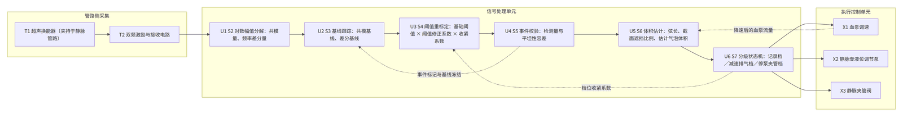
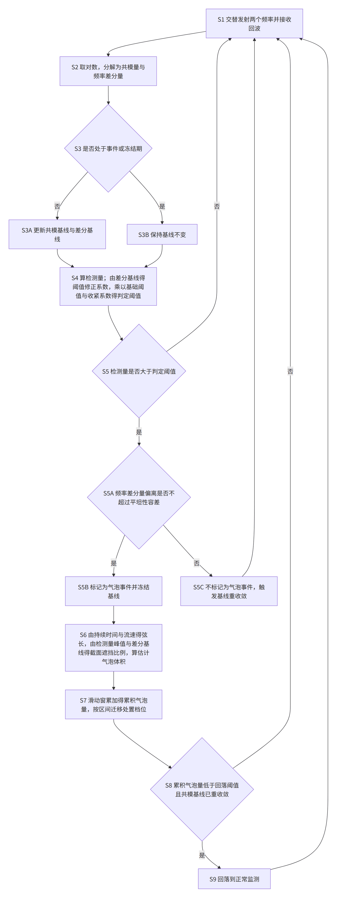
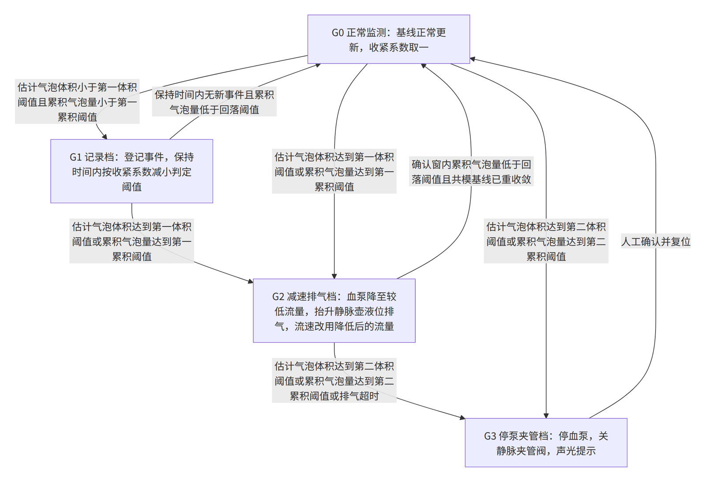

> 虚构演练案例。技术方案、试验数据、文献号、日期全部是编的，只用于演示本技能包的产物形态，不构成任何真实技术、医疗或法律主张。

发明名称：一种血液透析体外循环管路气泡检测与分级处置方法

## 说明书摘要

本发明公开一种血液透析体外循环管路气泡检测与分级处置方法。同一超声换能器交替发射第一频率和第二频率的超声脉冲，逐对取回波幅值的对数并分解为共模量和频率差分量；在未标记气泡事件时分别指数平滑得到共模基线和差分基线；以共模基线与共模量之差除以滚动标准差得到检测量，并由差分基线经标定映射得到阈值修正系数，与基础阈值和处置档位的收紧系数相乘得到判定阈值；仅当检测量越过判定阈值且频率差分量相对差分基线的偏离不超过平坦性容差时才判为气泡事件，否则触发基线重收敛；再由事件持续时间、血泵流量和截面遮挡比例估计气泡体积，按单泡体积与滑动窗累积气泡量在记录档、减速排气档和停泵夹管档之间迁移。

## 权利要求书

1. 一种血液透析体外循环管路气泡检测与分级处置方法，用于对夹持在体外循环管路上的超声换能器接收到的回波进行处理，并据此控制血泵、静脉壶液位调节泵和静脉夹管阀，其特征在于，所述方法包括：
S1、由同一超声换能器按预定的脉冲对重复周期交替发射第一频率的超声脉冲和第二频率的超声脉冲，所述第二频率高于所述第一频率，并接收对应的第一回波和第二回波，逐个脉冲对得到第一回波幅值和第二回波幅值；
S2、对每一个脉冲对，取所述第一回波幅值的对数和所述第二回波幅值的对数，以二者之和的一半作为该脉冲对的共模量，以二者之差作为该脉冲对的频率差分量；
S3、在当前脉冲对未被标记为气泡事件且不处于基线冻结期时，分别对所述共模量和所述频率差分量做指数平滑，得到共模基线和差分基线；处于基线冻结期时保持所述共模基线和所述差分基线不变；
S4、以所述共模基线与当前共模量之差除以共模量的滚动标准差，得到当前脉冲对的检测量；将所述差分基线代入预先标定的单调映射得到阈值修正系数，并把基础阈值、所述阈值修正系数与当前处置档位对应的收紧系数三者相乘，得到当前判定阈值；
S5、当所述检测量大于所述当前判定阈值，且当前脉冲对的频率差分量相对所述差分基线的偏离量的绝对值不超过平坦性容差时，把当前脉冲对标记为气泡事件并进入基线冻结期；当所述检测量大于所述当前判定阈值而所述偏离量的绝对值超过所述平坦性容差时，不把当前脉冲对标记为气泡事件，并触发基线重收敛；
S6、把连续被标记为气泡事件的脉冲对归为一个气泡事件，以该气泡事件所含脉冲对个数与所述脉冲对重复周期之积作为事件持续时间，以当前血泵流量与管路截面积之商作为流速，以所述流速与所述事件持续时间之积作为弦长；把该气泡事件的检测量峰值与所述差分基线代入预先标定的映射，得到截面遮挡比例；以所述截面遮挡比例、所述管路截面积与所述弦长三者之积作为该气泡事件的估计气泡体积；
S7、在预定长度的滑动窗内累加各气泡事件的估计气泡体积，得到累积气泡量；按所述估计气泡体积与所述累积气泡量所落入的区间，在记录档、减速排气档和停泵夹管档之间迁移；其中记录档登记该气泡事件，并在预定保持时间内把所述收紧系数取为小于一的值以减小所述当前判定阈值；减速排气档把血泵流量降至预设的较低流量，并驱动静脉壶液位调节泵抬升静脉壶液位以排气，同时以降低后的血泵流量重新计算 S6 中的所述流速；停泵夹管档停止血泵并关闭静脉夹管阀；
S8、由所述减速排气档回落到正常监测，以下述两个条件同时成立为前提：所述累积气泡量在确认窗内低于回落阈值；以及所述共模量与所述共模基线之差的绝对值在连续预定个数的脉冲对内小于收敛容差。

2. 根据权利要求 1 所述的方法，其特征在于，所述第一频率取 1.5 MHz 至 3 MHz，所述第二频率取 4 MHz 至 6 MHz，所述第二频率与所述第一频率之比不小于二，所述脉冲对重复周期不大于 1 ms。

3. 根据权利要求 1 所述的方法，其特征在于，S4 中所述单调映射为分段线性映射，其在所述差分基线等于标定参考值时取值为一，其斜率由至少三档已知散射强度的标定介质测得，并把所述阈值修正系数截断在预设的修正下限与修正上限之间。

4. 根据权利要求 1 所述的方法，其特征在于，S5 中所述基线重收敛包括：把 S3 中指数平滑的平滑系数临时增大至预设倍数，并在所述共模量与所述共模基线之差的绝对值小于所述收敛容差之前把所述基础阈值提高预设倍数；重收敛结束后恢复原平滑系数与原基础阈值。

5. 根据权利要求 1 所述的方法，其特征在于，S7 中所述记录档的收紧系数随所述保持时间内已登记的气泡事件个数递减，且不小于预设的收紧下限。

6. 根据权利要求 1 所述的方法，其特征在于，S7 中进入所述减速排气档后，若在预设的排气超时时间内所述累积气泡量未低于所述回落阈值，则强制迁移到所述停泵夹管档。

7. 根据权利要求 1 所述的方法，其特征在于，S4 中所述共模量的滚动标准差仅由未被标记为气泡事件且不处于基线冻结期的脉冲对估计得到。

8. 根据权利要求 1 所述的方法，其特征在于，迁移到所述停泵夹管档时输出事件记录，所述事件记录包含本滑动窗内各气泡事件的估计气泡体积、检测量峰值以及该气泡事件发生时的差分基线。

9. 一种血液透析体外循环管路气泡检测与分级处置装置，其特征在于，包括：夹持在体外循环管路上的超声换能器；与所述超声换能器连接的双频激励与接收电路，配置为按预定的脉冲对重复周期交替激励第一频率和第二频率并接收对应回波；信号处理单元，配置为执行权利要求 1 至 8 中任一项所述方法中的 S2 至 S7 的信号处理步骤，并输出处置档位；以及执行控制单元，配置为按所述处置档位控制血泵、静脉壶液位调节泵和静脉夹管阀。

## 说明书

### 技术领域

本发明涉及体外循环设备的安全监测与控制技术领域，具体涉及一种血液透析体外循环管路气泡检测与分级处置方法，以及实施该方法的装置。本发明的处理对象是体外循环管路管腔内的气体与液体所引起的超声回波变化，控制对象是血泵、静脉壶液位调节泵和静脉夹管阀这些设备执行部件，不涉及对人体的诊断或者治疗。

### 背景技术

血液透析治疗时，血液经动脉管路引出、经透析器后由静脉管路回输。为防止空气进入静脉管路，通常在静脉管路上夹持超声换能器构成气泡检测器：换能器发射超声脉冲，接收穿过管路后的回波；当管腔内出现气体时，气体与液体之间的声阻抗差异使声路被阻断，回波幅值明显下降。

现有的气泡检测器多采用单一频率与固定阈值。例如公开号为 CN199801733A 的专利文献公开了一种血液透析气泡报警阈值设定方法，其在治疗开始前读取外部输入的化验值，按查表方式一次性设定报警阈值，治疗过程中不再更新该阈值。又如某透析机气泡检测模块技术说明书（虚构版本 2.1）记载，其阈值为出厂固定值，仅在上机前对空管做一次自校准。这类方案存在两方面缺陷。

其一是基线漂移导致的误动作。回波幅值的基线并不稳定：管腔内液体的散射与吸收强度会随治疗进程改变，换能器与管路之间的贴合状态也会因夹具蠕变、耦合剂干涸而缓慢变化，二者都使回波幅值缓慢下降。基线一旦下降到接近固定阈值，管腔内并无气体时也会触发报警并停泵，操作者不得不反复复位，或者把阈值调松而牺牲安全裕度。

其二是微小气泡串的漏检。单个体积很小的气泡通过换能器时，回波幅值下降幅度远小于固定阈值，逐个判断时一个也不会被检出；但这类气泡常成串出现，一段时间内累积的气体体积并不小。现有方案只对单次幅值作判断，没有累积量这一路信息。

针对基线漂移，现有技术给出过若干改进方向。公开号为 CN199804260A 的专利文献公开了一种基于夹持压力传感的超声气泡检测基线补偿方法，在夹具上增设压力传感器，用夹持力读数补偿基线；该方案需要增加传感器与结构件，且只能补偿贴合状态的变化，无法补偿管腔内液体自身声学性质的变化。公开号为 CN199800456A 的专利文献公开了一种体外循环管路气泡超声检测装置及方法，其以同一换能器交替发射两个频率的超声脉冲，比较两路回波幅值以区分气泡与管壁附着物，判定为气泡后直接输出停泵信号；该方案把两个频率的比较结果只用作一次性的二分判断，既没有用它去修正判定阈值，也没有在判定为非气泡时对基线作任何处理。此外，某虚构论文（何澜、吴敬远 2021）主张双频回波幅值比在常见散射范围内与介质成分无关，可作为不受介质影响的稳定判据，这一主张实际上劝阻本领域技术人员把频率差分信息用作介质状态的估计通道。

针对处置方式，公开号为 CN199802914A 的专利文献公开了一种输液管路气泡分级报警方法，按单个气泡的尺寸分为提示、减速和停机三档，其尺寸由单频幅值经单点查表得到，分档结果不回作用于检测环节。公开号为 CN199803508A 的专利文献公开了一种血液净化设备静脉壶液位自动调节装置，可抬升静脉壶液位以促使气体浮出，该执行手段本身已属已知。

综上，现有技术缺少一种既能在治疗过程中在线区分"管腔内出现气体"与"液体声学性质或贴合状态发生变化"，又能把检出结果按量分级处置、并使处置状态反过来修正检测判据的方案。

### 发明内容

本发明要解决的技术问题是：单频固定阈值的气泡检测在基线漂移条件下误触发停泵、在微小气泡串条件下漏检，且现有的双频比较仅用于一次性二分判断、分级处置与检测判据彼此解耦。

本发明的技术构思基于两点声学差异。第一，管腔内液体对超声的衰减具有频率依赖性，散射强度改变时，第一频率与第二频率的回波幅值下降幅度不同；换能器与管路之间贴合状态改变时，两个频率的传输损失同样不相等。第二，本发明所关注尺度的气泡远大于工作频段的波长，其作用是把声路整体遮挡，对两个频率造成的幅值下降接近相等。因此，把同一脉冲对的两路对数幅值分解为共模量与频率差分量之后，共模量对气泡敏感，频率差分量则主要反映管腔内液体的声学性质与贴合状态，而对气泡不敏感。

据此，本发明按权利要求 1 给出的 S1 至 S8 组织处理流程，其中三处协同关系是本发明区别于现有技术的关键：

第一处协同，频率差分量的平滑结果（差分基线）不是一个仅供显示的量，它经预先标定的单调映射转成阈值修正系数，直接参与共模通道判定阈值的计算。散射强度上升时回波整体变弱、共模量的滚动标准差变大，判定阈值随之按比例抬高；散射强度下降时判定阈值随之降低。由此，判定阈值在治疗全程随管腔内液体的实际声学状态在线重标定，而不是治疗前设定一次。

第二处协同，频率差分量还作为气泡事件的必要校验条件。共模量跌破判定阈值只是必要条件，还要求该脉冲对的频率差分量相对差分基线的偏离不超过平坦性容差，即这次下降在两个频率上足够"平坦"，才判为气泡事件。若下降不平坦，说明这是贴合状态或者液体性质发生了变化，此时不判为气泡，而是触发基线重收敛，让基线尽快跟上新的工作点。正因为有这一层校验挡住了非气泡引起的下降，判定阈值才敢取得比现有固定阈值低得多的值，从而把单个体积很小的气泡也检出来。

第三处协同，分级处置的当前档位反过来进入检测与估计环节。记录档在保持时间内把收紧系数取为小于一的值，使判定阈值进一步下降，因为已经出现过微小气泡本身就是后续可能出现更多气体的证据；减速排气档降低血泵流量之后，气泡体积估计所用的流速立即改用降低后的流量重新计算，否则同一个气泡会被算成体积成倍偏大的气泡而错误升档；由减速排气档回落到正常监测，还必须等到共模基线重新收敛，否则回落之后立刻会用尚未跟上的基线再次误触发。

本发明的有益效果是：判定阈值随管腔内液体声学状态在线重标定，减少了基线漂移条件下的误触发停泵；平坦性校验把贴合状态变化引起的幅值下降从气泡事件中分出，使判定阈值可以取得更低，从而检出单个体积很小的气泡；滑动窗累积气泡量提供了单泡幅值之外的第二路触发依据，使成串出现的微小气泡在总量达到一定程度时被处置；分级处置在记录、减速排气与停泵夹管之间迁移，避免一出现气体就停泵。上述效果的台架依据见具体实施方式中的实施例三与实施例四。

### 附图说明

图1 是本发明实施例的系统框图；

图2 是本发明实施例的检测与处置流程图；

图3 是本发明实施例的分级处置状态迁移图。

### 具体实施方式

下面结合附图对本发明的实施例作详细说明。以下所有具体数值均为在体外台架上用标定介质得到的示例值，用于说明各步骤如何相互配合，不作为对权利要求保护范围的限制。

#### 一、术语与符号

体外循环管路：把血液从患者体内引出、经透析器后回输的管路组件，本发明只处理其静脉段管腔内的声学量。

脉冲对：一次第一频率发射接收与紧随其后的一次第二频率发射接收合起来称为一个脉冲对；相邻两个脉冲对的起点间隔称为脉冲对重复周期。

共模量：一个脉冲对的第一回波幅值的对数与第二回波幅值的对数之和的一半。它随管腔被气体遮挡而下降，也随整体传输损失而下降。

频率差分量：同一脉冲对的第一回波幅值的对数与第二回波幅值的对数之差。它反映两个频率之间的传输损失差异。

共模基线、差分基线：分别是共模量与频率差分量的指数平滑值，只在当前脉冲对未被标记为气泡事件且不处于基线冻结期时更新。

检测量：共模基线与当前共模量之差，再除以共模量的滚动标准差，是一个无量纲量。

判定阈值：基础阈值、阈值修正系数与收紧系数三者之积。

平坦性容差：允许气泡事件期间频率差分量相对差分基线偏离的最大绝对值。

截面遮挡比例：气泡在换能器声路上遮挡的管路截面面积与管路截面积之比。

估计气泡体积：截面遮挡比例、管路截面积与弦长三者之积。

累积气泡量：滑动窗内各气泡事件的估计气泡体积之和。

处置档位：正常监测、记录档、减速排气档、停泵夹管档四种状态之一。

#### 二、系统结构

如图1所示，本实施例的系统由三部分组成。

管路侧采集部分包括夹持在静脉管路上的超声换能器，以及与之连接的双频激励与接收电路。换能器为单片自发自收结构，工作带宽覆盖第一频率与第二频率；激励电路按脉冲对重复周期交替激励两个频率，接收电路对回波作包络检波并输出两路幅值。

信号处理单元依次完成对数幅值分解、基线跟踪、阈值重标定、事件校验、体积估计与分级状态机六项处理。其中阈值重标定接收基线跟踪输出的差分基线，也接收分级状态机输出的收紧系数；体积估计接收执行控制单元回报的当前血泵流量；事件校验向基线跟踪回送事件标记与冻结指令。图1中这三条回路以虚线表示。

执行控制单元按分级状态机输出的处置档位驱动三个执行部件：血泵调速、静脉壶液位调节泵、静脉夹管阀。

#### 三、检测与处置流程

如图2所示，本实施例按 S1 至 S9 执行。

S1，由同一超声换能器按脉冲对重复周期交替发射第一频率与第二频率的超声脉冲并接收回波。本实施例第一频率取 2.0 MHz，第二频率取 5.0 MHz，脉冲对重复周期取 0.5 ms，即每秒 2000 个脉冲对。两个频率同处一片换能器的工作带宽内，无需增加换能器或传感器。

S2，对每个脉冲对，取第一回波幅值与第二回波幅值的自然对数，二者之和的一半为共模量，二者之差为频率差分量。以下所有下降量均以对数值计，下降 0.21 相当于幅值下降约百分之十九。

S3，若当前脉冲对未被标记为气泡事件且不处于基线冻结期，则分别对共模量与频率差分量作指数平滑，得到共模基线与差分基线；本实施例平滑时间常数取 20 s，对应每脉冲对的平滑系数为 2.5 乘以十的负五次方。若当前脉冲对被标记为气泡事件或处于基线冻结期，则两条基线均保持不变。基线冻结期的作用是防止连续到达的气泡把基线一路带低，从而使后续气泡更难被检出。本实施例的冻结持续到事件结束后 2 s。

S4，检测量等于共模基线减去当前共模量，再除以共模量的滚动标准差。滚动标准差由最近 2 s 内未被标记为气泡事件、且不处于基线冻结期的脉冲对估计。判定阈值等于基础阈值乘以阈值修正系数再乘以收紧系数。本实施例基础阈值取 6.0；阈值修正系数由差分基线经分段线性映射得到，在差分基线等于标定参考值 0.62 时取 1.0，斜率取 0.9，并截断在 0.7 与 1.6 之间；收紧系数在正常监测时取 1.0，在记录档保持时间内取小于一的值。

S5，当检测量大于判定阈值时，进一步计算当前脉冲对的频率差分量与差分基线之差的绝对值。若该绝对值不超过平坦性容差，说明两个频率的回波下降幅度接近，判为气泡事件，标记该脉冲对并进入基线冻结期；若该绝对值超过平坦性容差，说明两个频率的下降幅度不一致，其成因是管腔内液体声学性质或者换能器贴合状态发生了变化，此时不标记为气泡事件，并触发基线重收敛。本实施例平坦性容差取 0.08。基线重收敛的做法是把 S3 的平滑系数临时增大到原值的 50 倍，并在共模量与共模基线之差的绝对值小于收敛容差 0.02 之前把基础阈值提高到原值的 1.5 倍，收敛完成后恢复原值。

S6，把连续被标记为气泡事件的脉冲对归为一个气泡事件。事件持续时间等于该事件所含脉冲对个数乘以脉冲对重复周期；流速等于当前血泵流量除以管路截面积；弦长等于流速乘以事件持续时间。截面遮挡比例由该事件的检测量峰值与差分基线共同决定：先由检测量峰值乘以共模量的滚动标准差还原出共模下降量，再除以由差分基线查得的下降量斜率。本实施例的斜率标定值为：差分基线 0.48 时取 1.05，0.62 时取 0.92，0.95 时取 0.74，中间值线性插值。估计气泡体积等于截面遮挡比例乘以管路截面积再乘以弦长。

S7，在滑动窗内累加各气泡事件的估计气泡体积，得到累积气泡量。本实施例滑动窗取 30 s，第一体积阈值取 3 μL，第二体积阈值取 20 μL，第一累积阈值取 5 μL，第二累积阈值取 30 μL，回落阈值取 1 μL。处置档位按下述区间迁移：估计气泡体积小于第一体积阈值且累积气泡量小于第一累积阈值时进入记录档；估计气泡体积达到第一体积阈值，或者累积气泡量达到第一累积阈值时进入减速排气档；估计气泡体积达到第二体积阈值，或者累积气泡量达到第二累积阈值时进入停泵夹管档。记录档只登记事件，并在保持时间 10 s 内把收紧系数取为 0.85，且随保持时间内已登记事件个数继续递减，下限为 0.6。减速排气档把血泵流量由 200 mL/min 降至 100 mL/min，并驱动静脉壶液位调节泵抬升静脉壶液位，使气体在静脉壶内浮出；同时把 S6 中的流速改用 100 mL/min 重新计算。停泵夹管档停止血泵、关闭静脉夹管阀并发出声光提示，需人工确认后复位。

S8，由减速排气档回落到正常监测，须同时满足两个条件：确认窗（本实施例取 30 s）内累积气泡量低于回落阈值；共模量与共模基线之差的绝对值在连续 4000 个脉冲对（即 2 s）内小于收敛容差 0.02。第二个条件保证冻结期结束后基线已经重新跟上当前工作点，避免刚回落就再次误触发。若在排气超时时间 60 s 内累积气泡量仍未低于回落阈值，则强制迁移到停泵夹管档。

S9，回落到正常监测后，收紧系数恢复为一，两条基线恢复正常更新，血泵流量恢复至治疗设定值，滑动窗继续累加后续气泡事件的估计气泡体积。

#### 四、分级处置的状态迁移

如图3所示，处置档位在正常监测、记录档、减速排气档与停泵夹管档之间迁移。

#### 五、参数示例

下表列出本实施例采用的参数取值，均为体外台架示例值，不作为对权利要求保护范围的限制。

| 参数 | 本实施例取值 |
|---|---|
| 第一频率、第二频率 | 2.0 MHz、5.0 MHz |
| 脉冲对重复周期 | 0.5 ms |
| 管路内径、管路截面积 | 4.0 mm、12.566 mm² |
| 基线平滑时间常数 | 20 s |
| 基础阈值 | 6.0 |
| 阈值修正系数：参考值、斜率、截断区间 | 0.62、0.9、0.7 至 1.6 |
| 平坦性容差 | 0.08 |
| 收敛容差、连续脉冲对个数 | 0.02、4000 |
| 下降量斜率标定（差分基线 0.48／0.62／0.95） | 1.05／0.92／0.74 |
| 滑动窗、确认窗、记录档保持时间、排气超时时间 | 30 s、30 s、10 s、60 s |
| 第一体积阈值、第二体积阈值 | 3 μL、20 μL |
| 第一累积阈值、第二累积阈值、回落阈值 | 5 μL、30 μL、1 μL |
| 记录档收紧系数、收紧下限 | 0.85、0.6 |
| 减速排气档血泵流量 | 由 200 mL/min 降至 100 mL/min |

#### 六、实施例一：单个较大气泡的检出与体积估计

管路内径 4.0 mm，管路截面积为 12.566 mm²；血泵流量 200 mL/min 即 3333.3 mm³/s，流速为 3333.3 除以 12.566 等于 265.3 mm/s。当前差分基线为 0.62，共模量的滚动标准差为 0.012。

一个气泡通过换能器，连续 24 个脉冲对被标记为气泡事件，事件持续时间为 24 乘以 0.5 ms 等于 12.0 ms；弦长为 265.3 mm/s 乘以 0.012 s 等于 3.18 mm。该事件的检测量峰值为 38.3，还原出的共模下降量为 38.3 乘以 0.012 等于 0.46；差分基线 0.62 对应的下降量斜率为 0.92，故截面遮挡比例为 0.46 除以 0.92 等于 0.50。估计气泡体积为 0.50 乘以 12.566 mm² 再乘以 3.18 mm 等于 19.98 mm³，即约 20 μL。该值达到第二体积阈值 20 μL，直接迁移到停泵夹管档。

#### 七、实施例二：处置档位改变流速后的复算

承实施例一的管路参数。若此前已因累积气泡量达到第一累积阈值而进入减速排气档，血泵流量为 100 mL/min 即 1666.7 mm³/s，流速为 1666.7 除以 12.566 等于 132.6 mm/s。同样一个 20 μL 的气泡通过时，事件持续时间延长为 48 个脉冲对即 24.0 ms，弦长为 132.6 mm/s 乘以 0.024 s 等于 3.18 mm，估计气泡体积仍为 20 μL，与实施例一一致。

若按 S7 迁移到减速排气档后仍沿用降速前的流速 265.3 mm/s，弦长会被算成 6.37 mm，估计气泡体积会被算成约 40 μL。这一数值同样越过第二体积阈值，会把一个本可由排气处置的气泡误判成需要停泵的气泡。这说明 S7 中"以降低后的血泵流量重新计算 S6 中的流速"这一步是必需的，而不是可选的优化。

#### 八、实施例三：微小气泡串的累积处置

差分基线 0.62，共模量的滚动标准差 0.012，血泵流量 200 mL/min。一串体积各约 0.4 μL 的气泡以约 0.6 s 的间隔连续通过换能器。

单个气泡的事件持续 2 个脉冲对即 1.0 ms，弦长为 265.3 乘以 0.001 等于 0.265 mm；检测量峰值为 9.2，共模下降量为 9.2 乘以 0.012 等于 0.110，截面遮挡比例为 0.110 除以 0.92 等于 0.12；估计气泡体积为 0.12 乘以 12.566 乘以 0.265 等于 0.400 mm³ 即 0.4 μL。

在本实施例的参数下，判定阈值为 6.0 乘以 1.0 再乘以 1.0 等于 6.0，检测量 9.2 大于判定阈值，该气泡被检出并进入记录档。作为对照，按现有单频固定阈值方案，其门限折算成截面遮挡比例约为 0.45，上述气泡的遮挡比例仅 0.12，逐个判断时一个也不会被检出。

进入记录档后，收紧系数由 1.0 降为 0.85，判定阈值降为 5.1，后续更小的气泡也更容易被检出。每个气泡的估计气泡体积均小于第一体积阈值 3 μL，但滑动窗内累积气泡量持续上升；累加到第 13 个气泡时累积气泡量为 13 乘以 0.4 等于 5.2 μL，达到第一累积阈值 5 μL，迁移到减速排气档。血泵流量降至 100 mL/min，静脉壶液位被抬升，其余气泡在静脉壶内浮出。30 s 确认窗结束时窗内累积气泡量降至 0.8 μL，低于回落阈值 1 μL；同时共模量与共模基线之差在连续 4000 个脉冲对内均小于 0.02，两个条件同时成立，回落到正常监测，全程未停泵。

#### 九、实施例四：贴合状态变化的鉴别与基线重收敛

差分基线 0.62，共模量的滚动标准差 0.012，管腔内无气体。换能器夹具的压板松动约 0.5 mm，回波传输损失阶跃增大：共模量下降 0.15，检测量为 0.15 除以 0.012 等于 12.5，大于判定阈值 6.0。

若按现有的单频阈值方案，此处即报警停泵。按本发明的 S5，还要检查频率差分量：此时频率差分量相对差分基线的偏离量为 0.11，超过平坦性容差 0.08，说明两个频率的下降幅度不一致，不是气泡引起的遮挡。因此不标记为气泡事件，转而触发基线重收敛：平滑系数临时增大到原值的 50 倍，基础阈值临时提高到原值的 1.5 倍；共模基线在数秒内跟到新的工作点，共模量与共模基线之差的绝对值小于收敛容差 0.02 之后恢复原平滑系数与原基础阈值，恢复正常监测。

作为对照，在同样参数下真实气泡事件的频率差分量相对差分基线的偏离量显著更小，落在平坦性容差以内，因此不会被这一校验误挡。台架上对 30 次定量注入气泡的观察表明，该偏离量的中位数为 0.021、最大值为 0.049，平坦性容差 0.08 即由该最大值加裕度确定。

#### 十、实施例五：不同散射强度下的判定阈值重标定

三档标定介质的差分基线分别为 0.48、0.62 和 0.95，对应的共模量滚动标准差分别为 0.009、0.012 和 0.019。

差分基线 0.48 时，阈值修正系数为 1 加 0.9 乘以（0.48 减 0.62）等于 0.874，判定阈值为 6.0 乘以 0.874 等于 5.24，对应的共模下降量为 5.24 乘以 0.009 等于 0.047，除以斜率 1.05 得可检出的最小截面遮挡比例 0.045。

差分基线 0.62 时，阈值修正系数为 1.0，判定阈值为 6.0，对应共模下降量 0.072，除以斜率 0.92 得最小截面遮挡比例 0.078。

差分基线 0.95 时，阈值修正系数为 1 加 0.9 乘以（0.95 减 0.62）等于 1.297，判定阈值为 6.0 乘以 1.297 等于 7.78，对应共模下降量 0.148，除以斜率 0.74 得最小截面遮挡比例 0.200。

由此可见，本实施例可检出的最小截面遮挡比例随散射强度上升由 0.045 增至 0.200；三档取值均明显小于现有单频固定阈值方案的约 0.45。需要说明的是，在散射强度最高的一档，截面遮挡比例 0.12 的微小气泡不再能被逐个检出，此时对微小气泡串的处置依赖 S7 的累积气泡量通道与记录档的收紧系数。这是本方案的适用边界，不宜外推。

#### 十一、异常与降级

换能器开路、回波幅值持续低于可测下限，或者两路回波之一长时间缺失时，信号处理单元不再输出处置档位，直接迁移到停泵夹管档并给出与气泡报警不同的提示，以免把硬件故障当作管腔内无气体。

基线重收敛在预设时间内未能收敛（本实施例取 30 s）时，同样迁移到停泵夹管档，因为此时无法保证判定阈值仍然有效。

血泵流量读数缺失时，S6 的流速改用最近一次有效读数，并把该事件的估计气泡体积标为不可靠；不可靠的事件仍计入事件个数，但不计入累积气泡量，处置档位按记录档处理。

#### 十二、关于处理对象与控制对象的说明

本发明的处理对象是体外循环管路管腔内的气体与液体在超声传播路径上引起的幅值变化。频率差分量所反映的是管腔内液体对超声的频率相关衰减，是被测介质的声学参数；本发明并不据此输出任何关于人体健康状况的判断，也不输出任何诊断结果。本发明的控制对象是血泵、静脉壶液位调节泵和静脉夹管阀这三个设备执行部件，处置的直接目的是阻止管腔内的气体进入下游管路，属于设备安全控制；本发明不涉及透析处方、超滤速率、抗凝方案等治疗参数的确定或调整。

本输出为撰写辅助，不构成法律意见，不保证授权，不代为提交。
