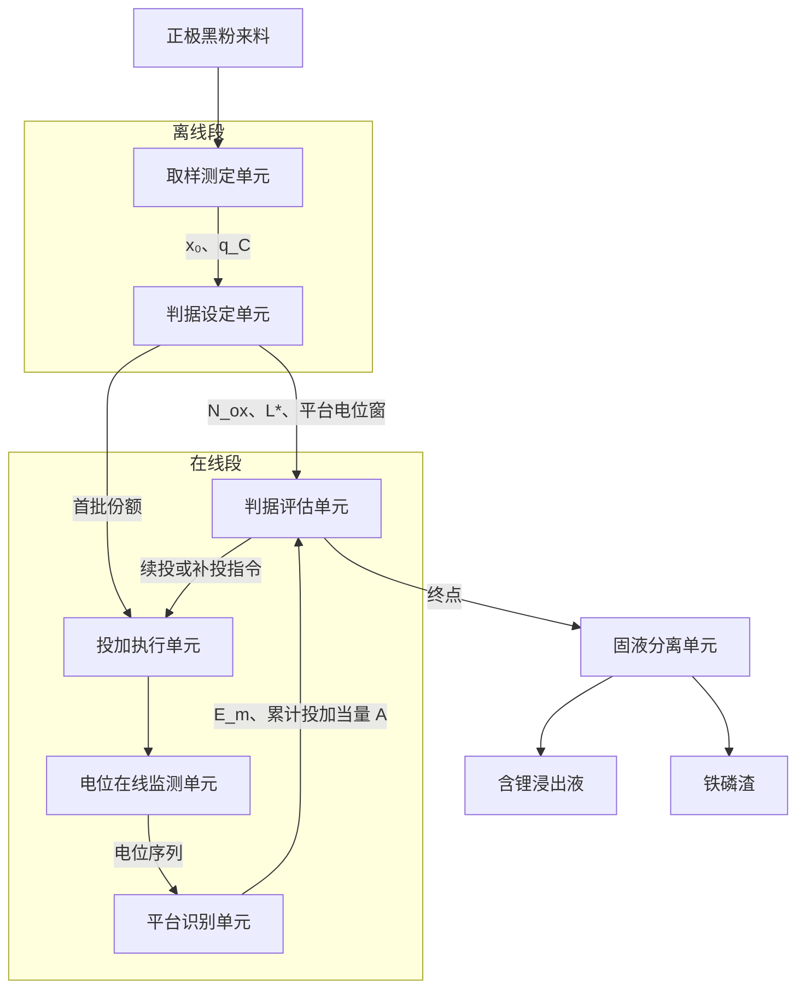
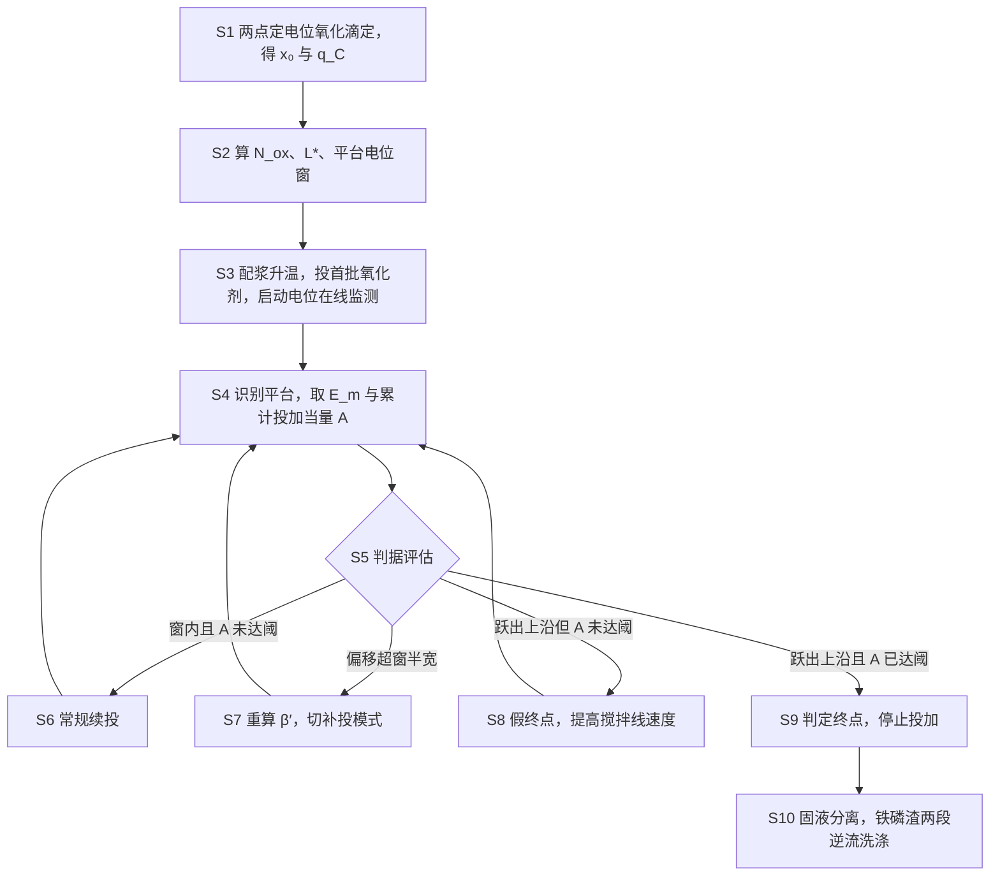

# 技术交底书

> 虚构演练案例。工艺方案、实验数据、文献号、日期全部是编的，只用于演示本技能包的产物形态，不构成任何真实技术或法律主张。

- 案件名称：一种废旧磷酸铁锂正极材料的选择性提锂方法
- 技术联系人：（姓名）　（电话）　（邮箱）
- 专利类型：发明

## 注意事项

交底书是写给代理人看的，他不了解这条产线，读完就要能自己动手写权利要求，所以背景技术和技术方案都要写全、写清楚，不能只写结论。

公开程度以本领域普通技术人员照着做就能实施为准：温度、浓度、电位、时间、判据阈值这些数，能给的都给，给不出精确值的给范围并说明是怎么定出来的。

代理人来问的时候请认真回答、及时补材料。特别是本文末尾「附：证据状态」里标为"拟议待验证"的几条，代理人会专门回来确认。

## 一、背景与现有技术

**检索说明**：本案检索在国家知识产权局专利公布公告系统（关键词轮与分类号轮各一次，分类号用 C22B26、C22B7、H01M10）、Google Patents 和 Google Scholar 三个入口进行，中英双语，检索截止 2026-09-06。CNKI、万方两个中文数据库全程未接入，日文与韩文专利未检索，这两块不构成"未发现"的结论。检索过程按检索轨迹台账单独记录，本节只放结论。下列文献中 P7 只拿到摘要，未取得全文。

> 本案为虚构演练案例，下列文献号、作者、年份均为编造，不存在可打开的公开源 URL。真实案件中本栏必须填写实际打开确认过的 URL。

### 1.1 现有技术

按技术方向分四类。

**（一）按化学计量定量投加**

- P2，CN199901246A，《废旧磷酸铁锂粉料的定量氧化脱锂工艺》，某回收企业申请。方案：测定黑粉的全铁含量，按二价铁全部氧化所需的理论氧化剂量乘以 1.05 的固定过量系数，一次性投入过硫酸钠，恒温搅拌至设定时间后压滤。应用场景：拆解分选后的磷酸铁锂黑粉批处理。局限性：投加量只由全铁量决定，而全铁量既不反映来料中已经脱锂的那一部分（这部分铁本来就是三价，不需要再氧化），也不反映碳基还原性物质的额外消耗；对放电不彻底的批次必然过量，对粘结剂残余多的批次必然不足。**读过全文**。

**（二）按氧化还原电位反馈投加**

- P1，CN199900789A，《一种基于氧化还原电位控制的废旧磷酸铁锂选择性浸出方法》，某材料公司申请。方案：在浸出釜中插入铂电极与参比电极，设定一个固定的电位目标值（说明书第 0018 段给出 650±10 mV），控制器持续投加氧化剂直至液相电位达到并保持该目标值。应用场景：连续或间歇氧化浸出。局限性：目标值是一个与来料无关的常数。料浆中碳基还原性物质与铁的氧化还原电对共同形成混合电位，会把液相电位整体压低，压低幅度随碳含量变化；碳含量高的批次电位长时间达不到目标值，控制器持续投加，造成严重过量。全文未出现任何按来料测定结果调整目标值的内容。**读过全文**。
- P7，CN199904402A，《锂电池黑粉氧化浸出的在线电位监控装置》。摘要提到"在线电位监控"，但全文下载被付费墙挡住。**未取得全文**，因此只能写"摘要未见按来料测定结果确定判据阈值的内容"，不能写"它未做这件事"。

**（三）平台电位现象的机理研究**

- P3，Zhao 2024（虚构），《水相氧化脱锂中两相共存平台电位的原位观测》。内容：用原位电位测量证实，磷酸铁锂与磷酸铁两相共存时液相电位被钉扎在近似恒定值上，两相中的一相耗尽后电位快速跃升。应用场景：机理研究，实验室尺度。局限性：只作现象观测和热力学解释，全文没有把平台电位或平台长度用于任何投加控制或终点判断。**读过全文**。
- P5，Nakamura & Feng 2023（虚构），《含碳黑粉浸出体系中碳的混合电位干扰》。内容：用旋转圆盘电极定量了碳含量与电位压低量的关系，并指出碳包覆致密的颗粒外层先反应完、内层滞后。局限性：把碳的干扰当作误差项处理，明确写"该干扰难以在线补偿"，未给出测定方法，也未给出补偿方法。**读过全文**。
- P8，Iberra 2022（虚构），《碳含量对过硫酸盐氧化浸出耗量的影响》。内容：给出碳含量与过硫酸盐耗量的静态经验相关式。局限性：输入是离线测得的碳含量，输出是耗量估计值，全文与电位无关，没有任何在线反馈环节。**读过全文**。

**（四）分批投加与其他工艺路线**

- P6，CN199903117A，《一种废旧磷酸铁锂的分批氧化浸出方法》。方案：把氧化剂分为三批，每批投加后保持 30 min，分批比例按来料质量固定为 4:3:3。局限性：分批比例是固定的，与来料状态无关；过程中不判断反应进行到什么程度，也没有任何在线判据。**读过全文**。
- P4，CN199902035A，《一种机械化学活化—水浸提锂方法》。方案：黑粉先行球磨活化，再用水浸出提锂，不加氧化剂。局限性：球磨能耗高，对来料碳含量和荷电状态更敏感，批次波动大。另外，该文献第 0032 段明确主张：含碳黑粉体系中在线电位受碳的混合电位干扰、读数不能反映真实氧化程度，应当采用离线取样滴定。这是一条对本案技术路线的相反教导，答辩时有用。**读过全文**。

### 1.2 现有技术的缺点

1. 投加量的确定依据里没有来料的荷电状态。全铁量不区分二价铁和三价铁，按全铁投加对高荷电态批次必然过量。（对应 P2）
2. 投加量的确定依据里没有碳的消耗。碳基还原性物质在浸出条件下同样消耗氧化剂，且各批差异大。（对应 P2、P8）
3. 电位反馈用的是固定目标值，而该目标值本身会被碳压低到达不到，反馈失去终止条件。（对应 P1）
4. 平台现象只被当作机理观测，没有被转化为可执行的判据；文献甚至明确认为在线电位在含碳体系中不可用。（对应 P3、P5、P4）
5. 分批投加的批次比例与来料状态无关，且过程中不判断"反应进行到哪一步"，分批只是把一次投加拆开，没有产生新的控制能力。（对应 P6）
6. 上述做法都无法区分两种完全不同的异常：一种是"平台还没走完"（该继续加），另一种是"平台电位偏移了"（该修正判据再加）。两者的现场表现都是"电位还没跃升"，处置方式却相反。（对应 P1、P6）

**申请人现状（不属于现有技术的缺点）**：申请人现有产线按全铁理论量乘 1.15 至 1.3 的经验系数投加，系数来源不可追溯；滤饼为单段水洗，洗水直排；来料的残余脱锂度需送外检做物相定量，周期数天，产线无法等待。

## 二、要解决的技术问题

对着 1.2 逐条：

1. 针对缺点 1：怎样在产线可接受的时间内测出来料中实际还剩多少二价铁，从而把已经脱锂的那部分从投加量里扣掉。
2. 针对缺点 2：怎样把碳的耗剂量单独测出来，作为投加量的一个独立补偿项，而不是混在一个经验过量系数里。
3. 针对缺点 3：怎样让电位判据的阈值随来料变化，而不是用一个固定目标值。
4. 针对缺点 4：怎样把两相共存平台从一个机理现象变成一个可以判读、可以据以动作的在线判据。
5. 针对缺点 5：怎样让分批投加的每一批之间产生真正的判断，而不只是把总量拆开。
6. 针对缺点 6：怎样区分"平台未走完"和"平台已偏移"，并对后者给出定量的判据修正方式，而不是靠人工试凑。

## 三、技术方案详述

### 3.1 背景

**场景与参与者。** 干活的主体是废旧磷酸铁锂回收产线的提锂工序。上游是电池包放电、拆解、破碎、分选，交过来的东西是正极黑粉；黑粉的主要成分是磷酸铁锂，另外含导电碳、颗粒表面的碳包覆层、聚偏氟乙烯类粘结剂的热解残余物，以及少量铜铝集流体碎屑。提锂工序把黑粉配成酸性料浆，加氧化剂把二价铁氧化成三价铁，锂从晶格里脱出进入液相，固相变成磷酸铁；下游一边是含锂浸出液去除杂、浓缩、沉碳酸锂，另一边是铁磷渣去做磷酸铁前驱体。整个工序在间歇式反应釜里完成，一釜一批。

**黑粉怎么进入这道工序。** 分选段按班次出料，出料后按批取样烘干送检。现有做法是检全铁，检完就按经验系数配药。本方案在这个环节插入一步：同一份样品在小试装置上做一次两点定电位氧化滴定，用时约 40 至 65 min，得到两个数交给釜上的控制逻辑。这一步不改变来料的调度方式，只是在配药之前多做一次测定。材料中没有写分选段如何决定出料批次的划分方式，本文不作假设。

**高频术语的场景定义。** 下面几个词全文同名同义：

- **残余脱锂度 x₀**：来料正极材料中已经处于脱锂状态（即已是磷酸铁）的摩尔分数，取值 0 到 1。上游放电越不彻底，x₀ 越大。判定方式见 3.4 的 S1。
- **碳耗当量 q_C**：单位质量来料中碳基还原性物质在浸出条件下可消耗的氧化剂电子当量，单位 mmol/g。它把导电碳、碳包覆层和粘结剂残余合并成一个数，不区分来源。
- **电子当量**：统一按 1 mol 过硫酸钠提供 2 mol 电子折算，单位 mmol/g 来料。全文所有"当量"都是这个意思。
- **平台**：料浆液相氧化还原电位在投加过程中出现的近似恒定区段。它的物理来源是磷酸铁锂与磷酸铁两相共存时对液相电位的钉扎。
- **平台电位窗**：本方案预测该平台应当落入的电位区间，由 q_C 算出中心、由 ΔE_w 给出半宽。
- **预期平台当量长度 L\***：本方案预测"平台走完时累计应当投入多少电子当量"。
- **氧化剂当量比**：实际投加的电子当量与需要氧化的二价铁摩尔量之比，用来横向比较各方案的耗剂水平。
- 全部电位值以银—氯化银（饱和氯化钾）电极为参比。

### 3.2 系统框图

### 3.3 模块功能

**取样测定单元。** 在小试装置上对来料样品做两点定电位氧化滴定，输出残余脱锂度 x₀ 和碳耗当量 q_C。上游接分选段的取样，下游把两个数交给判据设定单元。它不与釜上任何设备直接连接，是一次性的前置测定。

**判据设定单元。** 拿 x₀ 和 q_C 算出三个控制判据量：氧化剂总投加当量 N_ox、预期平台当量长度 L\*、平台电位窗。上游是取样测定单元，下游一路把首批份额给投加执行单元、一路把三个判据量给判据评估单元。本方案的关键就落在这个单元上：同一套在线逻辑，在不同来料上会拿到不同的阈值。它还接收判据评估单元回传的补偿系数修正量，重算 N_ox 和 L\*，因此与判据评估单元之间是双向的。

**投加执行单元。** 按判据设定单元给的首批份额和判据评估单元给的续投或补投指令，控制蠕动泵或计量泵把氧化剂溶液投入反应釜，并累计已投入的电子当量。上游是这两个单元，下游是反应釜本身。

**电位在线监测单元。** 铂工作电极加银—氯化银参比电极，按固定采样间隔采集料浆液相的氧化还原电位并输出电位序列。上游是反应釜，下游是平台识别单元。它只采集，不判断。

**平台识别单元。** 在电位序列上找出足够平坦的一段，输出实测平台电位 E_m 和该段结束时刻的累计投加当量 A。上游是电位在线监测单元和投加执行单元的累计量，下游是判据评估单元。它只做识别，不做判断——这样把"什么叫平台"和"平台意味着什么"两件事分开，后者的阈值才可以整体替换。

**判据评估单元。** 拿 E_m 和 A 两个量，对着判据设定单元给的平台电位窗和 L\* 做二维判断，输出四种动作之一：常规续投、切换补投模式、判定终点、判定假终点。上游是平台识别单元和判据设定单元，下游一路回到投加执行单元、一路回到判据设定单元（补偿系数修正）、一路到固液分离单元（终点）。这个单元是整个回路的闭合点。

**固液分离单元。** 终点后压滤，输出含锂浸出液和铁磷渣，铁磷渣可再经两段逆流洗涤。上游是判据评估单元的终点信号。

### 3.4 系统流程

**S1 两点定电位氧化滴定。** 取来料 2.00 g，加 1.0 mol/L 硫酸 40 mL，60 ℃ 搅拌。用恒电位仪把体系钉在第一设定电位 E1，蠕动泵按电位偏差补加 0.50 mol/L 过硫酸钠溶液。当 10 min 内的平均补加速率降到该段起始 5 min 平均补加速率的 5% 以下时，认为本段收敛，记本段消耗的电子当量为 n1。随后把设定电位抬到第二设定电位 E2，按同样的收敛判据继续滴定，记本段追加消耗的电子当量为 n2。全铁量 n_Fe 另用消解后分光光度法测定。分段的道理是：二价铁在较低电位下就能快速氧化，碳基还原性物质要更高的电位、反应还慢；E1 卡在只让铁反应的位置，E2 抬到让碳也反应的位置，两段耗量就分开了。

**S2 判据设定。** 由 S1 的三个数算三个判据量，公式见 3.4.1。要点是：N_ox 决定"总共加多少"，L\* 决定"平台该走多长"，平台电位窗决定"平台该出现在哪个电位区间"。后两个是本方案区别于现有技术的地方——现有技术要么只有总量、要么只有一个固定电位阈值，没有"平台该多长、该在哪"这两个由来料算出来的预测量。

**S3 分批投加与在线监测启动。** 按液固比把来料与硫酸溶液配成料浆，升温到浸出温度并保持搅拌，投入 N_ox 的首批份额，同时开始按 10 s 间隔采集液相电位。

**S4 平台识别。** 每批投入后进入保持期。若连续 t_P 时间内电位极差不超过设定波动限，就把这一段判为平台，取其电位平均值作为实测平台电位 E_m，并记下该段结束时刻的累计投加当量 A。若保持期内电位一直在单调爬升、达不到波动限，则延长保持期直到出现平台或电位跃升。

**S5 判据评估与状态迁移。** 用 E_m 和 A 两个量做二维判断，四个出口：

- E_m 在窗内且 A 小于 L\*·(1 − ε)：平台还没走完，走 S6。
- E_m 落在窗外且偏移量 ΔE 大于窗半宽 ΔE_w：平台偏移了，走 S7。
- 电位跃出窗上沿、t_P 内不回落，且 A 不小于 L\*·(1 − ε)：到终点了，走 S9。
- 电位跃出窗上沿但 A 小于 L\*·(1 − ε)：假终点，走 S8。

这里最要紧的一点：前两个出口的现场表现都是"电位还没跃升"，但处置方式相反——一个是照原计划继续加，另一个是先改判据再加。能把这两种情况分开，靠的就是 S2 给出的窗口和长度这两个预测量。没有这两个预测量，只看电位曲线本身是分不开的。

**S6 常规续投。** 按剩余当量的等分份额投入下一批氧化剂，判据本身不动，返回 S4。

**S7 重算补偿系数并切换补投模式。** 平台偏移说明 S1 测得的 q_C 在实际浸出条件下低估了碳的消耗——离线滴定一小时内做完，只计入碳的快速氧化部分，而釜里要走四小时，碳的慢速氧化部分同样要吃氧化剂。此时按偏移量的大小反算新的碳耗补偿系数 β′，用 β′ 重算 N_ox 和 L\*，然后把每批投加量降到重算后 N_ox 的 3% 至 8%、保持时间由 t_P 延长到 2 倍 t_P，返回 S4。之所以要降量延时，是为了让修正后的判据能在下一段平台上被重新检验，而不是一次性把差额补完就不管了。β′ 设上限 0.70，超上限时按 0.70 取值并报警，防止一次异常读数把系数推进过量投加区间。注意平台电位窗只由 q_C 决定，不随 β 变化，所以重算后的判据窗口不变，变的是 N_ox 和 L\*。

**S8 假终点处置。** 电位跃升但累计投加还没到 L\*·(1 − ε)，说明固相里还有磷酸铁锂没反应，跃升多半是局部传质受限造成的（颗粒外层反应完、内层的反应物送不进去，局部液相先富集了三价铁）。此时不停止投加，把搅拌桨端线速度提高到原来的 1.3 至 1.8 倍，返回 S4。若提速后电位回落并重新形成平台，说明判断对了。

**S9 终点判定。** 停止投加氧化剂，保温搅拌至设定总时长。

**S10 固液分离。** 趁热压滤。滤液是硫酸锂溶液，进后续净化沉锂；滤饼是铁磷渣，可做两段逆流洗涤，第二段洗液返作第一段洗水、第一段洗液返下一批配浆用水。

#### 3.4.1 符号与公式

| 符号 | 含义 | 下标含义 | 量纲或取值范围 |
|---|---|---|---|
| n_Fe | 单位质量来料的全铁摩尔量 | Fe 指全铁 | mmol/g，本案 5.98–6.31 |
| n1 | 第一设定电位段消耗的氧化剂电子当量 | 1 指第一段 | mmol/g |
| n2 | 第二设定电位段追加消耗的电子当量 | 2 指第二段 | mmol/g |
| x₀ | 残余脱锂度 | 0 指来料初始态 | 无量纲，0–1 |
| q_C | 碳耗当量 | C 指碳基还原性物质 | mmol/g |
| α | 过量系数 | — | 无量纲，0.02–0.08 |
| β | 碳耗补偿系数 | — | 无量纲，0.30–0.70 |
| β′ | 修正后的碳耗补偿系数 | 撇号指修正后 | 无量纲，上限 0.70 |
| γ | 碳压降系数 | — | mV，400–560 |
| N_ox | 氧化剂总投加当量 | ox 指氧化剂 | mmol/g |
| L\* | 预期平台当量长度 | 星号指预测值 | mmol/g |
| A | 累计投加当量 | — | mmol/g |
| ε | 平台余量系数 | — | 无量纲，0.05–0.15 |
| E1 | 第一设定电位 | 1 指第一段 | mV，560–620 |
| E2 | 第二设定电位 | 2 指第二段 | mV，760–820 |
| E_pl0 | 无碳基准平台电位 | pl 指平台，0 指无碳 | mV，690–720 |
| E_pl | 预期平台电位 | pl 指平台 | mV |
| E_m | 实测平台电位 | m 指实测 | mV |
| ΔE | 平台偏移量 | — | mV |
| ΔE_w | 平台电位窗半宽 | w 指窗 | mV，15–30 |
| ΔE_ref | 偏移基准电位差 | ref 指基准 | mV，本案取 100 |
| t_P | 平台保持判定时间 | P 指平台 | min，8–20 |

公式：

\[ x_0 = 1 - \frac{n_1}{n_{Fe}} \qquad q_C = n_2 \]

\[ N_{ox} = (1 - x_0)\,n_{Fe}\,(1 + \alpha) + \beta\,q_C \]

\[ L^{*} = (1 - x_0)\,n_{Fe} + \beta\,q_C \]

\[ E_{pl} = E_{pl0} - \gamma\,\frac{q_C}{n_{Fe}} \qquad \Delta E = \left| E_{pl} - E_m \right| \]

\[ \beta' = \beta\left(1 + \frac{\Delta E}{\Delta E_{ref}}\right) \]

文字解释：第一式把"还剩多少二价铁"从全铁里分出来。第二式把总投加量拆成三块——需要氧化的二价铁、留给动力学的过量、碳吃掉的那部分。第三式与第二式只差过量项，因为平台走完的标志是二价铁和碳的还原性都被消耗掉，过量的那部分是留给终点后的收尾的，不算进平台长度。第四式把碳含量换算成平台电位的下移量，碳越多平台越低。第五式是修正环节：实测平台比预测低多少，就按比例把碳耗补偿系数放大多少。

**来源标注（详见文末证据状态）**：五个式子全部由本技能在小试记录第 3 节的拟定式基础上整理成文，属材料转录加形式整理。数值例：来料 B-04，n_Fe = 6.02、n1 = 5.06、n2 = 1.08，则 x₀ = 1 − 5.06/6.02 = 0.16，q_C = 1.08；取 α = 0.05、β = 0.50，N_ox = 5.06 × 1.05 + 0.50 × 1.08 = 5.85，L\* = 5.06 + 0.54 = 5.60；取 E_pl0 = 705、γ = 480，E_pl = 705 − 480 × 1.08/6.02 = 619；实测 E_m = 588，ΔE = 31；取 ΔE_ref = 100，β′ = 0.50 × 1.31 = 0.655，取 0.66。用 β′ 重算得 N_ox = 6.03、L\* = 5.77。这一串数可以拿计算器逐个复核。

### 3.5 关键技术参数

| 符号 | 含义 | 取值范围或本例取值 | 来源 |
|---|---|---|---|
| E1 | 第一设定电位 | 560–620 mV，本例 590 mV | 小试记录第 2 节五档选点试验实测 |
| E2 | 第二设定电位 | 760–820 mV，本例 790 mV | 小试记录第 2 节三档选点试验实测 |
| α | 过量系数 | 0.02–0.08，本例 0.05 | 小试记录第 5 节 E-1 至 E-5 端点考察 |
| β | 碳耗补偿系数 | 0.30–0.70，本例 0.50 | 小试记录第 5 节 E-6 至 E-9 端点考察；初值 0.50 由 B-01 试凑 |
| γ | 碳压降系数 | 400–560 mV，本例 480 mV | 小试记录第 3 节三点线性拟合（点数偏少） |
| E_pl0 | 无碳基准平台电位 | 690–720 mV，本例 705 mV | 同上，同一次拟合的截距 |
| ΔE_w | 平台电位窗半宽 | 15–30 mV，本例 25 mV | 小试记录第 5 节 E-18 至 E-21 |
| ε | 平台余量系数 | 0.05–0.15，本例 0.10 | 小试记录第 5 节 E-14 至 E-17 |
| t_P | 平台保持判定时间 | 8–20 min，本例 12 min | 小试记录第 5 节 E-22 至 E-25 |
| 波动限 | 判为平台的电位极差上限 | 示例值 4 mV | 本技能补写的示例值，材料未记 |
| ΔE_ref | 偏移基准电位差 | 本例 100 mV | 小试记录第 4 节，只有 P-4 一组数据 |
| 分批数 | 氧化剂分批数 | 3–4 批，本例 4 批 | 小试记录第 6 节 F-1 至 F-4，只试到 4 批 |
| 首批份额 | 首批投加占 N_ox 比例 | 35%–45%，本例 40% | 小试记录第 6 节 F-3 至 F-6 |
| 硫酸浓度 | 浸出酸浓度 | 示例值 0.5–1.5 mol/L，本例 1.0 mol/L | 本技能补写的示例范围；材料只用过 1.0 mol/L |
| 液固比 | 浸出液固比 | 示例值 6–12 mL/g，本例 8 mL/g | 本技能补写的示例范围；材料只用过 8 mL/g |
| 浸出温度 | 浸出温度 | 55–85 ℃，本例 70 ℃ | 小试记录第 5 节 E-10 至 E-13 |
| 搅拌线速度 | 桨端线速度 | 第一线速度 1.6 m/s，假终点后提至 2.4 m/s | 小试记录第 4 节 P-6 组实测 |
| 提速倍数 | 假终点后线速度倍数 | 示例值 1.3–1.8 倍，本例 1.5 倍 | 本技能补写的示例范围；材料只有 1.5 倍一个点 |

## 四、与现有技术相比的优点

总的来说，本方案把"投多少氧化剂"这件事从经验系数和固定电位阈值，变成了由来料测定值算出来的一组判据，并且让在线观测到的偏差反过来修正这组判据。带来四点好处，每一点都能指回具体的区别特征。

1. **耗剂量与来料实际需要匹配。** 由 3.4 的 S1、S2 产生：x₀ 直接扣掉了来料中已经脱锂的部分，q_C 单独作补偿项。实测数据：实施例三批的氧化剂当量比为 1.09、1.11、1.19，按固定电位目标值控制的对比例为 1.42（小试记录第 4 节 P-1、P-3、P-4、P-5，70 ℃、硫酸 1.0 mol/L、液固比 8 mL/g）。高荷电态批次 B-03 若按全铁投加应投 6.71 mmol/g，按本方案只投 4.05 mmol/g，这一条是机制推导加算例，不是实测对照。
2. **铁磷渣含锂下降。** 由 S5 的终点判据产生：既要求累计投加达到预期平台长度（防止脱锂不完全），又在两相共存结束时立即停止（防止过度氧化导致渣细化和夹带）。实测：渣含锂 0.21%、0.24%、0.27%，对比例 0.71%（同上条件）。
3. **批次间波动减小。** 由 S1、S2 的按料算判据产生。实测：三次平行的锂浸出率相对标准偏差 0.6%、0.8%、1.1%，对比例 4.7%（小试记录第 4 节平行性一段）。
4. **判据具备自校正能力。** 由 S7 产生：碳的实际行为超出离线测定预测时，偏移量被换算成补偿系数的定量修正，判据在过程中被更新，而不是等浸出结束后从结果里发现异常。实测：B-04 偏移 31 mV，修正后当量比 1.19、锂浸出率 95.4%；同源来料 B-05 按固定目标值控制则当量比 1.42、锂浸出率 88.3%。

## 五、技术关键点和欲保护点

1. **两点定电位氧化滴定分离二价铁耗量与碳耗量。** 对来料小样，先在 E1 下滴定至补加速率收敛得 n1，再抬到 E2 滴定至收敛得 n2，由 n1 与全铁量得残余脱锂度、由 n2 得碳耗当量。详见 3.4 的 S1、3.4.1。证据状态：直接证据。**拟作核心保护点。**
2. **由测定值算出预期平台当量长度和平台电位窗。** L\* 由 (1 − x₀)·n_Fe 加碳耗补偿给出，平台电位窗中心由 E_pl0 减去 γ·q_C/n_Fe 给出。详见 3.4 的 S2、3.4.1。证据状态：直接证据（γ 和 E_pl0 的拟合仅三点，见证据状态表）。**拟作核心保护点。**
3. **用平台电位位置与累计投加进度做二维状态迁移。** 以 E_m 相对窗口的位置、A 相对 L\* 的进度共同决定续投、补投、终点三个出口，从而把"平台未走完"和"平台已偏移"分开。详见 3.4 的 S5。证据状态：直接证据。**拟作核心保护点。**
4. **按平台偏移量反算碳耗补偿系数并同步更新投加总量与平台长度。** β′ = β(1 + ΔE/ΔE_ref)，用 β′ 重算 N_ox 与 L\*，并切换到小批量、长保持的补投模式。详见 3.4 的 S7、3.4.1。证据状态：直接证据（ΔE_ref = 100 mV 这个常数只有一组数据支撑，见证据状态表）。**拟作核心保护点。**
5. **假终点判定与搅拌提速处置。** 电位跃出窗上沿但累计投加未达 L\*·(1 − ε) 时不停止投加，提高搅拌桨端线速度后返回平台监测。详见 3.4 的 S8。证据状态：直接证据（提速倍数范围为补写示例）。拟作从属特征。
6. **两个设定电位的取值区间与收敛判据。** E1 取 560–620 mV、E2 取 760–820 mV，收敛限为该段起始 5 min 平均补加速率的 5%。详见 3.4 的 S1、3.5。证据状态：直接证据。拟作从属特征。
7. **各判据参数的数值区间。** α、β、γ、E_pl0、ΔE_w、ε、t_P、分批数、首批份额、浸出温度的取值区间及其端点依据。详见 3.5 及第六章的端点考察。证据状态：直接证据（硫酸浓度、液固比、提速倍数三项为补写示例范围，见证据状态表）。拟作从属特征。
8. **铁磷渣两段逆流洗涤。** 第二段洗液返作第一段洗水、第一段洗液返下一批配浆。详见 3.4 的 S10。证据状态：**拟议待验证**——一次实验都没做过，只做过单段水洗。建议只写入说明书，不进权利要求；若代理人认为有必要写入从属项，请先与工艺组确认可实施性。

## 六、其它

### 实施例

**实施例一：中位来料批 B-01。** 取来料 B-01，n_Fe = 6.24 mmol/g。取样测定单元在 E1 = 590 mV 下测得 n1 = 5.18 mmol/g，在 E2 = 790 mV 下测得 n2 = 0.42 mmol/g，故 x₀ = 0.17、q_C = 0.42。判据设定单元取 α = 0.05、β = 0.50，算得 N_ox = 5.65 mmol/g、L\* = 5.39 mmol/g；取 E_pl0 = 705 mV、γ = 480 mV，算得 E_pl = 673 mV，取 ΔE_w = 25 mV，窗为 648–698 mV。投加执行单元按液固比 8 mL/g、硫酸 1.0 mol/L 配浆，升温 70 ℃，分 4 批、首批 40% 即 2.26 mmol/g 投加。四批的实测平台电位依次为 668、670、667、669 mV，全在窗内；累计投加依次为 2.26、3.39、4.52、5.65 mmol/g，L\*·(1 − ε) = 4.85 mmol/g，故前三批判平台未走完继续投，第四批后电位跃至 749 mV 不回落且累计已超 4.85，判终点。结果：锂浸出率 96.8%，铁浸出率 0.9%，渣含锂 0.21%，当量比 1.09。

**实施例二：高荷电态来料批 B-03（主路径的一个分支——来料状态变化）。** n_Fe = 6.18，测得 n1 = 3.65、n2 = 0.44，故 x₀ = 0.41、q_C = 0.44。同样取 α = 0.05、β = 0.50，算得 N_ox = 4.05、L\* = 3.87，窗 646–696 mV。其余条件与实施例一相同，操作人员不做任何调整。四批平台电位 666、668、665、664 mV 全在窗内，累计 1.62、2.43、3.24、4.05，L\*·(1 − ε) = 3.48，第四批后判终点。结果：锂浸出率 96.1%，渣含锂 0.24%，当量比 1.11。**这个实施例要说明的是：同一套逻辑因为 x₀ 从 0.17 变成 0.41，L\* 自动从 5.39 缩到 3.87，投加量自动从 5.65 降到 4.05，没有任何人工干预。** 若照全铁投加应为 6.71，过量约 66%。

**实施例三：高碳来料批 B-04（分支——判据偏移与补投）。** n_Fe = 6.02，测得 n1 = 5.06、n2 = 1.08，x₀ = 0.16、q_C = 1.08。初算 N_ox = 5.85、L\* = 5.60，E_pl = 619 mV，窗 594–644 mV。首批投 2.34，第二批投 1.17、累计 3.51 后形成平台，实测 E_m = 588 mV，低于窗下沿，ΔE = 31 mV 大于 ΔE_w = 25 mV，判平台偏移。取 ΔE_ref = 100 mV，β′ = 0.66，重算 N_ox = 6.03、L\* = 5.77、L\*·(1 − ε) = 5.19。切补投模式：每批 6.03 × 6% = 0.36 mmol/g，保持时间由 12 min 延到 24 min。此后各段平台电位 591–596 mV，补投 7 批共 2.52 后累计达 6.03，电位跃至 751 mV 不回落且已超 5.19，判终点，总投加 6.03。结果：锂浸出率 95.4%，渣含锂 0.27%，当量比 1.19。作为对照，同源来料 B-05 按固定电位目标值 650 mV 连续投加（该批预期平台电位仅 616 mV，控制器始终看不到 650 mV），投到 6.96 mmol/g 才越过目标值，锂浸出率 88.3%，渣含锂 0.71%，当量比 1.42。

三个实例之间的依赖关系：实施例一确定 E_pl0 与 γ 的拟合基准和 β 的初值；实施例二用同一组常数验证 x₀ 变化时判据自动跟随；实施例三用同一组常数暴露 q_C 的离线低估，并触发对 β 的修正。三例共用一套常数，因此可以横向比较。

### 技术效果

按第四章写。四条效果中，第 1、2、3 条有小试实测数据支撑，条件为 70 ℃、硫酸 1.0 mol/L、液固比 8 mL/g、间歇釜、每组三次平行；第 1 条中"高荷电态批按全铁投加会过量 66%"一句是算例推导，不是实测对照试验。第 4 条有 B-04 与 B-05 一组对照支撑。所有效果均限于间歇釜条件，连续操作没有数据。

### 参数设置示例（不作为权利要求限制）

E1 = 590 mV，E2 = 790 mV，收敛限 5%；α = 0.05，β = 0.50，β′ 上限 0.70；γ = 480 mV，E_pl0 = 705 mV，ΔE_w = 25 mV；ε = 0.10，t_P = 12 min，波动限 4 mV；ΔE_ref = 100 mV；分批数 4，首批份额 40%，补投批量 6%；硫酸 1.0 mol/L，液固比 8 mL/g，浸出温度 70 ℃，总时长 4 h；搅拌桨端线速度 1.6 m/s，假终点后 2.4 m/s。数值与 3.5 一致。

## 附：证据状态

| 内容 | 位置 | 证据状态 | 出处或说明 |
|---|---|---|---|
| 两点定电位氧化滴定分离铁耗与碳耗 | 3.4 S1 | 直接证据 | 小试记录第 2 节 T-0a 至 T-0f 六个批次实测 |
| E1、E2 的取值区间与收敛判据 | 3.4 S1、3.5 | 直接证据 | 小试记录第 2 节五档与三档选点试验 |
| x₀ 的定义式与算法 | 3.4.1 | 直接证据 | 小试记录第 2 节；B-03 另有外检物相定量交叉核对（0.39 对 0.41） |
| q_C 以 n2 计 | 3.4.1 | 直接证据 | 小试记录第 2 节 |
| N_ox 与 L\* 的计算式 | 3.4.1 | 直接证据 | 小试记录第 3 节拟定式，第 4 节 P-1 至 P-4 逐组验算一致 |
| E_pl 的计算式 | 3.4.1 | 直接证据 | 小试记录第 3 节，由 B-01/B-03/B-04 三点线性拟合 |
| γ = 480 mV、E_pl0 = 705 mV | 3.5 | 直接证据（弱） | 同上。**只有三个点，材料自己也标注为最弱一环**，代理人写权 4 时请注意 |
| β′ 的修正式 | 3.4.1、3.4 S7 | 直接证据 | 小试记录第 4 节 P-4 组 |
| ΔE_ref = 100 mV | 3.5 | 直接证据（弱） | 小试记录第 4 节，**只有 P-4 一组数据凑出来**，60 和 80 两档也试过但只在同一批次上 |
| β′ 上限 0.70 | 3.4 S7 | 必然可推出 | 由 β 范围上限 0.70（E-8/E-9 端点考察）推出，材料未单独写"上限"二字 |
| 平台电位窗不随 β 变化 | 3.4 S7 | 必然可推出 | 由 E_pl 计算式中不含 β 直接得出 |
| 补投批量 3%–8%、保持 2 倍 t_P | 3.4 S7、3.5 | 发明人确认 | 材料只记了 P-4 用的 6% 和 24 min 一个点；区间由本技能提出，已经工艺组口头确认可行 |
| 假终点判定与提速处置 | 3.4 S8 | 直接证据 | 小试记录第 4 节 P-6 组及其平行组 P-6b |
| 提速倍数 1.3–1.8 倍 | 3.5 | 拟议待验证 | 材料只有 1.6 → 2.4 m/s 一个点（1.5 倍），区间是本技能补写的 |
| 波动限 4 mV | 3.5 | 拟议待验证 | 材料未记录波动限取值，为本技能补写的示例值 |
| α、β、ε、ΔE_w、t_P、温度的取值区间 | 3.5 | 直接证据 | 小试记录第 5 节 E-1 至 E-25 端点考察，端点内外各有数据 |
| 分批数 3–4 批、首批份额 35%–45% | 3.5 | 直接证据 | 小试记录第 6 节 F-1 至 F-6。**注意 k 只试到 4 批，5 批和 6 批没做** |
| 硫酸浓度 0.5–1.5 mol/L | 3.5 | 拟议待验证 | 材料全部试验只用过 1.0 mol/L，区间是本技能按常规工艺补写的 |
| 液固比 6–12 mL/g | 3.5 | 拟议待验证 | 材料全部试验只用过 8 mL/g，区间是本技能按常规工艺补写的 |
| 铁磷渣两段逆流洗涤 | 3.4 S10、五-8 | 拟议待验证 | 材料明确写"只是设想，一次都没做过"，只做过单段水洗 |
| 氧化剂可用过硫酸铵、双氧水或氧气 | 六、可替换方式 | 拟议待验证 | 材料只用过过硫酸钠；换气体氧化剂后平台形态是否可辨没有数据 |
| 连续操作的适用性 | 3.1、六 | 拟议待验证 | 材料全部是间歇釜数据，已在正文写明不作展开 |
| 效果：当量比 1.09–1.19 对 1.42 | 四-1 | 直接证据 | 小试记录第 4 节 P-1、P-3、P-4、P-5 |
| 效果：渣含锂 0.21%–0.27% 对 0.71% | 四-2 | 直接证据 | 同上 |
| 效果：平行相对标准偏差 0.6%–1.1% 对 4.7% | 四-3 | 直接证据 | 小试记录第 4 节平行性一段，每组三次 |
| 效果：高荷电态批按全铁投加过量 66% | 四-1 | 必然可推出 | 由 B-03 的 x₀ = 0.41 与投加式直接算出，没有做过这个对照试验 |
| 效果：判据自校正 | 四-4 | 直接证据 | B-04 与 B-05 一组对照 |
| 粒径与假终点的因果关系 | 3.4 S8 | 拟议待验证 | 只有 B-06 一个粗粒径批次，且它同时是唯一出现假终点的批次，未做交叉验证。**正文只写了传质受限的机理推测，没有断言粒径是原因** |

本输出为撰写辅助，不构成法律意见，不保证授权，不代为提交。
