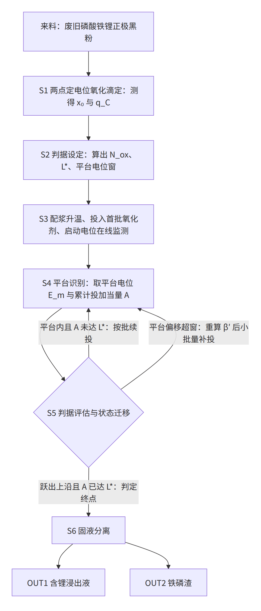
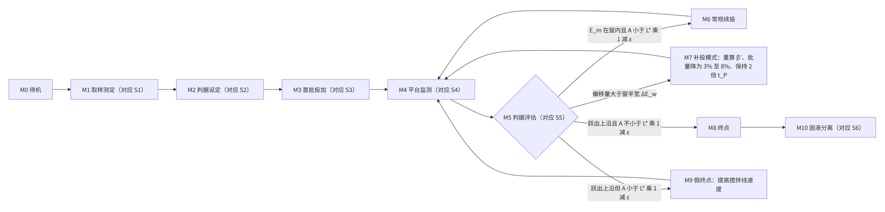

# 申请文件

> 虚构演练案例。工艺方案、实验数据、文献号、日期全部是编的，只用于演示本技能包的产物形态，不构成任何真实技术或法律主张。

发明名称：一种废旧磷酸铁锂正极材料的选择性提锂方法

## 权利要求书

1. 一种废旧磷酸铁锂正极材料的选择性提锂方法，其特征在于，包括以下步骤：

S1 取样测定：取待处理的废旧磷酸铁锂正极材料小样，置于硫酸介质中，先在第一设定电位 E1 下进行定电位氧化滴定，滴加氧化剂至补加速率低于设定收敛限，记录本段消耗的氧化剂电子当量 n1；再将设定电位升至第二设定电位 E2 并同样滴定至收敛，记录本段追加消耗的氧化剂电子当量 n2，E2 高于 E1；结合该正极材料的全铁摩尔量 n_Fe，按 x₀ = 1 − n1 / n_Fe 得到该正极材料的残余脱锂度 x₀，并以 n2 作为该正极材料的碳耗当量 q_C；

S2 判据设定：由 S1 得到的 x₀ 和 q_C 确定下列三个控制判据量：氧化剂总投加当量 N_ox = (1 − x₀)·n_Fe·(1 + α) + β·q_C，预期平台当量长度 L* = (1 − x₀)·n_Fe + β·q_C，以及以 E_pl = E_pl0 − γ·q_C / n_Fe 为中心、以 ΔE_w 为半宽的平台电位窗；式中 α 为过量系数，β 为碳耗补偿系数，γ 为碳压降系数，E_pl0 为无碳基准平台电位；

S3 分批投加：将该正极材料与硫酸溶液配成料浆并升温至浸出温度，按 N_ox 的首批份额投入氧化剂，并对料浆液相的氧化还原电位进行在线监测；

S4 平台识别：在每一批氧化剂投入后的保持期内，将氧化还原电位在保持时间 t_P 内的变化幅度不超过设定波动限的区段识别为平台，取该区段内的电位平均值作为实测平台电位 E_m，并记录该区段结束时刻的累计投加当量 A；

S5 判据评估与状态迁移：以 E_m 相对于 S2 所确定的平台电位窗的位置、以及 A 相对于 L* 的进度共同决定下一步动作，
其中，当 E_m 落在所述平台电位窗内且 A 小于 L*·(1 − ε) 时，判定为平台未走完，按剩余当量的等分份额继续投入氧化剂并返回 S4，ε 为平台余量系数；
当 E_m 落在所述平台电位窗外，且偏移量 ΔE = |E_pl − E_m| 大于 ΔE_w 时，判定为平台偏移，按 β′ = β·(1 + ΔE / ΔE_ref) 重新确定碳耗补偿系数，以 β′ 代替 β 重新计算 N_ox 和 L*，并切换至补投模式后返回 S4，ΔE_ref 为偏移基准电位差；
当氧化还原电位跃出所述平台电位窗上沿、在 t_P 内不回落且 A 不小于 L*·(1 − ε) 时，判定到达浸出终点，停止投加氧化剂；

S6 固液分离：到达浸出终点后对料浆进行固液分离，得到含锂浸出液和铁磷渣。

2. 根据权利要求 1 所述的方法，其特征在于，S1 中所述第一设定电位 E1 为 560 mV 至 620 mV，所述第二设定电位 E2 为 760 mV 至 820 mV，均以银—氯化银电极为参比电极；所述收敛限为该段起始 5 min 平均补加速率的 5%。

3. 根据权利要求 1 所述的方法，其特征在于，S2 中所述过量系数 α 为 0.02 至 0.08，所述碳耗补偿系数 β 为 0.30 至 0.70。

4. 根据权利要求 1 所述的方法，其特征在于，S2 中所述无碳基准平台电位 E_pl0 为 690 mV 至 720 mV，所述碳压降系数 γ 为 400 mV 至 560 mV，所述平台电位窗半宽 ΔE_w 为 15 mV 至 30 mV；所述 E_pl0 和 γ 由不少于三个已知 q_C 的批次在同一浸出温度和同一硫酸浓度下实测的平台电位对 q_C / n_Fe 作线性拟合得到，其中截距为 E_pl0，斜率的相反数为 γ。

5. 根据权利要求 1 所述的方法，其特征在于，S4 中所述保持时间 t_P 为 8 min 至 20 min，所述设定波动限为 4 mV；S5 中所述平台余量系数 ε 为 0.05 至 0.15。

6. 根据权利要求 1 所述的方法，其特征在于，S3 中氧化剂的分批数为 3 批至 4 批，所述首批份额为 N_ox 的 35% 至 45%。

7. 根据权利要求 1 所述的方法，其特征在于，S5 中所述偏移基准电位差 ΔE_ref 为 100 mV，且 β′ 的取值不超过 0.70；所述补投模式为：每批氧化剂投加量降为重新计算后的 N_ox 的 3% 至 8%，且每批投加后的保持时间由 t_P 延长至 2 倍 t_P。

8. 根据权利要求 1 至 7 中任一项所述的方法，其特征在于，S5 中还包括假终点判定：当氧化还原电位跃出所述平台电位窗上沿而 A 小于 L*·(1 − ε) 时，判定为假终点，不停止投加氧化剂，将料浆搅拌桨端线速度由第一线速度提高至第二线速度后返回 S4，所述第二线速度为所述第一线速度的 1.3 倍至 1.8 倍。

9. 根据权利要求 1 至 8 中任一项所述的方法，其特征在于，S3 中所述硫酸溶液的浓度为 0.5 mol/L 至 1.5 mol/L，液固比为 6 mL/g 至 12 mL/g，所述浸出温度为 55 ℃ 至 85 ℃，所述氧化剂为过硫酸钠水溶液。

## 说明书

### 技术领域

本发明涉及废旧锂离子电池资源化回收技术领域，具体涉及一种废旧磷酸铁锂正极材料的选择性提锂方法。

### 背景技术

废旧磷酸铁锂电池经放电、拆解、破碎和分选后得到的正极黑粉，主要成分为磷酸铁锂，并含有导电碳、碳包覆层、聚偏氟乙烯类粘结剂的热解残余物以及少量集流体碎屑。从该黑粉中先把锂单独提取出来、再把铁和磷以磷酸铁形式回收，是目前的主流路线，通常称为选择性提锂。

选择性提锂的化学基础是：向酸性料浆中加入氧化剂，把磷酸铁锂晶格中的二价铁氧化为三价铁，锂离子失去电荷补偿而脱出进入溶液，固相转变为磷酸铁并留在渣中。理想情况下锂全部进入液相、铁和磷全部留在渣中。

现有技术中，氧化剂的投加量通常按下述两类方式确定。

第一类是按化学计量定量投加。测定来料的全铁含量，按二价铁全部氧化所需理论量乘以一个固定的过量系数一次性或分批投加。这类做法的问题在于：来料的残余脱锂度和碳含量都会波动，而这两个量都不体现在全铁分析结果里。上游放电不彻底的批次，正极材料本身已经处于部分脱锂状态，其中的二价铁量明显低于按全铁推算的量，按全铁投加必然过量；粘结剂残余较多的批次，碳基还原性物质会额外消耗氧化剂，按全铁投加则不足。

第二类是按氧化还原电位反馈投加。在料浆中插入铂电极和参比电极，设定一个固定的电位目标值，控制器持续投加氧化剂直至液相电位达到该目标值。这类做法的问题在于：料浆中的碳基还原性物质会与铁的氧化还原电对共同形成混合电位，把液相电位整体拉低，且拉低的幅度随碳含量变化。对碳含量高的批次，液相电位长时间达不到固定目标值，控制器持续投加，最终造成严重过量。

上述两类做法的共同后果是投加量偏离实际需要。投加不足时脱锂不完全，锂浸出率下降，未脱出的锂留在铁磷渣中损失掉；投加过量时三价铁开始进入液相，一方面增加后续净化负担和酸耗，另一方面过度氧化会使铁磷渣颗粒细化并呈现胶状，压滤和洗涤困难，渣对母液的夹带量增加，渣含锂反而升高。因此投加过量并不能换来更高的锂收率。

此外，也有采用机械化学活化后水浸提锂的路线，即先对黑粉进行球磨活化再用水浸出。该路线避免了氧化剂投加量的问题，但对来料的碳含量和荷电状态更为敏感，球磨能耗高，批次间波动大。

本发明的发明人在实践中观察到：在上述氧化浸出过程中，只要固相中磷酸铁锂和磷酸铁两相共存，液相的氧化还原电位就被两相平衡钉在一个近似恒定的数值上，形成一段可辨认的电位平台；直到磷酸铁锂被消耗完，该钉扎作用消失，电位才快速跃升。这段平台的电位高低受碳基还原性物质的影响而整体下移，平台的长度则取决于来料中尚未脱锂的那部分磷酸铁锂的量。也就是说，电位平台的两个特征——平台电位和平台长度——本身就携带了来料荷电状态和碳含量的信息。但现有技术或者只把电位当作一个需要达到的固定目标值，或者只把平台现象作为一种机理观测记录下来，都没有把来料的荷电状态测定结果反过来用于确定该平台应当出现在哪个电位区间、应当持续多长，因而无法区分"平台还没走完"和"平台已经偏移"这两种完全不同的状况。

### 发明内容

本发明要解决的技术问题是：在废旧磷酸铁锂正极材料的选择性提锂中，由于来料的残余脱锂度和碳含量批次间波动，按固定过量系数或固定电位目标值确定的氧化剂投加量偏离实际需要，导致锂浸出率低、铁磷渣含锂高、氧化剂和酸消耗大、批次间结果波动大。

为解决上述技术问题，本发明提供一种废旧磷酸铁锂正极材料的选择性提锂方法，其核心在于把一次离线的两点定电位氧化滴定的结果，直接转换成在线控制的判据参数，再由在线观测到的平台形态反过来修正该离线测定中最不确定的那一项。

本发明的方法包括如权利要求 1 所述的 S1 至 S6 六个步骤。其中：

S1 解决的是"来料到底还有多少二价铁、碳会吃掉多少氧化剂"这一问题。二价铁的氧化在较低电位下即可快速进行，而碳基还原性物质的氧化需要更高的电位且反应较慢。因此在第一设定电位 E1 下滴定至收敛，所消耗的电子当量 n1 主要对应可快速氧化的二价铁；把设定电位抬高到 E2 后追加消耗的电子当量 n2 则主要对应碳基还原性物质。由 n1 与全铁量 n_Fe 之比即可得到残余脱锂度 x₀，由 n2 即可得到碳耗当量 q_C。这一步把两个此前混在一起、且都不体现在全铁分析中的量分离开来。

S2 是本发明的关键一环：S1 得到的 x₀ 和 q_C 不是仅仅用来算一个投加总量，而是同时用来确定在线判据的三个量。总投加当量 N_ox 由需要氧化的二价铁量、过量系数和碳耗补偿三部分构成；预期平台当量长度 L* 是"平台走完时累计应当投入多少当量"的预测值，它直接由 (1 − x₀)·n_Fe 给出，即来料越接近满锂状态，平台越长；平台电位窗则以 E_pl0 − γ·q_C / n_Fe 为中心，即碳耗当量越大，预期的平台电位越低。这样，同一套控制逻辑在不同来料上会自动使用不同的判据阈值，而这些阈值全部来自 S1 的测定值。

S4 和 S5 是在线执行部分。S4 只做识别，不做判断：把电位曲线中足够平坦的一段取出来，给出实测平台电位 E_m 和该段结束时的累计投加当量 A。S5 用 E_m 和 A 两个量对着 S2 给出的窗口和长度做二维判断，得到三种不同的状态迁移：

其一，E_m 在窗内说明碳耗估计是准的，A 未达 L*·(1 − ε) 说明磷酸铁锂还没反应完，此时按批继续投加即可，判据本身不需要改动。

其二，E_m 落到窗外且偏移量超过窗半宽，说明 S1 测得的 q_C 在实际浸出条件下低估了碳的消耗——离线滴定在较短时间内完成，而浸出过程持续数小时，碳的慢速氧化部分在离线测定中未被计入。此时本发明不是简单地多加氧化剂，而是按偏移量的大小反算碳耗补偿系数 β′ = β·(1 + ΔE / ΔE_ref)，用 β′ 重算 N_ox 和 L*，即把判据本身修正后再继续。同时把每批投加量降到很小并延长保持时间，使得修正后的判据能够在下一段平台上被重新检验。

其三，电位跃出窗上沿且累计投加已达到 L*·(1 − ε)，说明两相共存已经结束，判定终点。

由此，S1 的测定结果改变的是 S5 的校验阈值和状态迁移方向，而 S5 观测到的偏移又改变了 S2 中 β 的取值，两个机制之间存在双向的因果关系，而不是先测一次再按顺序做完后面的工序。

本发明的有益效果是：

第一，氧化剂投加量与来料的实际需要相匹配。由于 x₀ 直接扣除了来料中已经脱锂的部分，高荷电态批次不再按满锂量投加；由于 q_C 单独进入补偿项，高碳批次也不再依靠反复试凑。在具体实施方式给出的实施例中，氧化剂当量比稳定在 1.09 至 1.19，而按固定电位目标值控制的对比例为 1.42。

第二，铁磷渣含锂下降。终点判据要求累计投加达到预期平台长度才允许停止，避免了脱锂不完全；平台判据又使投加在两相共存结束时即停止，避免了过度氧化造成的渣细化和夹带。实施例中铁磷渣含锂为 0.21% 至 0.27%，对比例为 0.71%。

第三，批次间波动减小。实施例三批平行试验的锂浸出率相对标准偏差为 0.6% 至 1.1%，对比例为 4.7%。

第四，判据具有自校正能力。当来料的碳行为超出离线测定的预测时，平台偏移会被识别出来并转换为对补偿系数的定量修正，而不是等到浸出结束后从结果中发现异常。

### 附图说明

图1 是本发明实施例的工艺流程图；

图2 是本发明实施例的控制判据状态迁移图。

### 具体实施方式

下面结合附图和实施例对本发明作进一步说明。以下实施例、对比例和考察数据均为本申请为说明技术方案而给出的示例性数据。

#### 术语与符号

本文中，残余脱锂度 x₀ 指来料正极材料中已经处于脱锂状态的磷酸铁的摩尔分数，取值 0 至 1，x₀ 越大说明来料越接近充电态；碳耗当量 q_C 指单位质量来料中碳基还原性物质在浸出条件下可消耗的氧化剂电子当量，单位为 mmol/g；电子当量统一按 1 mol 过硫酸钠提供 2 mol 电子折算；n_Fe 为单位质量来料的全铁摩尔量，单位为 mmol/g；氧化剂当量比指实际投加的电子当量与需氧化的二价铁摩尔量之比，即 N_ox 与 (1 − x₀)·n_Fe 之比；平台指液相氧化还原电位随投加量变化时出现的近似恒定区段；平台电位窗指本方法预测该平台应当落入的电位区间。全部电位值均以银—氯化银（饱和氯化钾）电极为参比。

#### 实施方式概述

如图1所示，本实施方式包括 S1 至 S6 六个步骤，其中 S3 至 S5 构成一个循环。如图2所示，控制逻辑在 M0 待机、M1 取样测定、M2 判据设定、M3 首批投加、M4 平台监测、M5 判据评估、M6 常规续投、M7 补投模式、M8 终点、M9 假终点和 M10 固液分离之间迁移；M1 至 M5 分别对应 S1 至 S5，M10 对应 S6，M6、M7、M9 是 M5 的三个出口分支。

S1 取样测定的具体做法：取来料 2.00 g，加入 1.0 mol/L 硫酸 40 mL，在 60 ℃ 下搅拌，用恒电位仪将体系电位钉在 E1，由蠕动泵按电位偏差补加 0.50 mol/L 过硫酸钠溶液；当 10 min 内的平均补加速率降至该段起始 5 min 平均补加速率的 5% 以下时，认为本段收敛，记录累计加入的电子当量为 n1。随后将设定电位抬升至 E2，按同样的收敛判据滴定，记录本段追加的电子当量为 n2。全铁量 n_Fe 由消解后的分光光度法测定。

E1 与 E2 的选取依据：E1 过低时二价铁氧化不完全，n1 偏低且平行性差；E1 过高时碳在第一段已被部分氧化，两段无法分开。在 540 mV、570 mV、590 mV、620 mV、650 mV 五档考察中，540 mV 和 570 mV 属前一种情况，650 mV 时 n2 由 0.42 mmol/g 降至 0.19 mmol/g，属后一种情况，590 mV 与 620 mV 结果接近。E2 过低时保持时间过长，E2 过高时出现析氧干扰，730 mV、790 mV、850 mV 三档中 730 mV 单次耗时超过 100 min，850 mV 出现明显析氧。据此，E1 取 560 mV 至 620 mV，E2 取 760 mV 至 820 mV。

S2 判据设定的具体做法：按 N_ox = (1 − x₀)·n_Fe·(1 + α) + β·q_C 计算总投加当量，按 L* = (1 − x₀)·n_Fe + β·q_C 计算预期平台当量长度，按 E_pl = E_pl0 − γ·q_C / n_Fe 计算预期平台电位并以 ΔE_w 为半宽给出平台电位窗。E_pl0 和 γ 是与设备和浸出条件有关的两个常数，在同一浸出温度和硫酸浓度下由不少于三个已知 q_C 的批次实测平台电位对 q_C / n_Fe 作线性拟合确定。在本实施方式的装置和条件（70 ℃、硫酸 1.0 mol/L、液固比 8 mL/g）下拟合得到 E_pl0 = 705 mV、γ = 480 mV。

S3 分批投加的具体做法：按液固比配浆，升温至浸出温度并保持搅拌，投入 N_ox 的首批份额，同时开始以 10 s 间隔采集液相氧化还原电位。

S4 平台识别的具体做法：每批投入后进入保持期，若连续 t_P 时间内电位的极差不超过设定波动限（本实施方式取 4 mV），则把该时间段判为平台，取其电位平均值为 E_m，并记录该段结束时刻的累计投加当量 A。

S5 判据评估的具体做法及三条主分支已在发明内容中说明，此处补充两点。其一，补投模式下每批投加量取重新计算后的 N_ox 的 3% 至 8%，保持时间由 t_P 延长至 2 倍 t_P，目的是让修正后的判据能在下一段平台上被重新检验，而不是一次性把差额补完。其二，β′ 设上限 0.70，超过该值时按 0.70 取值并给出提示，避免单次异常电位读数把补偿系数推到过量投加区间。

S5 还可包括假终点判定分支（对应图2 中的 M9）：若电位跃出窗上沿但 A 尚未达到 L*·(1 − ε)，则说明尚有磷酸铁锂未反应，电位跃升多由局部传质受限造成，此时不停止投加，把搅拌桨端线速度由第一线速度提高到其 1.3 倍至 1.8 倍后返回 S4。

S6 固液分离的具体做法：终点后趁热压滤，滤液为硫酸锂溶液，进入后续净化与沉锂工序；滤饼为铁磷渣。滤饼可采用两段逆流洗涤，第二段洗液返回作为第一段洗水、第一段洗液返回下一批浸出的配浆用水，以进一步降低渣对母液的夹带。

#### 实施例 1

来料批次 B-01，n_Fe = 6.24 mmol/g。

S1：E1 取 590 mV，测得 n1 = 5.18 mmol/g；E2 取 790 mV，测得 n2 = 0.42 mmol/g。故 x₀ = 1 − 5.18 / 6.24 = 0.17，q_C = 0.42 mmol/g。

S2：取 α = 0.05、β = 0.50，则 (1 − x₀)·n_Fe = 5.18 mmol/g，N_ox = 5.18 × 1.05 + 0.50 × 0.42 = 5.65 mmol/g，L* = 5.18 + 0.21 = 5.39 mmol/g；q_C / n_Fe = 0.0673，E_pl = 705 − 480 × 0.0673 = 673 mV，取 ΔE_w = 25 mV，得平台电位窗 648 mV 至 698 mV。

S3：按液固比 8 mL/g 用 1.0 mol/L 硫酸配浆，升温至 70 ℃，分 4 批投加，首批份额 40%，即先投 2.26 mmol/g。

S4 与 S5：首批投入后电位先升至 712 mV 再回落，于第 9 min 起进入平台，t_P 取 12 min，实测 E_m = 668 mV，落在 648 mV 至 698 mV 窗内；该段结束时 A = 2.26 mmol/g，小于 L*·(1 − ε) = 5.39 × 0.90 = 4.85 mmol/g，判定平台未走完，按剩余当量的等分份额继续投加。第 2、第 3 批投加后 E_m 分别为 670 mV 和 667 mV，均在窗内，A 分别为 3.39 mmol/g 和 4.52 mmol/g，仍小于 4.85 mmol/g，继续投加。第 4 批投加后累计 A = 5.65 mmol/g，电位由 669 mV 跃至 749 mV 并在 12 min 内不回落，且 A 已不小于 4.85 mmol/g，判定终点。

S6：压滤分离。结果：锂浸出率 96.8%，铁浸出率 0.9%，铁磷渣含锂 0.21%，浸出液铁 88 mg/L，硫酸消耗 2.8 mol/kg 来料，氧化剂当量比 5.65 / 5.18 = 1.09。三次平行试验的锂浸出率为 96.8%、96.4%、97.1%，相对标准偏差 0.6%。

#### 实施例 2（高荷电态来料）

来料批次 B-03，来自上游放电工装故障批，n_Fe = 6.18 mmol/g。

S1：测得 n1 = 3.65 mmol/g，n2 = 0.44 mmol/g，故 x₀ = 1 − 3.65 / 6.18 = 0.41，q_C = 0.44 mmol/g。该批的 x₀ 另经物相定量交叉核对，核对值 0.39。

S2：α = 0.05、β = 0.50，(1 − x₀)·n_Fe = 3.65 mmol/g，N_ox = 3.65 × 1.05 + 0.22 = 4.05 mmol/g，L* = 3.65 + 0.22 = 3.87 mmol/g；q_C / n_Fe = 0.0712，E_pl = 705 − 34 = 671 mV，平台电位窗 646 mV 至 696 mV。

S3 至 S5：其余条件同实施例 1。四批投加后 E_m 依次为 666 mV、668 mV、665 mV、664 mV，均在窗内；A 依次为 1.62、2.43、3.24、4.05 mmol/g，L*·(1 − ε) = 3.48 mmol/g，故前三批均判平台未走完，第 4 批后电位跃至 744 mV 不回落且 A 已超过 3.48 mmol/g，判定终点。

本例的意义在于：同一套控制逻辑无需任何人工调整，仅因 S1 测得 x₀ = 0.41，L* 即由实施例 1 的 5.39 mmol/g 自动缩短为 3.87 mmol/g，N_ox 由 5.65 mmol/g 降为 4.05 mmol/g。若按全铁量投加，本批应投 6.18 × 1.05 + 0.22 = 6.71 mmol/g，即过量约 66%。

结果：锂浸出率 96.1%，铁浸出率 1.1%，铁磷渣含锂 0.24%，浸出液铁 104 mg/L，硫酸消耗 2.1 mol/kg，氧化剂当量比 1.11，三次平行相对标准偏差 0.8%。

#### 实施例 3（高碳来料，触发平台偏移与补投模式）

来料批次 B-04，粘结剂残余较多，n_Fe = 6.02 mmol/g。

S1：测得 n1 = 5.06 mmol/g，n2 = 1.08 mmol/g，故 x₀ = 0.16，q_C = 1.08 mmol/g。

S2：α = 0.05、β = 0.50，N_ox = 5.06 × 1.05 + 0.54 = 5.85 mmol/g，L* = 5.06 + 0.54 = 5.60 mmol/g；q_C / n_Fe = 0.1794，E_pl = 705 − 480 × 0.1794 = 619 mV，平台电位窗 594 mV 至 644 mV。

S3 至 S5：首批投入 2.34 mmol/g，第 2 批投入 1.17 mmol/g、累计 3.51 mmol/g 后形成平台，实测 E_m = 588 mV，低于窗下沿，偏移量 ΔE = |619 − 588| = 31 mV，大于 ΔE_w = 25 mV，判定平台偏移。取 ΔE_ref = 100 mV，得 β′ = 0.50 × (1 + 31 / 100) = 0.655，取 0.66，未超过上限 0.70。以 β′ 重算：N_ox = 5.06 × 1.05 + 0.66 × 1.08 = 6.03 mmol/g，L* = 5.06 + 0.71 = 5.77 mmol/g，L*·(1 − ε) = 5.19 mmol/g。随即切换补投模式，每批投加 6.03 × 6% = 0.36 mmol/g，保持时间由 12 min 延长至 24 min。此后各段平台电位在 591 mV 至 596 mV 之间，仍落入原窗口内（平台电位窗仅由 q_C 决定，不随 β 变化）；补投 7 批共 2.52 mmol/g，累计投加达 6.03 mmol/g 时电位跃至 751 mV 并不回落，A 已超过 5.19 mmol/g，判定终点，实际总投加 6.03 mmol/g。

本例的意义在于：S1 的离线滴定在约 1 h 内完成，只计入了碳的快速氧化部分；而在 70 ℃、4 h 的浸出条件下碳的慢速氧化部分同样消耗氧化剂，使实测平台电位比预测值低 31 mV。本发明不是简单地增加投加量，而是把这一电位偏移换算为补偿系数的修正量，使 N_ox 和 L* 两个判据同时更新，因此终点判定仍然成立。

结果：锂浸出率 95.4%，铁浸出率 1.4%，铁磷渣含锂 0.27%，浸出液铁 131 mg/L，硫酸消耗 3.0 mol/kg，氧化剂当量比 6.03 / 5.06 = 1.19，三次平行相对标准偏差 1.1%。

#### 对比例 1（固定电位目标值连续投加）

来料批次 B-05，与 B-04 同源，n_Fe = 5.98 mmol/g，x₀ = 0.18，q_C = 1.11 mmol/g，(1 − x₀)·n_Fe = 4.90 mmol/g。

不执行 S1 与 S2，改为在 70 ℃、硫酸 1.0 mol/L、液固比 8 mL/g 下连续投加过硫酸钠，以液相电位达到并保持 650 mV 作为唯一终点判据。

过程：投加初期电位缓慢上升至 613 mV 后长时间不再上升。按本发明的算法，该批的预期平台电位为 705 − 480 × 1.11 / 5.98 = 616 mV，即 613 mV 正是两相共存平台，而设定的 650 mV 目标值高于该平台，控制器无法识别，持续投加。累计投加至 6.96 mmol/g 后电位才越过 650 mV。

结果：锂浸出率 88.3%，铁浸出率 4.2%，铁磷渣含锂 0.71%，浸出液铁 402 mg/L，硫酸消耗 4.3 mol/kg，氧化剂当量比 6.96 / 4.90 = 1.42。三次平行的锂浸出率为 88.3%、92.6%、84.9%，相对标准偏差 4.7%。

对比例 1 说明：固定电位目标值的失效并非偶然，而是因为该目标值是一个与来料碳含量无关的常数，一旦碳把平台电位压到目标值以下，反馈控制就失去终止条件。渣含锂由 0.27% 升至 0.71%，也印证了过度氧化并不能提高锂收率。

#### 效果对比表

| 项目 | 实施例 1 | 实施例 2 | 实施例 3 | 对比例 1 |
|---|---|---|---|---|
| 来料批次 | B-01 | B-03 | B-04 | B-05 |
| 残余脱锂度 x₀ | 0.17 | 0.41 | 0.16 | 0.18 |
| 碳耗当量 q_C（mmol/g） | 0.42 | 0.44 | 1.08 | 1.11 |
| 控制方式 | 本发明 | 本发明 | 本发明，触发补投 | 固定电位目标值 650 mV |
| 预测平台电位窗（mV） | 648–698 | 646–696 | 594–644 | 未使用 |
| 实测平台电位（mV） | 668 | 665 | 588 | 613 |
| 氧化剂当量比 | 1.09 | 1.11 | 1.19 | 1.42 |
| 锂浸出率（%） | 96.8 | 96.1 | 95.4 | 88.3 |
| 铁浸出率（%） | 0.9 | 1.1 | 1.4 | 4.2 |
| 铁磷渣含锂（%） | 0.21 | 0.24 | 0.27 | 0.71 |
| 浸出液铁（mg/L） | 88 | 104 | 131 | 402 |
| 硫酸消耗（mol/kg 来料） | 2.8 | 2.1 | 3.0 | 4.3 |
| 三次平行锂浸出率相对标准偏差（%） | 0.6 | 0.8 | 1.1 | 4.7 |

#### 数值范围端点考察

为说明权利要求 3 至 6 中各数值范围的端点选择依据，在来料批次 B-01 上按实施例 1 的基础条件逐一变动单个参数进行考察，结果如下。表中括注"范围内"者为本发明所要求保护的区间端点或区间内取值，其余为区间外取值。

| 变动参数 | 取值 | 锂浸出率（%） | 铁磷渣含锂（%） | 铁浸出率（%） | 观察到的现象 |
|---|---|---|---|---|---|
| α | 0.01 | 92.7 | 0.55 | 0.7 | 平台末段反应速率下降，4 h 内平台未走完 |
| α | 0.02（范围内下限） | 95.9 | 0.26 | 0.8 | 可用 |
| α | 0.05（范围内） | 96.8 | 0.21 | 0.9 | 基准 |
| α | 0.08（范围内上限） | 96.9 | 0.20 | 1.5 | 铁浸出开始抬头 |
| α | 0.10 | 96.9 | 0.20 | 2.6 | 锂浸出率不再提高，铁浸出率翻倍 |
| β | 0.20 | 93.9 | 0.41 | 0.8 | 碳耗补偿不足，L* 偏短，平台未走完即判终点 |
| β | 0.30（范围内下限） | 96.0 | 0.25 | 0.9 | 可用 |
| β | 0.70（范围内上限） | 96.6 | 0.22 | 1.6 | 可用 |
| β | 0.85 | 96.7 | 0.22 | 3.1 | 相当于变相过量投加 |
| 浸出温度 | 45 ℃ | 89.4 | 0.78 | 0.6 | 平台形态不清晰，平台电位漂移超过 25 mV，误触发补投 3 次 |
| 浸出温度 | 55 ℃（范围内下限） | 95.2 | 0.29 | 0.8 | 可用 |
| 浸出温度 | 85 ℃（范围内上限） | 96.4 | 0.23 | 1.9 | 可用 |
| 浸出温度 | 95 ℃ | 95.1 | 0.29 | 3.8 | 过硫酸钠自分解加剧，当量比升至 1.31 |
| ε | 0.03 | 94.2 | 0.38 | 0.9 | 余量过小，电位噪声被判为真终点 |
| ε | 0.05（范围内下限） | 96.3 | 0.23 | 0.9 | 可用 |
| ε | 0.15（范围内上限） | 96.6 | 0.22 | 1.3 | 可用 |
| ε | 0.20 | 96.5 | 0.23 | 2.2 | 真终点后仍继续投加 |
| ΔE_w | 10 mV | 96.5 | 0.23 | 1.0 | 误触发补投 5 次，总工时增加约 40% |
| ΔE_w | 15 mV（范围内下限） | 96.7 | 0.21 | 0.9 | 可用 |
| ΔE_w | 30 mV（范围内上限） | 96.6 | 0.22 | 1.0 | 可用 |
| ΔE_w | 40 mV | 91.8 | 0.49 | 0.9 | 在批次 B-04 上复做时 31 mV 的偏移落入窗内，补投未被触发 |
| t_P | 6 min | 95.0 | 0.31 | 1.0 | 保持时间过短，电位回落段被误判为平台 |
| t_P | 8 min（范围内下限） | 96.4 | 0.23 | 0.9 | 可用 |
| t_P | 20 min（范围内上限） | 96.7 | 0.21 | 0.9 | 可用 |
| t_P | 30 min | 96.7 | 0.21 | 0.9 | 效果不再改善，单批工时增加 |

分批数与首批份额的考察在同一来料上进行：一次投完时锂浸出率 93.1%、渣含锂 0.44%，前段局部过氧化而后段不足；分 2 批、首批 60% 时锂浸出率 95.4%、渣含锂 0.29%，段数过少使平台偏移判据只有一次触发机会；分 3 批、首批 45% 时锂浸出率 96.5%、渣含锂 0.22%；分 4 批、首批 40% 时锂浸出率 96.8%、渣含锂 0.21%；分 4 批而首批降为 30% 时锂浸出率 95.8%、渣含锂 0.27%，首批过少使平台迟迟不能建立；分 4 批而首批升为 55% 时锂浸出率 96.0%、渣含锂 0.25%，首批过多使第一批即走完大半平台，后续判据失去意义。据此，分批数取 3 批至 4 批、首批份额取 35% 至 45%。

#### 假终点分支的示例

来料批次 B-06，n_Fe = 6.27 mmol/g，x₀ = 0.18，q_C = 0.47 mmol/g，粒径偏粗（体积中位径约 42 μm，常规批约 18 μm）。按 α = 0.05、β = 0.50 算得 N_ox = 5.63 mmol/g、L* = 5.38 mmol/g、L*·(1 − ε) = 4.84 mmol/g，平台电位窗 644 mV 至 694 mV。第 3 批投加后累计 A = 4.51 mmol/g 时，电位由 669 mV 跃至 742 mV 并保持 12 min 不回落。由于 A 小于 4.84 mmol/g，判为假终点，不停止投加，将搅拌桨端线速度由 1.6 m/s 提高至 2.4 m/s，运行 15 min 后电位回落至 674 mV 并重新形成平台，继续按批投加至累计 5.63 mmol/g 时电位跃至 758 mV 不回落，判定终点。最终锂浸出率 96.2%，铁磷渣含锂 0.23%，铁浸出率 1.0%。作为对照，同批在假终点处即停止的平行试验，锂浸出率为 90.7%，铁磷渣含锂 0.52%。

#### 可替换的实施方式

氧化剂除过硫酸钠水溶液外，也可采用过硫酸铵、双氧水或以气体形式通入的氧气；采用气体氧化剂时，投加当量按通气速率与时间的乘积折算，其余判据不变。E_pl0 与 γ 是与设备、参比电极和浸出条件绑定的两个常数，更换反应器、参比电极或改变浸出温度与硫酸浓度时应重新拟合。铁磷渣的洗涤除两段逆流方式外，也可采用单段水洗，此时渣含锂略有升高。

本发明的方法适用于间歇式反应釜。在连续操作的场合，平台的识别需要按停留时间分布另行处理，本文不作展开。

本输出为撰写辅助，不构成法律意见，不保证授权，不代为提交。

## 说明书摘要

本发明公开一种废旧磷酸铁锂正极材料的选择性提锂方法，属于废旧锂离子电池回收技术领域。先取来料小样在硫酸介质中于第一设定电位和第二设定电位下分别定电位氧化滴定，得残余脱锂度和碳耗当量；再由二者算出氧化剂总投加当量、预期平台当量长度和平台电位窗；然后分批投加氧化剂并在线监测料浆液相氧化还原电位，把电位平坦区段识别为平台，按平台电位相对该窗的位置和累计投加量相对该长度的进度进行状态迁移：在窗内且未达长度则按批续投，偏移超出窗半宽则按偏移量重算碳耗补偿系数并切换小批量补投，跃出窗上沿且已达长度则判定终点；最后固液分离得含锂浸出液和铁磷渣。
